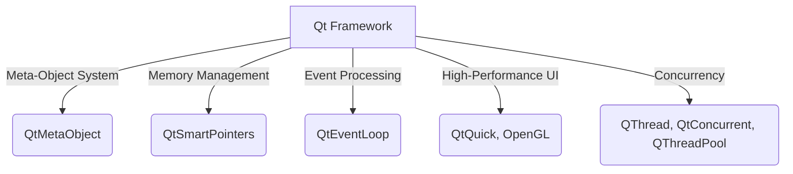

# Qt Technical Notes [Advanced]
<!-- [A high-level architectural diagram showcasing advanced Qt concepts such as signal-slot internals, event-driven architecture, multithreading with QThreadPool, and integration with external libraries like OpenGL and WebAssembly.] -->

## Quick Reference
- **One-sentence definition**: Qt is a robust cross-platform **C++ framework** designed for developing high-performance applications with a focus on UI, concurrency, and embedded systems.
- **Key use cases**: Real-time applications, large-scale software systems, industrial automation, automotive UIs, high-performance graphics applications.
- **Prerequisites**: Proficiency in C++, strong understanding of Qt’s object model, event-driven programming, and multithreading.

## Table of Contents
## Table of Contents
1. [Introduction](#introduction)
2. [Core Concepts](#core-concepts)
   - [Advanced Qt Architecture](#advanced-qt-architecture)
   - [Low-Level Signal-Slot Mechanism](#low-level-signal-slot-mechanism)
   - [Advanced Model-View Programming](#advanced-model-view-programming)
   - [Deep Dive into Event Handling](#deep-dive-into-event-handling)
   - [Multithreading & Performance Optimization](#multithreading--performance-optimization)
   - [Qt and High-Performance Computing](#qt-and-high-performance-computing)
3. [Visual Architecture](#visual-architecture)
   - [Qt’s Advanced Module Interactions](#qts-advanced-module-interactions)
   - [Memory Management in Qt](#memory-management-in-qt)
   - [Event Processing Internals](#event-processing-internals)
4. [Implementation Details](#implementation-details)
   - [Advanced Patterns](#advanced-patterns)
   - [System Optimization Techniques](#system-optimization-techniques)
5. [Real-World Applications](#real-world-applications)
   - [Industry Examples](#industry-examples)
   - [High-Performance Qt Project](#high-performance-qt-project)
6. [Tools & Resources](#tools--resources)
   - [Performance Profiling Tools](#performance-profiling-tools)
   - [Deep Learning & Qt Integration](#deep-learning--qt-integration)
7. [References](#references)
8. [Appendix](#appendix)

## Introduction
- **What**: Qt is a high-performance, **modular framework** for **scalable** application development across diverse platforms.
- **Why**: It offers **low-level control**, **optimized memory management**, and **extensive concurrency support** for real-time applications.
- **Where**: Qt is widely used in **automotive, aerospace, industrial control systems, AI-driven applications, and embedded devices**.

## Core Concepts
### Advanced Qt Architecture
- **Deep dive into Qt’s meta-object system**
- **Memory management and ownership semantics in Qt**
- **Low-level signal-slot implementation**

### Low-Level Signal-Slot Mechanism
- **Performance overhead of signals & slots**
- **Direct connections vs. Queued connections**
- **Using function pointers for high-performance signaling**

### Advanced Model-View Programming
- **Custom Model Implementations** (`QAbstractTableModel`, `QAbstractListModel`)
- **Asynchronous model updates for large datasets**
- **High-performance filtering with `QSortFilterProxyModel`**

### Deep Dive into Event Handling
- **Event compression techniques for performance**
- **Custom event types and event dispatching**
- **Fine-tuning `QEventLoop` for real-time applications**

### Multithreading & Performance Optimization
- **Comparison of `QThread`, `QThreadPool`, and `QtConcurrent`**
- **Worker thread architectures in large-scale Qt applications**
- **Shared resource management and thread safety**

### Qt and High-Performance Computing
- **Integration with OpenGL, Vulkan, and Metal APIs**
- **Using WebAssembly for Qt applications in the browser**
- **Optimizing Qt for low-power and embedded systems**

## Visual Architecture


## Implementation Details
### Advanced Patterns [Advanced]
```cpp
#include <QThreadPool>
#include <QRunnable>
#include <QDebug>

class WorkerTask : public QRunnable {
public:
    void run() override {
        qDebug() << "Running in thread:" << QThread::currentThread();
    }
};

int main() {
    QThreadPool::globalInstance()->start(new WorkerTask());
    return 0;
}
```
- **Thread pooling for performance-critical tasks**
- **Signal-slot performance tuning**
- **Memory optimization using `QSharedPointer`**

### System Optimization Techniques
- **Reducing event loop overhead**
- **Using OpenGL for rendering optimizations**
- **Optimized QML performance techniques**

## Real-World Applications
### Industry Examples
- **Automotive**: Qt in digital instrument clusters & infotainment.
- **Aerospace**: Real-time control systems with high reliability.
- **AI & Machine Learning**: Qt for visualization of neural networks.

### High-Performance Qt Project
**Real-Time Sensor Dashboard with Qt and OpenGL**
- **Project goals**: Render real-time sensor data efficiently.
- **Implementation steps**:
  1. **Multithreading**: Offload data processing to `QThreadPool`.
  2. **Efficient UI updates**: Use `QQuickFramebufferObject` for OpenGL rendering.
  3. **Optimized memory management**: Use `QSharedPointer` for large datasets.
- **Validation methods**: Benchmark frame rates and memory usage.

## Tools & Resources
### Performance Profiling Tools
- **Qt Creator Profiler**
- **Valgrind for memory leak detection**
- **QML Profiler for UI performance**

### Deep Learning & Qt Integration
- **TensorFlow Lite + Qt** for edge AI applications.
- **ONNX Runtime integration for AI inference**.

## References
- [Qt Meta-Object System Guide](https://doc.qt.io/qt-5/qmetaobject.html)
- [Qt High-Performance Graphics](https://doc.qt.io/qt-5/qtopengl.html)
- [Qt Concurrent Programming](https://doc.qt.io/qt-5/threads.html)

## Appendix
- **Glossary**: Definitions of advanced Qt terms.
- **Setup guides**: Configuring Qt for high-performance applications.
- **Code templates**: Advanced Qt programming patterns.

