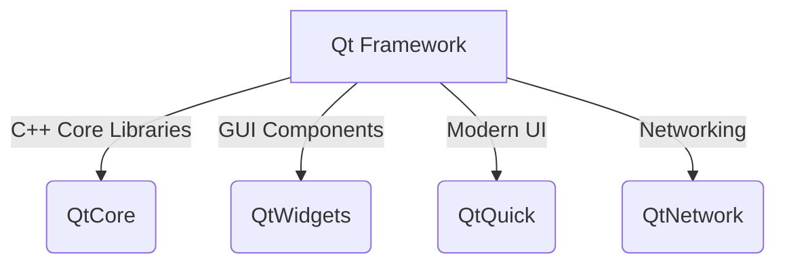

# Qt Technical Notes [Basic]
<!-- [A clean and modern UI framework powering cross-platform applications. The image should depict a structured software architecture diagram illustrating Qt's main components, such as Qt Widgets, Qt Quick, and Qt Core, in a visually engaging way.] -->

## Quick Reference
- **One-sentence definition**: Qt is a **cross-platform C++ framework** for developing GUI and embedded applications, featuring tools like Qt Widgets and Qt Quick.
- **Key use cases**: Desktop applications, mobile apps, embedded systems, industrial automation, automotive UIs.
- **Prerequisites**: Basic knowledge of C++ and object-oriented programming.

## Table of Contents
1. [Introduction](#introduction)
2. [Core Concepts](#core-concepts)
  - [Fundamental Understanding](#fundamental-understanding)
3. [Visual Architecture](#visual-architecture)
4. [Implementation Details](#implementation-details)
  - [Basic Implementation](#basic-implementation-beginner)
5. [Real-World Applications](#real-world-applications)
  - [Industry Examples](#industry-examples)
  - [Hands-On Project](#hands-on-project)
6. [Tools & Resources](#tools--resources)
  - [Essential Tools](#essential-tools)
  - [Learning Resources](#learning-resources)
7. [References](#references)
8. [Appendix](#appendix)

## Introduction
- **What**: Qt is an open-source and commercial framework for **developing cross-platform applications** with a focus on GUI applications.
- **Why**: It simplifies UI development, provides a **rich set of libraries**, and allows applications to be deployed on **Windows, macOS, Linux, Android, and embedded systems** with minimal changes.
- **Where**: Qt is widely used in **software development, industrial automation, automotive UIs, and IoT applications**.

## Core Concepts
### Fundamental Understanding
- **Basic principles**: Qt provides an object-oriented programming framework with a **signals and slots mechanism** for event-driven programming.
- **Key components**:
  - **Qt Core**: Essential non-GUI classes (e.g., event handling, data structures).
  - **Qt Widgets**: Traditional desktop UI elements.
  - **Qt Quick**: QML-based modern UI design.
  - **Qt Network**: Networking capabilities.
- **Common misconceptions**:
  - Qt is not only for GUIs; it also supports headless applications.
  - QML is not a replacement for Qt Widgets but an alternative for modern UIs.

### Visual Architecture


## Implementation Details
### Basic Implementation [Beginner]
```cpp
#include <QApplication>
#include <QPushButton>

int main(int argc, char *argv[]) {
    QApplication app(argc, argv);
    QPushButton button("Hello, Qt!");
    button.show();
    return app.exec();
}
```
- **Step-by-step setup**:
  1. Install Qt (via Qt Installer or package manager).
  2. Create a new Qt application project.
  3. Write a simple UI application using Qt Widgets.
  4. Compile and run using `qmake` and `make`.
- **Common pitfalls**:
  - Forgetting to call `app.exec()` to start the event loop.
  - Missing Qt libraries in the runtime environment.

## Real-World Applications
### Industry Examples
- **Desktop applications**: KDE desktop environment, video editors.
- **Embedded systems**: Automotive infotainment, industrial HMIs.
- **Mobile apps**: Cross-platform applications using Qt Quick.

### Hands-On Project
**Simple Notepad Application**
- **Project goals**: Create a basic text editor using Qt Widgets.
- **Implementation steps**:
  1. Create a `QMainWindow`.
  2. Add a `QTextEdit` component.
  3. Implement basic file operations (open, save).
- **Validation methods**: Ensure file operations work correctly and the UI is responsive.

## Tools & Resources
### Essential Tools
- **Development environment**: Qt Creator, Visual Studio Code (with Qt plugin)
- **Key frameworks**: Qt Core, Qt Widgets, Qt Quick
- **Testing tools**: Qt Test module

### Learning Resources
- **Documentation**: [Qt Official Docs](https://doc.qt.io/)
- **Tutorials**: Qt for Beginners (Qt Wiki)
- **Community resources**: Qt Forum, Stack Overflow

## References
- [Qt Official Documentation](https://doc.qt.io/)
- [Qt Source Code](https://code.qt.io/cgit/)
- [C++ Standard Library](https://en.cppreference.com/w/)

## Appendix
- **Glossary**: Definitions of key Qt terms.
- **Setup guides**: Installing Qt and setting up a project.
- **Code templates**: Boilerplate for Qt applications.

