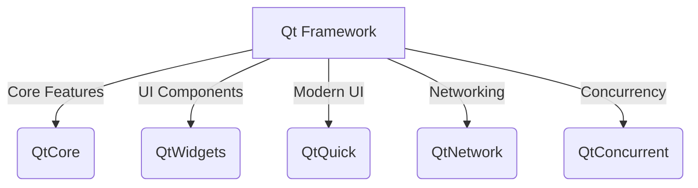

# Qt Technical Notes [Intermediate]
<!-- [A structured software architecture diagram illustrating Qt's main components, such as Qt Widgets, Qt Quick, and Qt Core, with an emphasis on intermediate-level concepts like model-view programming, event handling, and threading.] -->

## Quick Reference
- **One-sentence definition**: Qt is a **cross-platform C++ framework** for building scalable GUI and embedded applications with extensive libraries for UI, networking, and multithreading.
- **Key use cases**: Desktop applications, mobile apps, embedded systems, real-time processing, industrial automation, automotive UIs.
- **Prerequisites**: Solid C++ knowledge, familiarity with object-oriented programming, basic understanding of event-driven programming.

## Table of Contents
1. [Introduction](#introduction)
2. [Core Concepts](#core-concepts)
  - [Fundamental Understanding](#fundamental-understanding)
  - [Model-View Programming](#model-view-programming)
  - [Event Handling](#event-handling)
  - [Multithreading in Qt](#multithreading-in-qt)
3. [Visual Architecture](#visual-architecture)
4. [Implementation Details](#implementation-details)
  - [Basic Implementation](#basic-implementation)
  - [Intermediate Patterns](#intermediate-patterns)
5. [Real-World Applications](#real-world-applications)
  - [Industry Examples](#industry-examples)
  - [Hands-On Project](#hands-on-project)
6. [Tools & Resources](#tools--resources)
  - [Essential Tools](#essential-tools)
  - [Learning Resources](#learning-resources)
7. [References](#references)
8. [Appendix](#appendix)

## Introduction
- **What**: Qt is a powerful C++ framework for **developing scalable cross-platform applications** with advanced UI capabilities and backend integration.
- **Why**: It provides a **consistent API across platforms**, a robust **signals and slots mechanism**, and built-in support for **model-view programming and multithreading**.
- **Where**: Qt is widely used in **desktop software, automotive infotainment, industrial automation, medical devices, and IoT applications**.

## Core Concepts
### Fundamental Understanding
- **Key components**:
  - **Qt Core**: Event handling, multithreading, data structures.
  - **Qt GUI**: 2D graphics, OpenGL integration.
  - **Qt Widgets**: Traditional UI elements.
  - **Qt Quick**: QML-based UI design.
  - **Qt Network**: Networking capabilities.
  - **Qt Concurrent**: Threading and parallel programming.

- **Common misconceptions**:
  - Qt is not just a UI framework; it provides full-fledged backend services.
  - QML is not limited to mobile applications; it is widely used in embedded and industrial UIs.

### Model-View Programming
- **Why?** Separates data representation from UI logic.
- **Key Classes**:
  - `QAbstractItemModel` (base model class)
  - `QListView`, `QTableView`, `QTreeView` (view classes)
  - `QSortFilterProxyModel` (data filtering)

### Event Handling
- **Qt’s event loop** (`QEventLoop`)
- **Custom events** using `QEvent` and `installEventFilter()`
- **Event propagation and filtering**

### Multithreading in Qt
- **QThread vs. QtConcurrent**
- **Worker thread pattern**
- **Thread-safe signals and slots**

### Visual Architecture


## Implementation Details
### Basic Implementation [Beginner]
```cpp
#include <QApplication>
#include <QPushButton>

int main(int argc, char *argv[]) {
    QApplication app(argc, argv);
    QPushButton button("Hello, Qt!");
    button.show();
    return app.exec();
}
```

### Intermediate Patterns [Intermediate]
```cpp
#include <QThread>
#include <QDebug>

class WorkerThread : public QThread {
protected:
    void run() override {
        qDebug() << "Running in a separate thread";
    }
};

int main() {
    WorkerThread thread;
    thread.start();
    thread.wait();
    return 0;
}
```
- **Design patterns**: Model-View, Factory Pattern in UI Components.
- **Best practices**: Avoid blocking the event loop; use worker threads.
- **Performance considerations**: Optimize event handling, use `QThreadPool` for parallel tasks.

## Real-World Applications
### Industry Examples
- **Automotive**: Infotainment UIs using Qt Quick.
- **Industrial Automation**: HMI applications with real-time updates.
- **Desktop Software**: Multi-platform applications like KDE.

### Hands-On Project
**Multi-Threaded Log Viewer**
- **Project goals**: Display real-time logs using `QThread` and `QListView`.
- **Implementation steps**:
  1. Create a background thread to read log files.
  2. Use `QSortFilterProxyModel` to filter logs.
  3. Implement UI using `QTableView`.
- **Validation methods**: Ensure smooth UI updates and efficient log handling.

## Tools & Resources
### Essential Tools
- **Development environment**: Qt Creator, Visual Studio Code (with Qt plugin)
- **Key frameworks**: Qt Core, Qt Widgets, Qt Quick, Qt Concurrent
- **Testing tools**: Qt Test module, QML Profiler

### Learning Resources
- **Documentation**: [Qt Official Docs](https://doc.qt.io/)
- **Tutorials**: Qt Intermediate Series (Qt Wiki)
- **Community resources**: Qt Forum, Stack Overflow

## References
- [Qt Official Documentation](https://doc.qt.io/)
- [Qt Model/View Programming Guide](https://doc.qt.io/qt-5/model-view-programming.html)
- [Qt Multithreading Guide](https://doc.qt.io/qt-5/thread-basics.html)

## Appendix
- **Glossary**: Definitions of key Qt terms.
- **Setup guides**: Installing Qt and setting up a project.
- **Code templates**: Boilerplate for Qt applications.

