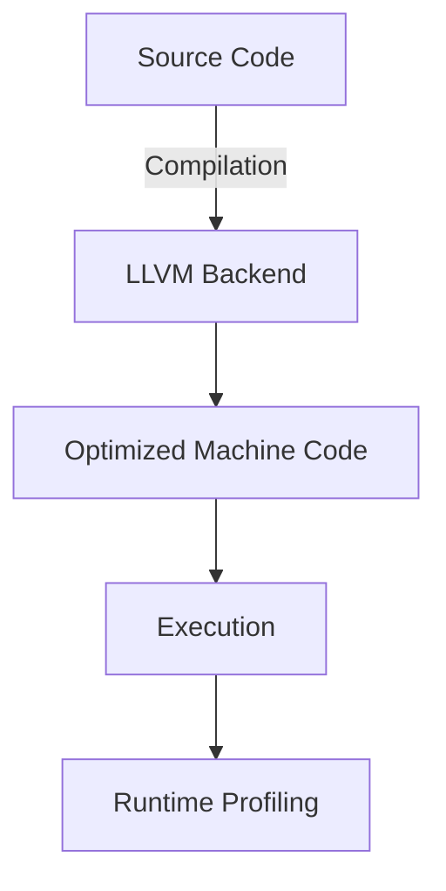

# Rust Programming Technical Notes

<!-- [An in-depth exploration of Rust for high-performance, safety-critical, and concurrent systems.] -->

## Quick Reference

- **Definition:** Rust is a statically typed, memory-safe programming language designed for performance, concurrency, and reliability in system-level programming.
- **Key Use Cases:** High-performance systems, embedded devices, financial systems, cryptography, and cloud-native applications.
- **Prerequisites:** Strong understanding of systems programming, memory management, concurrency models, and familiarity with C/C++ or similar low-level languages.

## Table of Contents

1. Introduction
2. Core Concepts
   - Advanced Understanding
   - Key Components
   - Common Pitfalls in Production
3. Visual Architecture
4. Implementation Details
   - Advanced System Design
5. Real-World Applications
   - Industry Examples
   - Advanced Hands-On Project
6. Tools & Resources
   - Essential Tools
   - Performance Profiling & Debugging
7. References
8. Appendix

## Introduction

### What is Rust?

Rust is a cutting-edge systems programming language designed to provide memory safety, concurrency, and high performance without a garbage collector.

### Why is Rust Important?

- Prevents **memory safety vulnerabilities** (e.g., buffer overflows, data races) at compile time.
- Offers **zero-cost abstractions**, ensuring high performance without sacrificing safety.
- Enforces **deterministic resource management** through ownership and borrowing.
- Optimized for **multi-threaded and parallel applications** with safe concurrency features.

### Where is Rust Used?

- **High-Performance Systems:** Game engines, real-time processing, high-frequency trading.
- **Embedded & Safety-Critical Systems:** Automotive, aerospace, industrial automation.
- **Cloud & Web:** Highly scalable backends, WebAssembly, secure microservices.
- **Cryptography & Security:** Rust is used in security-focused applications (e.g., OpenSSL replacement, blockchain).

## Core Concepts

### Advanced Understanding

- **Ownership, Borrowing, and Lifetimes**: Advanced memory safety mechanisms.
- **Trait Objects & Dynamic Dispatch**: Optimizing performance while maintaining abstraction.
- **Unsafe Rust & FFI**: Interoperability with C and other low-level languages.
- **Concurrency at Scale**: Leveraging async/await and thread-safe primitives.
- **Metaprogramming**: Macros and procedural macros for compile-time code generation.

### Key Components

1. **Zero-cost Abstractions** – Performance optimizations without runtime overhead.
2. **Memory Model** – Advanced allocation techniques, stack vs heap optimizations.
3. **Concurrency Primitives** – Using `Arc`, `Mutex`, `RwLock`, and lock-free data structures.
4. **Async Rust & Tokio** – High-performance asynchronous programming.
5. **Embedded & Real-Time Constraints** – `no_std` environments, Rust for microcontrollers.

### Common Pitfalls in Production

- **Understanding Borrow Checker Trade-offs** – Performance vs safety decisions.
- **Overuse of `unwrap()` and `expect()`** – Avoiding panics in critical systems.
- **Inefficient Memory Usage** – Profiling allocations and optimizing performance.
- **Concurrency Bugs** – Deadlocks and race conditions in async Rust.

## Visual Architecture



- **LLVM Optimizations**: How Rust generates highly optimized machine code.
- **Borrow Checker Flow**: Validating memory access at compile time.
- **Async Execution Model**: Managing tasks efficiently without blocking.

## Implementation Details

### Advanced System Design

#### High-Performance Data Processing with Rayon

```rust
use rayon::prelude::*;
fn main() {
    let numbers: Vec<i32> = (1..1000000).collect();
    let sum: i32 = numbers.par_iter().sum();
    println!("Sum: {}", sum);
}
```

- **System Design Considerations:** Parallel computing, data locality, lock-free algorithms.
- **Optimization Techniques:** CPU cache optimization, memory alignment.
- **Production Considerations:** Benchmarking with `criterion`, profiling with `perf`.

## Real-World Applications

### Industry Examples

- **Cloud Computing:** Rust in Kubernetes controllers, edge computing.
- **Financial Systems:** Low-latency trading, fraud detection.
- **Blockchain & Cryptography:** Secure, performant smart contract execution.
- **Embedded Systems:** Aerospace-grade safety-critical software.

### Advanced Hands-On Project: Distributed Key-Value Store

**Project Goals:**

- Implement a high-performance distributed key-value store.
- Utilize Rust’s async capabilities for scalable networking.
- Ensure data integrity using Rust’s type safety and error handling.

**Implementation Steps:**

1. Set up a Rust project with `tokio` for async networking.
2. Implement a distributed hash table (DHT) with `hyper`.
3. Optimize performance using `mio` for event-driven IO.
4. Add logging and monitoring with `tracing`.
5. Benchmark and test under load with `criterion`.

## Tools & Resources

### Essential Tools

- **Advanced Debugging:** `gdb`, `lldb`, `rust-gdb`.
- **Performance Profiling:** `flamegraph`, `perf`, `cargo bench`.
- **Memory Analysis:** `valgrind`, `heaptrack`.
- **Code Quality & Linting:** `clippy`, `rustfmt`, `cargo audit`.

### Performance Profiling & Debugging

- **Benchmarking:** Using `criterion` for performance tests.
- **Flamegraph Analysis:** Visualizing CPU usage for bottlenecks.
- **Concurrency Profiling:** Identifying race conditions in async Rust.

## References

- [Rust Performance Book](https://nnethercote.github.io/perf-book/)
- [Advanced Rust Programming](https://doc.rust-lang.org/nomicon/)
- [Tokio Async Ecosystem](https://tokio.rs/)
- [Rust for Embedded Systems](https://docs.rust-embedded.org/book/)

## Appendix

### Glossary

- **Zero-Cost Abstraction:** Compile-time optimizations ensuring no runtime cost.
- **Mutex vs RwLock:** Performance trade-offs in concurrent access.
- **Borrow Checker:** Enforces safe memory usage at compile time.

### Setup Guides

- Optimizing Rust builds for production (`cargo build --release`)
- Configuring cross-compilation for embedded targets (`rustup target add`) 
- Integrating Rust with C (`bindgen`, `cbindgen`, `FFI`)

### Code Templates

- **High-Performance Networking:** Async server with `tokio`.
- **Memory-Efficient Data Structures:** Custom allocators and pool-based memory management.
- **Concurrency Patterns:** Thread-safe parallelism with `rayon`.
