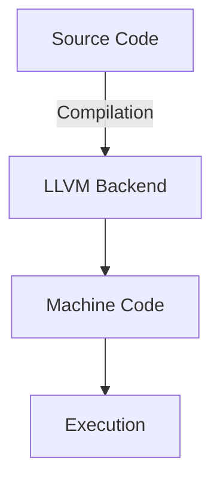

# Rust Programming Technical Notes
<!-- [An introduction to Rust, a systems programming language focused on safety, concurrency, and performance.] -->

## Quick Reference
- **Definition:** Rust is a statically typed, memory-safe programming language designed for performance and concurrency.
- **Key Use Cases:** Systems programming, embedded systems, web assembly, and high-performance applications.
- **Prerequisites:** Basic understanding of programming concepts, familiarity with C/C++ beneficial but not required.

## Table of Contents
1. Introduction
2. Core Concepts
   - Fundamental Understanding
   - Key Components
   - Common Misconceptions
3. Visual Architecture
4. Implementation Details
   - Basic Implementation
5. Real-World Applications
   - Industry Examples
   - Hands-On Project
6. Tools & Resources
   - Essential Tools
   - Learning Resources
7. References
8. Appendix

## Introduction
### What is Rust?
Rust is a modern systems programming language that provides memory safety without a garbage collector, making it ideal for performance-critical applications.

### Why is Rust Important?
Rust eliminates common memory bugs found in languages like C/C++ by enforcing strict ownership and borrowing rules, leading to more reliable software.

### Where is Rust Used?
- **Systems Programming:** Operating systems, embedded devices.
- **Web Development:** WebAssembly for high-performance web applications.
- **Game Development:** Engine development and performance-critical computations.
- **Concurrency & Parallelism:** Safe multi-threaded programming.

## Core Concepts
### Fundamental Understanding
- **Ownership and Borrowing:** Guarantees memory safety without a garbage collector.
- **Lifetimes:** Ensures references are valid throughout their scope.
- **Pattern Matching:** Provides powerful control flow constructs.
- **Concurrency Model:** Safe and efficient thread management.

### Key Components
1. **Cargo** – Rust’s package manager and build system.
2. **Crates** – Modules and package ecosystem.
3. **Ownership System** – Prevents memory leaks and ensures safe memory access.
4. **Error Handling** – Uses `Result` and `Option` types instead of exceptions.

### Common Misconceptions
- **Rust is difficult to learn:** The ownership model requires learning but provides significant safety benefits.
- **Rust is only for systems programming:** It is also used in web development, cloud computing, and game engines.
- **Rust is slow due to safety features:** Rust's performance is comparable to C/C++ with added safety guarantees.

## Visual Architecture

- **Compiler:** Translates Rust code to optimized machine code using LLVM.
- **Memory Management:** Enforced via ownership and borrowing.

## Implementation Details
### Basic Implementation
#### Hello, World! in Rust
```rust
fn main() {
    println!("Hello, world!");
}
```
- **Step 1:** Install Rust via `rustup`.
- **Step 2:** Create a new project using `cargo new my_project`.
- **Step 3:** Compile and run with `cargo run`.
- **Common Pitfalls:** Borrow checker errors, strict type enforcement.

## Real-World Applications
### Industry Examples
- **Operating Systems:** Rust-based OS like Redox.
- **WebAssembly:** Fast and safe execution in web browsers.
- **Blockchain:** Smart contract development (e.g., Solana).

### Hands-On Project: Simple CLI Tool
**Project Goals:**
- Create a command-line tool that reads and processes a file.
- Implement error handling using Rust’s `Result` type.

**Implementation Steps:**
1. Set up a new Rust project.
2. Read a file input using `std::fs`.
3. Process and output data safely.
4. Handle potential errors gracefully.

## Tools & Resources
### Essential Tools
- **Compiler & Package Manager:** Rustc, Cargo
- **Libraries:** Tokio (async), Serde (serialization)
- **IDE Support:** Rust Analyzer for VS Code, CLion, IntelliJ Rust Plugin

### Learning Resources
- **Documentation:**
  - [The Rust Programming Language](https://doc.rust-lang.org/book/)
  - [Rust API Documentation](https://doc.rust-lang.org/std/)
- **Tutorials:**
  - [Rustlings - Interactive Exercises](https://github.com/rust-lang/rustlings)
  - [Rust by Example](https://doc.rust-lang.org/stable/rust-by-example/)
- **Community Resources:**
  - [Rust User Forum](https://users.rust-lang.org/)
  - [Stack Overflow - Rust](https://stackoverflow.com/questions/tagged/rust)

## References
- [Official Rust Documentation](https://www.rust-lang.org/)
- [The Rust Programming Language Book](https://doc.rust-lang.org/book/)
- [Rustonomicon - Advanced Rust](https://doc.rust-lang.org/nomicon/)

## Appendix
### Glossary
- **Ownership:** Rust’s memory management system.
- **Crate:** A package of Rust code.
- **Lifetime:** Ensures references remain valid.

### Setup Guides
- Installing Rust using `rustup`
- Setting up Cargo for project management

### Code Templates
- Basic Rust syntax examples
- Error handling patterns

