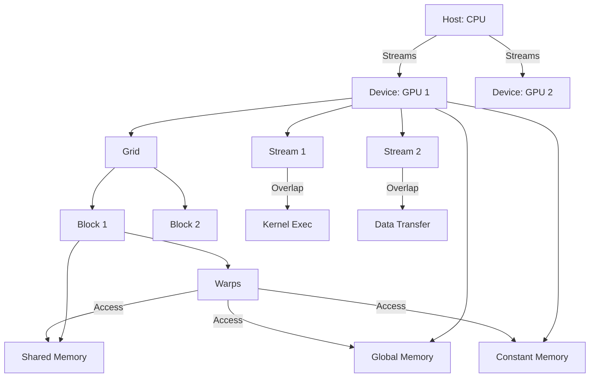

# CUDA (Compute Unified Device Architecture) Technical Notes

<!-- [Diagram depicting an advanced CUDA execution pipeline: a rectangular layout with a CPU orchestrating multiple GPUs, each with a detailed grid of blocks and threads, interconnected by streams and events. Includes annotations for memory types (global, shared, constant, texture), warp scheduling, and data flow between host and device.] -->

## Quick Reference
- **One-sentence definition**: CUDA is NVIDIA’s sophisticated parallel computing platform for leveraging GPU architectures to solve complex, large-scale computational problems.
- **Key use cases**: High-performance computing (HPC) workloads, real-time ray tracing, and distributed deep learning.
- **Prerequisites**: Proficiency in C/C++ and CUDA, understanding of GPU architecture (SMs, warps, memory hierarchy), and experience with profiling tools.

## Table of Contents
- [Introduction](#introduction)
- [Core Concepts](#core-concepts)
    - [Fundamental Understanding](#fundamental-understanding)
    - [Visual Architecture](#visual-architecture)
- [Implementation Details](#implementation-details)
    - [Advanced Topics](#advanced-topics)
- [Real-World Applications](#real-world-applications)
    - [Industry Examples](#industry-examples)
    - [Hands-On Project](#hands-on-project)
- [Tools & Resources](#tools--resources)
    - [Essential Tools](#essential-tools)
    - [Learning Resources](#learning-resources)
- [References](#references)

## Introduction
- **What**: CUDA provides a scalable, low-level interface to NVIDIA GPUs, enabling fine-grained control over parallel execution and memory management.
- **Why**: It addresses the need for extreme performance in compute-intensive applications by exploiting GPU parallelism at scale.
- **Where**: Deployed in supercomputing clusters, AI research, financial modeling, and game engine physics.

## Core Concepts
### Fundamental Understanding
- **Basic principles**: CUDA orchestrates thousands of threads across streaming multiprocessors (SMs), with performance hinging on memory coalescing, warp efficiency, and latency hiding.
  - Threads are grouped into warps (32 threads) that execute in lockstep.
  - Kernel execution is non-preemptive, requiring careful resource allocation.
- **Key components**:
  - **Memory Hierarchy**: Global, shared, constant, texture, and registers, each with distinct latency and bandwidth profiles.
  - **Streams**: Asynchronous execution queues for overlapping computation and data transfer.
  - **Unified Memory**: Simplifies host-device data sharing (with caveats).
- **Common misconceptions**:
  - "Unified Memory eliminates manual management" – It simplifies but often underperforms explicit transfers in production.
  - "Max threads = max performance" – Over-subscription can lead to register spilling or low occupancy.

### Visual Architecture

- **System overview**: Multiple GPUs process kernels in parallel, with streams enabling concurrency between computation and memory operations.
- **Component relationships**: Threads in warps share resources (e.g., shared memory), while streams coordinate independent tasks across the GPU.

## Implementation Details
### Advanced Topics [Advanced]
```c
// CUDA program for matrix multiplication with tiled shared memory and streams
#include <cuda_runtime.h>
#include <stdio.h>

#define TILE_SIZE 32
#define CHECK(err) if (err != cudaSuccess) { printf("Error: %s\n", cudaGetErrorString(err)); exit(1); }

__global__ void matrixMul(float *A, float *B, float *C, int N) {
    __shared__ float s_A[TILE_SIZE][TILE_SIZE];
    __shared__ float s_B[TILE_SIZE][TILE_SIZE];

    int bx = blockIdx.x, by = blockIdx.y;
    int tx = threadIdx.x, ty = threadIdx.y;
    int row = by * TILE_SIZE + ty;
    int col = bx * TILE_SIZE + tx;
    float sum = 0.0f;

    // Loop over tiles
    for (int m = 0; m < (N + TILE_SIZE - 1) / TILE_SIZE; m++) {
        if (row < N && m * TILE_SIZE + tx < N)
            s_A[ty][tx] = A[row * N + m * TILE_SIZE + tx];
        else
            s_A[ty][tx] = 0.0f;

        if (m * TILE_SIZE + ty < N && col < N)
            s_B[ty][tx] = B[(m * TILE_SIZE + ty) * N + col];
        else
            s_B[ty][tx] = 0.0f;

        __syncthreads();

        // Compute tile
        #pragma unroll
        for (int k = 0; k < TILE_SIZE; k++)
            sum += s_A[ty][k] * s_B[k][tx];

        __syncthreads();
    }

    if (row < N && col < N)
        C[row * N + col] = sum;
}

int main() {
    int N = 1024; // Matrix size
    size_t size = N * N * sizeof(float);
    float *h_A, *h_B, *h_C, *d_A, *d_B, *d_C;

    // Host allocation and initialization
    h_A = (float*)malloc(size); h_B = (float*)malloc(size); h_C = (float*)malloc(size);
    for (int i = 0; i < N * N; i++) { h_A[i] = 1.0f; h_B[i] = 2.0f; }

    // Device allocation
    cudaMalloc(&d_A, size); cudaMalloc(&d_B, size); cudaMalloc(&d_C, size);

    // Streams
    cudaStream_t stream1, stream2;
    cudaStreamCreate(&stream1); cudaStreamCreate(&stream2);

    // Async memory transfers and kernel launch
    cudaMemcpyAsync(d_A, h_A, size, cudaMemcpyHostToDevice, stream1);
    cudaMemcpyAsync(d_B, h_B, size, cudaMemcpyHostToDevice, stream2);

    dim3 block(TILE_SIZE, TILE_SIZE);
    dim3 grid((N + TILE_SIZE - 1) / TILE_SIZE, (N + TILE_SIZE - 1) / TILE_SIZE);
    matrixMul<<<grid, block, 0, stream1>>>(d_A, d_B, d_C, N);

    cudaMemcpyAsync(h_C, d_C, size, cudaMemcpyDeviceToHost, stream1);
    cudaStreamSynchronize(stream1); cudaStreamSynchronize(stream2);

    // Cleanup
    cudaFree(d_A); cudaFree(d_B); cudaFree(d_C);
    cudaStreamDestroy(stream1); cudaStreamDestroy(stream2);
    free(h_A); free(h_B); free(h_C);

    return 0;
}
```
- **System design**:
  - **Tiling**: Breaks matrix into smaller chunks fitting in shared memory, reducing global memory accesses.
  - **Streams**: Overlaps data transfers with computation for better throughput.
- **Optimization techniques**:
  - **Coalesced memory access**: Aligns thread accesses to contiguous memory.
  - **Loop unrolling**: Reduces branch overhead with `#pragma unroll`.
  - **Warp divergence minimization**: Ensures uniform execution paths within warps.
- **Production considerations**:
  - Error handling with `CHECK` macro for robustness.
  - Multi-GPU scaling (not shown but extendable via `cudaSetDevice`).
  - Profile with Nsight to tune block sizes and occupancy.

## Real-World Applications
### Industry Examples
- **Use case**: Distributed training of neural networks.
- **Implementation pattern**: Split data across GPUs, use streams for pipelining, and leverage cuDNN for optimized primitives.
- **Success metrics**: Training time reduction (e.g., hours to minutes) and scalability across GPU nodes.

### Hands-On Project
- **Project goals**: Optimize a Monte Carlo simulation for option pricing.
- **Implementation steps**:
  1. Design a kernel for parallel random number generation (cuRAND).
  2. Use shared memory for intermediate results.
  3. Implement streams for overlapping iterations.
  4. Profile and adjust for maximum SM utilization.
- **Validation methods**: Compare results to CPU baseline and measure speedup.

## Tools & Resources
### Essential Tools
- **Development environment**: Nsight Compute, Visual Studio with CUDA extensions.
- **Key frameworks**: CUDA Toolkit, cuBLAS, cuDNN, Thrust.
- **Testing tools**: Nsight Systems (profiling), CUDA-MEMCHECK (memory debugging).

### Learning Resources
- **Documentation**: CUDA C Best Practices Guide, GPU Architecture Whitepapers.
- **Tutorials**: NVIDIA Deep Learning AI courses, GTC session recordings.
- **Community resources**: CUDA GitHub repos, HPC forums.

## References
- NVIDIA CUDA Toolkit Documentation (developer.nvidia.com/cuda-toolkit).
- “CUDA Handbook” by Nicholas Wilt.
- IEEE Papers on GPU Computing (e.g., “Optimizing CUDA for HPC”).
