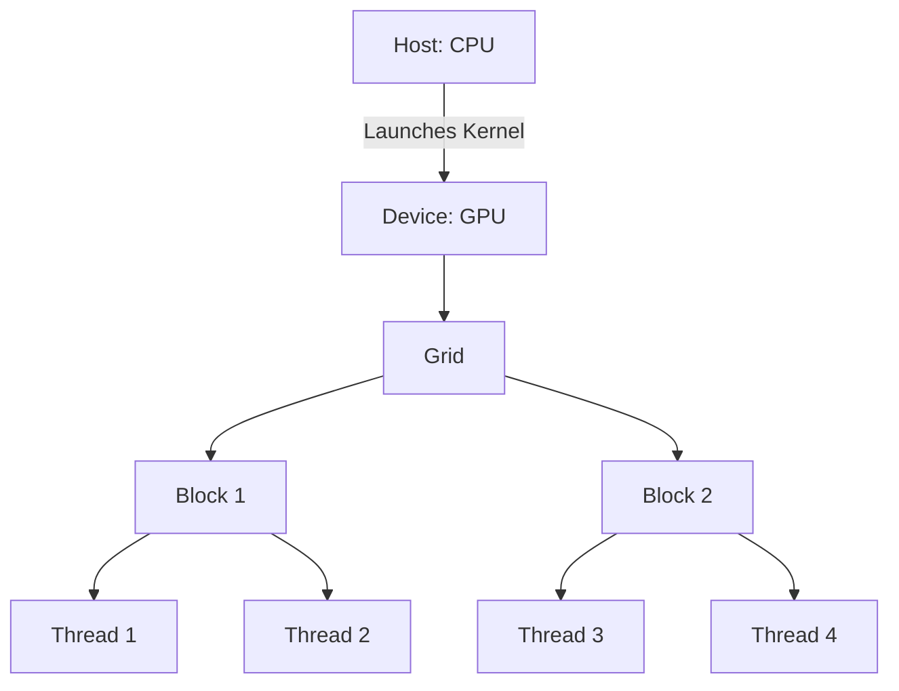

# CUDA (Compute Unified Device Architecture) Technical Notes

<!-- [An illustrative diagram showing a basic CUDA workflow: a rectangular layout with a CPU on the left connected to a GPU on the right, displaying multiple thread blocks and grids in a colorful, simplified format to represent parallel processing.] -->

## Quick Reference
- **One-sentence definition**: CUDA (Compute Unified Device Architecture) is a parallel computing platform and programming model developed by NVIDIA for general-purpose computing on GPUs.
- **Key use cases**: Accelerating scientific simulations, machine learning tasks, and image processing.
- **Prerequisites**: Basic understanding of programming (preferably C/C++), a computer with an NVIDIA GPU, and willingness to learn parallel computing concepts.

## Table of Contents
- [Introduction](#introduction)
- [Core Concepts](#core-concepts)
    - [Fundamental Understanding](#fundamental-understanding)
    - [Visual Architecture](#visual-architecture)
- [Implementation Details](#implementation-details)
    - [Basic Implementation [Beginner]](#basic-implementation-beginner)
- [Real-World Applications](#real-world-applications)
    - [Industry Examples](#industry-examples)
    - [Hands-On Project](#hands-on-project)
- [Tools & Resources](#tools--resources)
    - [Essential Tools](#essential-tools)
    - [Learning Resources](#learning-resources)
- [References](#references)
- [Appendix](#appendix)
    - [Glossary](#glossary)
    - [Setup guides](#setup-guides)

## Introduction
- **What**: CUDA is a platform that allows developers to leverage the parallel processing power of NVIDIA GPUs for general-purpose computing beyond graphics.
- **Why**: It solves the problem of slow computation for tasks that can be parallelized, offering significant speedups over traditional CPU-only approaches.
- **Where**: Used in fields like data science, physics simulations, cryptocurrency mining, and gaming.

## Core Concepts
### Fundamental Understanding
- **Basic principles**: CUDA enables parallel execution by running thousands of threads simultaneously on GPU cores, unlike the sequential execution typical of CPUs.
  - A "thread" is the smallest unit of execution.
  - Threads are grouped into "blocks," and blocks form a "grid."
- **Key components**:
  - **Host**: The CPU that manages the program's flow.
  - **Device**: The GPU that executes parallel tasks.
  - **Kernel**: A function that runs on the GPU across multiple threads.
- **Common misconceptions**:
  - "CUDA is only for graphics" – No, it’s for general-purpose computing.
  - "You need advanced math to start" – Basic programming skills are enough for beginners.

### Visual Architecture

- **System overview**: The CPU (host) sends instructions to the GPU (device), which processes them in a grid of thread blocks.
- **Component relationships**: Threads within blocks execute the same kernel code but can operate on different data.

## Implementation Details
### Basic Implementation [Beginner]
```c
// Simple CUDA program to add two arrays
#include <stdio.h>
#include <cuda_runtime.h>

// Kernel function to add elements of two arrays
__global__ void add(int *a, int *b, int *c, int n) {
    int i = threadIdx.x; // Each thread gets its own index
    if (i < n) {
        c[i] = a[i] + b[i]; // Perform addition
    }
}

int main() {
    int n = 10; // Array size
    int a[n], b[n], c[n]; // Host arrays
    int *d_a, *d_b, *d_c; // Device arrays

    // Initialize host arrays
    for (int i = 0; i < n; i++) {
        a[i] = i;
        b[i] = i * 2;
    }

    // Allocate memory on GPU
    cudaMalloc(&d_a, n * sizeof(int));
    cudaMalloc(&d_b, n * sizeof(int));
    cudaMalloc(&d_c, n * sizeof(int));

    // Copy data from host to device
    cudaMemcpy(d_a, a, n * sizeof(int), cudaMemcpyHostToDevice);
    cudaMemcpy(d_b, b, n * sizeof(int), cudaMemcpyHostToDevice);

    // Launch kernel with 1 block of 10 threads
    add<<<1, n>>>(d_a, d_b, d_c, n);

    // Copy result back to host
    cudaMemcpy(c, d_c, n * sizeof(int), cudaMemcpyDeviceToHost);

    // Print result
    for (int i = 0; i < n; i++) {
        printf("%d + %d = %d\n", a[i], b[i], c[i]);
    }

    // Free GPU memory
    cudaFree(d_a); cudaFree(d_b); cudaFree(d_c);

    return 0;
}
```
- **Step-by-step setup**:
  1. Install CUDA Toolkit from NVIDIA’s website.
  2. Write the code in a `.cu` file (e.g., `add.cu`).
  3. Compile with `nvcc add.cu -o add`.
  4. Run `./add`.
- **Code walkthrough**:
  - `__global__` marks the kernel function for GPU execution.
  - `<<<1, n>>>` specifies 1 block with `n` threads.
  - `cudaMalloc` and `cudaMemcpy` manage GPU memory and data transfer.
- **Common pitfalls**:
  - Forgetting to free GPU memory (causes leaks).
  - Mismatched array sizes or thread counts.

## Real-World Applications
### Industry Examples
- **Use case**: Speeding up matrix multiplication in scientific computing.
- **Implementation pattern**: Divide matrix into blocks for parallel processing.
- **Success metrics**: Reduced computation time (e.g., from minutes to seconds).

### Hands-On Project
- **Project goals**: Build a CUDA program to double an array’s values.
- **Implementation steps**:
  1. Create an array on the host.
  2. Allocate GPU memory and copy the array.
  3. Write a kernel to multiply each element by 2.
  4. Copy results back and verify.
- **Validation methods**: Compare output to CPU-based doubling.

## Tools & Resources
### Essential Tools
- **Development environment**: Visual Studio Code or any C/C++ IDE.
- **Key frameworks**: CUDA Toolkit (includes `nvcc` compiler).
- **Testing tools**: NVIDIA Nsight for debugging.

### Learning Resources
- **Documentation**: NVIDIA CUDA Programming Guide.
- **Tutorials**: CUDA by Example (book or online excerpts).
- **Community resources**: Stack Overflow, NVIDIA Developer Forums.

## References
- NVIDIA CUDA Toolkit Documentation (developer.nvidia.com/cuda-toolkit).
- “CUDA by Example” by Sanders and Kandrot.
- CUDA C Programming Guide (docs.nvidia.com/cuda).

## Appendix
- **Glossary**:
  - **Kernel**: GPU-executable function.
  - **Thread**: Smallest execution unit in CUDA.
  - **Grid**: Collection of thread blocks.
- **Setup guides**: See NVIDIA’s CUDA installation instructions.

This guide is tailored for beginners, emphasizing core concepts and a simple, actionable introduction to CUDA programming.