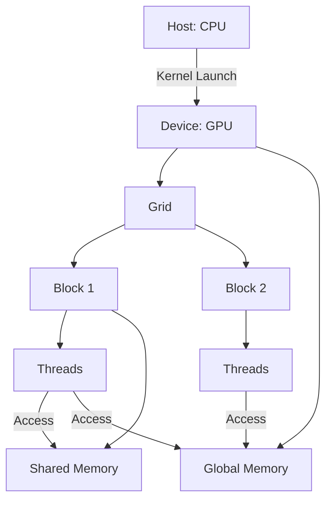

# CUDA (Compute Unified Device Architecture) Technical Notes
<!-- [Diagram illustrating a CUDA execution model: a rectangular layout showing a CPU (host) on the left transferring data to an NVIDIA GPU (device) on the right, with a detailed grid structure displaying multiple blocks, each containing threads, and arrows indicating memory flow between global, shared, and local memory types.] -->

## Quick Reference
- **One-sentence definition**: CUDA is NVIDIA’s parallel computing platform that enables developers to harness GPU power for general-purpose processing through a C/C++-based programming model.
- **Key use cases**: Real-time image processing, deep learning model training, and large-scale scientific simulations.
- **Prerequisites**: Familiarity with C/C++ programming, basic CUDA concepts (threads, blocks, grids), and an NVIDIA GPU with CUDA Toolkit installed.

## Table of Contents
- [Introduction](#introduction)
- [Core Concepts](#core-concepts)
    - [Fundamental Understanding](#fundamental-understanding)
    - [Visual Architecture](#visual-architecture)
- [Implementation Details](#implementation-details)
    - [Intermediate Patterns](#intermediate-patterns)
    - [Design Patterns](#design-patterns)
    - [Best Practices](#best-practices)
    - [Performance Considerations](#performance-considerations)
- [Real-World Applications](#real-world-applications)
    - [Industry Examples](#industry-examples)
    - [Hands-On Project](#hands-on-project)
- [Tools & Resources](#tools--resources)
    - [Essential Tools](#essential-tools)
    - [Learning Resources](#learning-resources)
- [References](#references)

## Introduction
- **What**: CUDA extends C/C++ to offload computationally intensive tasks to the GPU, leveraging its thousands of cores for parallel execution.
- **Why**: It accelerates workloads with inherent parallelism, reducing execution time for tasks like matrix operations or data transformations.
- **Where**: Applied in machine learning frameworks, computational finance, and high-performance computing (HPC).

## Core Concepts
### Fundamental Understanding
- **Basic principles**: CUDA’s power lies in its ability to execute a single kernel across thousands of threads, organized into blocks and grids, with efficient memory management critical for performance.
  - Threads within a block can cooperate via shared memory.
  - Blocks are scheduled across GPU streaming multiprocessors (SMs).
- **Key components**:
  - **Global Memory**: Main GPU memory, accessible by all threads (slower).
  - **Shared Memory**: Fast, per-block memory for thread collaboration.
  - **Thread Synchronization**: Mechanisms like `__syncthreads()` to coordinate execution.
- **Common misconceptions**:
  - "More threads always mean better performance" – No, memory bottlenecks or resource limits can degrade efficiency.
  - "CUDA is plug-and-play" – Optimization requires understanding GPU architecture.

### Visual Architecture

- **System overview**: The CPU launches kernels to the GPU, where threads in blocks access global memory or share data via shared memory.
- **Component relationships**: Threads within a block use shared memory for low-latency communication, while global memory serves as the primary data store.

## Implementation Details
### Intermediate Patterns [Intermediate]
```c
// CUDA program for vector addition with shared memory optimization
#include <stdio.h>
#include <cuda_runtime.h>

#define BLOCK_SIZE 256

// Kernel using shared memory for partial sums
__global__ void vectorAdd(float *a, float *b, float *c, int n) {
    __shared__ float s_data[BLOCK_SIZE]; // Shared memory per block
    int idx = blockIdx.x * blockDim.x + threadIdx.x; // Global thread index
    int tid = threadIdx.x; // Local thread index within block

    // Load data into shared memory
    if (idx < n) {
        s_data[tid] = a[idx] + b[idx];
    }
    __syncthreads(); // Ensure all threads have loaded data

    // Write result to global memory
    if (idx < n) {
        c[idx] = s_data[tid];
    }
}

int main() {
    int n = 1 << 20; // 1M elements
    float *h_a, *h_b, *h_c; // Host arrays
    float *d_a, *d_b, *d_c; // Device arrays

    // Allocate host memory
    size_t size = n * sizeof(float);
    h_a = (float*)malloc(size);
    h_b = (float*)malloc(size);
    h_c = (float*)malloc(size);

    // Initialize arrays
    for (int i = 0; i < n; i++) {
        h_a[i] = i * 1.0f;
        h_b[i] = i * 2.0f;
    }

    // Allocate device memory
    cudaMalloc(&d_a, size);
    cudaMalloc(&d_b, size);
    cudaMalloc(&d_c, size);

    // Copy to device
    cudaMemcpy(d_a, h_a, size, cudaMemcpyHostToDevice);
    cudaMemcpy(d_b, h_b, size, cudaMemcpyHostToDevice);

    // Configure and launch kernel
    int threadsPerBlock = BLOCK_SIZE;
    int blocksPerGrid = (n + threadsPerBlock - 1) / threadsPerBlock;
    vectorAdd<<<blocksPerGrid, threadsPerBlock>>>(d_a, d_b, d_c, n);

    // Copy result back
    cudaMemcpy(h_c, d_c, size, cudaMemcpyDeviceToHost);

    // Verify (sample check)
    for (int i = 0; i < 10; i++) {
        printf("%.1f + %.1f = %.1f\n", h_a[i], h_b[i], h_c[i]);
    }

    // Cleanup
    free(h_a); free(h_b); free(h_c);
    cudaFree(d_a); cudaFree(d_b); cudaFree(d_c);

    return 0;
}
```
- **Design patterns**:
  - **Shared memory usage**: Reduces global memory access latency by staging data in fast, block-local shared memory.
  - **Grid-stride loops**: Ensures scalability for large datasets (not shown here but common in intermediate code).
- **Best practices**:
  - Use constant block sizes (e.g., multiples of 32) to align with GPU warp size.
  - Minimize host-device memory transfers by performing as much computation as possible on the GPU.
  - Check for errors with `cudaGetLastError()` after kernel launches.
- **Performance considerations**:
  - Coalesce memory access by ensuring adjacent threads access adjacent memory locations.
  - Balance thread count and block size to maximize occupancy without overloading SMs.

## Real-World Applications
### Industry Examples
- **Use case**: Real-time video filtering (e.g., edge detection).
- **Implementation pattern**: Parallelize pixel operations across thread blocks, using shared memory for neighboring pixel data.
- **Success metrics**: Frames per second (FPS) improvement over CPU-based processing.

### Hands-On Project
- **Project goals**: Implement a CUDA-based matrix transpose.
- **Implementation steps**:
  1. Allocate 2D arrays on host and device.
  2. Write a kernel to swap rows and columns using shared memory tiles.
  3. Launch with optimized block/grid dimensions.
  4. Measure execution time vs. CPU version.
- **Validation methods**: Compare output matrix to a CPU-transposed reference.

## Tools & Resources
### Essential Tools
- **Development environment**: Visual Studio with CUDA support or Linux with `nvcc`.
- **Key frameworks**: CUDA Toolkit, cuBLAS (for linear algebra).
- **Testing tools**: NVIDIA Nsight Systems for profiling, CUDA-GDB for debugging.

### Learning Resources
- **Documentation**: CUDA C Programming Guide (NVIDIA).
- **Tutorials**: “CUDA Optimization Tips” (NVIDIA Developer Blog).
- **Community resources**: CUDA subreddit, GitHub repositories.

## References
- NVIDIA CUDA Toolkit Documentation (developer.nvidia.com/cuda-toolkit).
- “Programming Massively Parallel Processors” by Kirk and Hwu.
- CUDA Best Practices Guide (docs.nvidia.com/cuda).

---

This guide targets intermediate CUDA users, focusing on core concepts like memory hierarchy and thread organization, with practical examples and optimization insights. 