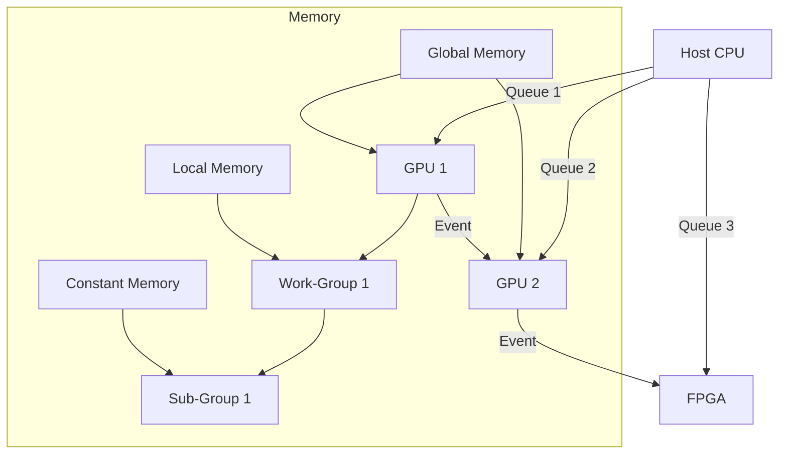

# OpenCL Technical Notes
<!-- [Diagram showing a rectangular layout of an advanced OpenCL system: a host CPU managing multiple heterogeneous devices (e.g., multi-GPU setup, FPGA), with multiple command queues, event-based synchronization, complex memory hierarchies (global, local, constant), and kernel pipelines with dataflow dependencies.] -->

## Quick Reference
- **Definition**: OpenCL is a cross-platform framework for programming parallel applications across diverse compute devices, optimizing for high-performance workloads.
- **Key Use Cases**: Large-scale simulations, real-time ray tracing, distributed machine learning, and cryptographic computations.
- **Prerequisites**: Proficiency in C/C++ and OpenCL, experience with parallel programming, and access to a multi-device system with OpenCL 2.x support.

## Table of Contents
- [Introduction](#introduction)
- [Core Concepts](#core-concepts)
    - [Fundamental Understanding](#fundamental-understanding)
    - [Visual Architecture](#visual-architecture)
- [Implementation Details](#implementation-details)
    - [Advanced Topics](#advanced-topics-advanced)
- [Real-World Applications](#real-world-applications)
    - [Industry Examples](#industry-examples)
    - [Hands-On Project](#hands-on-project)
- [Tools & Resources](#tools--resources)
    - [Essential Tools](#essential-tools)
    - [Learning Resources](#learning-resources)
- [References](#references)
- [Appendix](#appendix)

## Introduction
- **What**: OpenCL provides a unified API for orchestrating computation across CPUs, GPUs, FPGAs, and other accelerators, with fine-grained control over execution and memory.
- **Why**: It solves the challenge of scaling performance across heterogeneous systems, delivering low-latency, high-throughput solutions for compute-bound problems.
- **Where**: Deployed in high-performance computing (HPC), embedded systems, cloud infrastructure, and real-time graphics engines.

## Core Concepts
### Fundamental Understanding
- **Basic Principles**: OpenCL leverages a host-device model with dynamic work partitioning, advanced memory management (e.g., shared virtual memory in OpenCL 2.0), and fine-tuned kernel execution for maximum device utilization.
- **Key Components**: 
  - **Execution Model**: NDRange work-items grouped into work-groups, with sub-group extensions for intra-group optimization.
  - **Memory Model**: Hierarchical (global, local, private, constant) with explicit control over coherence and access patterns.
  - **Events**: Synchronization primitives for managing dependencies across queues and devices.
- **Common Misconceptions**: 
  - "OpenCL 2.x is universally supported" – Adoption varies by vendor; fallback strategies are critical.
  - "More parallelism is always better" – Memory bandwidth and contention often limit scalability.

### Visual Architecture

- **System Overview**: The host coordinates multiple devices via independent queues, using events for synchronization; kernels exploit sub-groups and memory tiers.
- **Component Relationships**: Devices share global memory, while local memory accelerates work-group computation; events ensure pipeline ordering.

## Implementation Details
### Advanced Topics [Advanced]
```c
// OpenCL 2.0 kernel for a pipelined FFT (Fast Fourier Transform) with shared virtual memory
#include <CL/cl.h>
#include <stdio.h>
#include <math.h>

const char *kernelSource = 
"#pragma OPENCL EXTENSION cl_khr_fp64 : enable\n"
"__kernel void fft_stage(__global double2 *data, __local double2 *scratch, int N, int stage) {\n"
"    int gid = get_global_id(0);\n"
"    int group_size = get_local_size(0);\n"
"    int lid = get_local_id(0);\n"
"    int butterfly = N >> stage;\n"
"    int pair = gid ^ (butterfly >> 1);\n"
"    double angle = -2.0 * M_PI * (gid & (butterfly - 1)) / butterfly;\n"
"    double2 twiddle = (double2)(cos(angle), sin(angle));\n"
"    barrier(CLK_LOCAL_MEM_FENCE);\n" // Sync within work-group
"    scratch[lid] = data[gid];\n"
"    barrier(CLK_LOCAL_MEM_FENCE);\n"
"    double2 a = scratch[lid];\n"
"    double2 b = scratch[lid ^ (butterfly >> 1)];\n"
"    data[gid] = gid < pair ? a + b * twiddle : a - b * twiddle;\n"
"}\n";

int main() {
    // Initialize multi-device setup
    cl_platform_id platform;
    cl_device_id devices[2];
    cl_context context;
    cl_command_queue queues[2];
    clGetPlatformIDs(1, &platform, NULL);
    clGetDeviceIDs(platform, CL_DEVICE_TYPE_ALL, 2, devices, NULL);
    context = clCreateContext(NULL, 2, devices, NULL, NULL, NULL);
    for (int i = 0; i < 2; i++) queues[i] = clCreateCommandQueue(context, devices[i], CL_QUEUE_PROFILING_ENABLE, NULL);

    // Build program
    cl_program program = clCreateProgramWithSource(context, 1, &kernelSource, NULL, NULL);
    clBuildProgram(program, 2, devices, "-cl-std=CL2.0", NULL, NULL);
    cl_kernel kernel = clCreateKernel(program, "fft_stage", NULL);

    // Data setup: 1024-point FFT
    const int N = 1024;
    double2 *data = (double2 *)malloc(sizeof(double2) * N);
    for (int i = 0; i < N; i++) data[i] = (double2)(sin(2 * M_PI * i / N), 0); // Sine wave

    // Shared virtual memory buffer (OpenCL 2.0)
    cl_mem buf = clCreateBuffer(context, CL_MEM_READ_WRITE | CL_MEM_USE_HOST_PTR, sizeof(double2) * N, data, NULL);

    // Pipeline FFT stages across devices
    cl_event events[10];
    size_t globalSize[1] = {N / 2};
    size_t localSize[1] = {64};
    for (int stage = 1; stage <= log2(N); stage++) {
        clSetKernelArg(kernel, 0, sizeof(cl_mem), &buf);
        clSetKernelArg(kernel, 1, sizeof(double2) * localSize[0], NULL); // Local memory
        clSetKernelArg(kernel, 2, sizeof(int), &N);
        clSetKernelArg(kernel, 3, sizeof(int), &stage);
        clEnqueueNDRangeKernel(queues[stage % 2], kernel, 1, NULL, globalSize, localSize, 
                               stage > 1 ? 1 : 0, stage > 1 ? &events[stage - 2] : NULL, &events[stage - 1]);
    }

    // Wait and map result
    clWaitForEvents(1, &events[log2(N) - 1]);
    double2 *result = (double2 *)clEnqueueMapBuffer(queues[0], buf, CL_TRUE, CL_MAP_READ, 0, sizeof(double2) * N, 0, NULL, NULL, NULL);

    // Validate (simplified)
    printf("Sample: %f + %fi\n", result[1].x, result[1].y);

    // Cleanup omitted
    free(data);
    return 0;
}
```
- **System Design**: 
  - Multi-device pipelining with event-based synchronization for overlapping computation.
  - Use of OpenCL 2.0 features like shared virtual memory (SVM) for seamless host-device data access.
- **Optimization Techniques**: 
  - Local memory for scratchpad computation reduces global memory bandwidth.
  - Sub-group execution (if supported) for finer parallelism within work-groups.
  - Coalesced memory access patterns to maximize throughput.
- **Production Considerations**: 
  - Error handling with `clGetEventProfilingInfo` for performance tuning.
  - Fallback to OpenCL 1.2 if 2.0 features (e.g., SVM) are unsupported.
  - Device-specific tuning via runtime queries (`CL_DEVICE_MAX_WORK_GROUP_SIZE`).

## Real-World Applications
### Industry Examples
- **Use Case**: Real-time ray tracing in a game engine using multi-GPU OpenCL.
- **Implementation Pattern**: Distribute ray batches across devices, synchronize via events, and merge results in global memory.
- **Success Metrics**: Achieve 60 FPS at 4K resolution with complex scenes.

### Hands-On Project
- **Project Goals**: Implement a distributed Monte Carlo simulation for financial modeling.
- **Implementation Steps**: 
  1. Partition random number generation across devices.
  2. Use kernels with local memory for per-device accumulation.
  3. Aggregate results with atomic operations or reduction kernels.
- **Validation Methods**: Compare variance and mean against a known benchmark (e.g., Black-Scholes model).

## Tools & Resources
### Essential Tools
- **Development Environment**: CLion or Visual Studio with OpenCL profiling plugins.
- **Key Frameworks**: OpenCL 2.x SDKs (e.g., Intel oneAPI, NVIDIA CUDA 12+).
- **Testing Tools**: gDEBugger, AMD Radeon Profiler, or NVIDIA Nsight Compute.

### Learning Resources
- **Documentation**: OpenCL 2.2 Specification (Khronos Group).
- **Tutorials**: "Advanced OpenCL Optimization" (vendor webinars, e.g., Intel, AMD).
- **Community Resources**: OpenCL Slack channels, SIGGRAPH papers.

## References
- OpenCL Optimization Guide (Khronos Group)
- "High-Performance Computing with OpenCL" (technical papers)
- IEEE Papers on Heterogeneous Computing

## Appendix
- **Glossary**: 
  - NDRange: Multi-dimensional execution space for work-items.
  - SVM: Shared Virtual Memory for host-device coherence.
  - Sub-Group: Smaller thread blocks within a work-group.
- **Setup Guides**: Configuring multi-device OpenCL on Linux/Windows with vendor drivers.

---

This advanced guide dives deep into OpenCL’s core concepts, focusing on production-grade techniques like multi-device orchestration, memory optimization, and event-driven execution, tailored for experienced developers. 