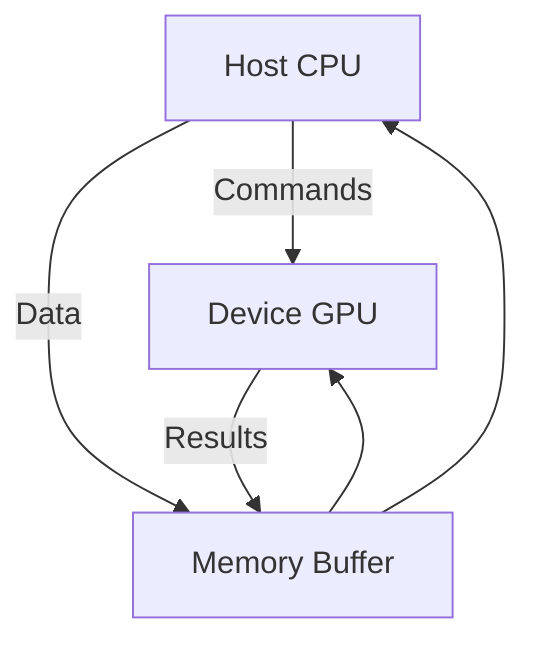

# OpenCL Technical Notes
<!-- [Diagram showing a rectangular layout of a basic OpenCL system: a host CPU connected to a GPU device, with arrows indicating the flow of data and commands between them, simple memory buffers, and a kernel execution flow.] -->

## Quick Reference
- **Definition**: OpenCL (Open Computing Language) is an open standard for writing programs that execute across heterogeneous platforms like CPUs, GPUs, and other processors.
- **Key Use Cases**: Parallel computing tasks such as image processing, scientific simulations, and machine learning.
- **Prerequisites**: Basic programming knowledge (C/C++ preferred), a computer with a compatible GPU or CPU, and an OpenCL-capable driver installed.

## Table of Contents
- [Introduction](#introduction)
- [Core Concepts](#core-concepts)
    - [Fundamental Understanding](#fundamental-understanding)
    - [Visual Architecture](#visual-architecture)
- [Implementation Details](#implementation-details) 
    - [Basic Implementation [Beginner]](#basic-implementation-beginner)
- [Real-World Applications](#real-world-applications)
    - [Industry Examples](#industry-examples)
    - [Hands-On Project](#hands-on-project)
- [Tools & Resources](#tools--resources)
    - [Essential Tools](#essential-tools)
    - [Learning Resources](#learning-resources)
- [References](#references)
- [Appendix](#appendix)
    - [Glossary](#glossary)
    - [Setup Guides](#setup-guides)

## Introduction
- **What**: OpenCL is a framework that allows developers to write programs that run on different types of processors (CPUs, GPUs, etc.) using a single codebase.
- **Why**: It enables faster computation by harnessing parallel processing, solving the problem of slow execution in tasks with heavy data workloads.
- **Where**: Used in gaming, scientific research, data analysis, and any field requiring high-performance computing.

## Core Concepts
### Fundamental Understanding
- **Basic Principles**: OpenCL lets you offload repetitive, parallel tasks from the CPU (host) to a device like a GPU. You write "kernels" (small programs) that run on the device, processing data in parallel.
- **Key Components**: 
  - **Host**: The CPU that manages the program and sends tasks to the device.
  - **Device**: The processor (e.g., GPU) that runs the kernels.
  - **Kernel**: A function written in OpenCL C that executes on the device.
  - **Memory Buffers**: Data containers that move information between host and device.
- **Common Misconceptions**: 
  - "OpenCL is only for GPUs" – It works on CPUs and other processors too.
  - "It’s too hard for beginners" – With basic examples, it’s approachable.

### Visual Architecture

- **System Overview**: The host sets up the environment, transfers data to memory buffers, and tells the device to run kernels.
- **Component Relationships**: The host and device communicate through memory buffers; kernels process data on the device.

## Implementation Details
### Basic Implementation [Beginner]
```c
// Simple OpenCL program to add two arrays
#include <CL/cl.h>
#include <stdio.h>

const char *kernelSource = 
"__kernel void add_arrays(__global float *a, __global float *b, __global float *result) {\n"
"    int id = get_global_id(0);\n" // Get the thread’s unique ID
"    result[id] = a[id] + b[id];\n" // Add elements
"}\n";

int main() {
    // 1. Initialize OpenCL platform and device
    cl_platform_id platform;
    cl_device_id device;
    clGetPlatformIDs(1, &platform, NULL);
    clGetDeviceIDs(platform, CL_DEVICE_TYPE_GPU, 1, &device, NULL);

    // 2. Create context and command queue
    cl_context context = clCreateContext(NULL, 1, &device, NULL, NULL, NULL);
    cl_command_queue queue = clCreateCommandQueue(context, device, 0, NULL);

    // 3. Create and build program
    cl_program program = clCreateProgramWithSource(context, 1, &kernelSource, NULL, NULL);
    clBuildProgram(program, 1, &device, NULL, NULL, NULL);

    // 4. Create kernel
    cl_kernel kernel = clCreateKernel(program, "add_arrays", NULL);

    // 5. Set up memory buffers (example data)
    float a[4] = {1, 2, 3, 4};
    float b[4] = {5, 6, 7, 8};
    float result[4];
    cl_mem bufA = clCreateBuffer(context, CL_MEM_READ_ONLY, sizeof(float) * 4, NULL, NULL);
    cl_mem bufB = clCreateBuffer(context, CL_MEM_READ_ONLY, sizeof(float) * 4, NULL, NULL);
    cl_mem bufResult = clCreateBuffer(context, CL_MEM_WRITE_ONLY, sizeof(float) * 4, NULL, NULL);

    // 6. Write data to buffers
    clEnqueueWriteBuffer(queue, bufA, CL_TRUE, 0, sizeof(float) * 4, a, 0, NULL, NULL);
    clEnqueueWriteBuffer(queue, bufB, CL_TRUE, 0, sizeof(float) * 4, b, 0, NULL, NULL);

    // 7. Set kernel arguments and run
    clSetKernelArg(kernel, 0, sizeof(cl_mem), &bufA);
    clSetKernelArg(kernel, 1, sizeof(cl_mem), &bufB);
    clSetKernelArg(kernel, 2, sizeof(cl_mem), &bufResult);
    size_t globalSize[1] = {4}; // Number of work-items (threads)
    clEnqueueNDRangeKernel(queue, kernel, 1, NULL, globalSize, NULL, 0, NULL, NULL);

    // 8. Read result back
    clEnqueueReadBuffer(queue, bufResult, CL_TRUE, 0, sizeof(float) * 4, result, 0, NULL, NULL);

    // 9. Print result
    for (int i = 0; i < 4; i++) printf("%f ", result[i]); // Expected: 6 8 10 12

    // 10. Cleanup (omitted for brevity)
    return 0;
}
```
- **Step-by-Step Setup**: Install an OpenCL SDK (e.g., from NVIDIA, AMD, or Intel), link the library, and compile with a C compiler.
- **Code Walkthrough**: The host sets up the environment, sends data to the GPU, runs the kernel, and retrieves results.
- **Common Pitfalls**: Forgetting to check errors (use `cl_int err`), mismatched buffer sizes, or not installing the right driver.

## Real-World Applications
### Industry Examples
- **Use Case**: Image filtering (e.g., blurring a photo) by running parallel kernels on each pixel.
- **Implementation Pattern**: Data is split across threads, processed, and recombined.
- **Success Metrics**: Faster processing time compared to CPU-only code.

### Hands-On Project
- **Project Goals**: Create a program to double an array of numbers using OpenCL.
- **Implementation Steps**: 
  1. Set up OpenCL context and queue.
  2. Write a kernel that multiplies each element by 2.
  3. Transfer data, run the kernel, and verify results.
- **Validation Methods**: Compare output (e.g., {2, 4, 6}) to expected results.

## Tools & Resources
### Essential Tools
- **Development Environment**: A C compiler (e.g., GCC) and an OpenCL SDK.
- **Key Frameworks**: OpenCL library (provided by GPU vendors like NVIDIA or AMD).
- **Testing Tools**: CLinfo (to check OpenCL support on your system).

### Learning Resources
- **Documentation**: Khronos OpenCL Registry (opencl.org).
- **Tutorials**: "OpenCL Programming Guide" (free online chapters).
- **Community Resources**: Stack Overflow, OpenCL forums.

## References
- Official OpenCL Specification (Khronos Group)
- "Heterogeneous Computing with OpenCL" (book)
- OpenCL API Reference Card

## Appendix
- **Glossary**: 
  - Kernel: A function that runs on the device.
  - Host: The CPU managing OpenCL.
  - Buffer: Memory used to transfer data.
- **Setup Guides**: Instructions for installing OpenCL on Windows/Linux/macOS (vendor-specific).