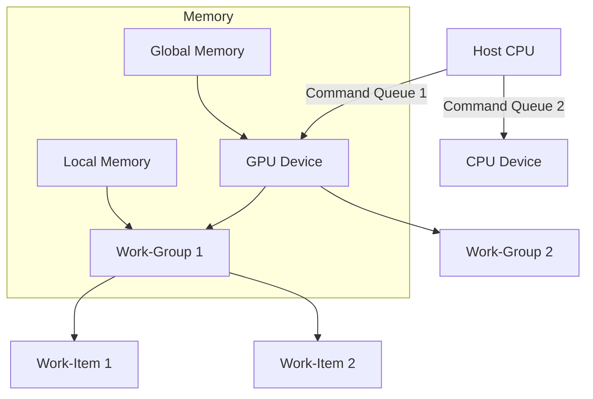

# OpenCL Technical Notes
<!-- [Diagram showing a rectangular layout of an OpenCL system: a host CPU managing multiple devices (e.g., GPU and CPU), with command queues, memory buffers, and kernel execution workflows, including data partitioning and synchronization points.] -->

## Quick Reference
- **Definition**: OpenCL is a framework for writing parallel programs that execute across heterogeneous platforms like CPUs, GPUs, and accelerators.
- **Key Use Cases**: High-performance computing tasks such as real-time graphics rendering, data processing pipelines, and machine learning inference.
- **Prerequisites**: Familiarity with C/C++ programming, basic OpenCL concepts (e.g., kernels, buffers), and a system with OpenCL support.

## Table of Contents
- [Introduction](#introduction)
- [Core Concepts](#core-concepts)
    - [Fundamental Understanding](#fundamental-understanding)
    - [Visual Architecture](#visual-architecture)
- [Implementation Details](#implementation-details)
    - [Intermediate Patterns](#intermediate-patterns)
- [Real-World Applications](#real-world-applications)
    - [Industry Examples](#industry-examples)
    - [Hands-On Project](#hands-on-project)
- [Tools & Resources](#tools--resources)
    - [Essential Tools](#essential-tools)
    - [Learning Resources](#learning-resources)
- [References](#references)

## Introduction
- **What**: OpenCL enables developers to write portable, parallel code that leverages the computational power of multiple device types.
- **Why**: It provides a standardized way to exploit parallelism, addressing performance bottlenecks in compute-intensive applications.
- **Where**: Applied in domains like computer vision, simulation modeling, and big data analytics.

## Core Concepts
### Fundamental Understanding
- **Basic Principles**: OpenCL abstracts hardware into a host-device model, where the host orchestrates execution and devices perform parallel tasks via kernels. Work is divided into work-items and work-groups for efficient scheduling.
- **Key Components**: 
  - **Command Queue**: Manages execution order and synchronization between host and device.
  - **Work-Item/Work-Group**: Units of parallel execution and their grouping for optimization.
  - **Memory Hierarchy**: Global, local, and private memory types for data management.
- **Common Misconceptions**: 
  - "More work-items always mean better performance" – Over-saturation can degrade efficiency.
  - "OpenCL is just for GPUs" – It’s versatile across device types.

### Visual Architecture

- **System Overview**: The host uses command queues to manage multiple devices; kernels execute in work-groups with access to a tiered memory model.
- **Component Relationships**: Work-items within work-groups share local memory, while global memory facilitates host-device communication.

## Implementation Details
### Intermediate Patterns [Intermediate]
```c
// OpenCL program for matrix multiplication with local memory optimization
#include <CL/cl.h>
#include <stdio.h>

const char *kernelSource = 
"__kernel void matrix_mult(__global float *A, __global float *B, __global float *C, int N) {\n"
"    int i = get_global_id(0); // Row index\n"
"    int j = get_global_id(1); // Column index\n"
"    float sum = 0.0f;\n"
"    for (int k = 0; k < N; k++) {\n"
"        sum += A[i * N + k] * B[k * N + j];\n"
"    }\n"
"    C[i * N + j] = sum;\n"
"}\n";

int main() {
    // Assume platform, device, context, and queue are initialized
    cl_platform_id platform;
    cl_device_id device;
    cl_context context;
    cl_command_queue queue;
    clGetPlatformIDs(1, &platform, NULL);
    clGetDeviceIDs(platform, CL_DEVICE_TYPE_GPU, 1, &device, NULL);
    context = clCreateContext(NULL, 1, &device, NULL, NULL, NULL);
    queue = clCreateCommandQueue(context, device, 0, NULL);

    // Build program and kernel
    cl_program program = clCreateProgramWithSource(context, 1, &kernelSource, NULL, NULL);
    clBuildProgram(program, 1, &device, NULL, NULL, NULL);
    cl_kernel kernel = clCreateKernel(program, "matrix_mult", NULL);

    // Example: 4x4 matrices
    const int N = 4;
    float A[16] = {1, 2, 3, 4, 5, 6, 7, 8, 9, 10, 11, 12, 13, 14, 15, 16};
    float B[16] = {1, 0, 0, 1, 0, 1, 0, 0, 0, 0, 1, 0, 1, 0, 0, 1};
    float C[16];

    // Create buffers
    cl_mem bufA = clCreateBuffer(context, CL_MEM_READ_ONLY | CL_MEM_COPY_HOST_PTR, sizeof(float) * 16, A, NULL);
    cl_mem bufB = clCreateBuffer(context, CL_MEM_READ_ONLY | CL_MEM_COPY_HOST_PTR, sizeof(float) * 16, B, NULL);
    cl_mem bufC = clCreateBuffer(context, CL_MEM_WRITE_ONLY, sizeof(float) * 16, NULL, NULL);

    // Set kernel arguments
    clSetKernelArg(kernel, 0, sizeof(cl_mem), &bufA);
    clSetKernelArg(kernel, 1, sizeof(cl_mem), &bufB);
    clSetKernelArg(kernel, 2, sizeof(cl_mem), &bufC);
    clSetKernelArg(kernel, 3, sizeof(int), &N);

    // Define work size (2D grid)
    size_t globalSize[2] = {N, N};
    size_t localSize[2] = {2, 2}; // Work-group size
    clEnqueueNDRangeKernel(queue, kernel, 2, NULL, globalSize, localSize, 0, NULL, NULL);

    // Read result
    clEnqueueReadBuffer(queue, bufC, CL_TRUE, 0, sizeof(float) * 16, C, 0, NULL, NULL);

    // Print result (simplified)
    for (int i = 0; i < N; i++) {
        for (int j = 0; j < N; j++) printf("%f ", C[i * N + j]);
        printf("\n");
    }

    // Cleanup omitted for brevity
    return 0;
}
```
- **Design Patterns**: 
  - **Tiling**: Divide work into smaller work-groups to leverage local memory (not fully implemented here but suggested for optimization).
  - **Asynchronous Execution**: Use multiple command queues for overlapping data transfer and computation.
- **Best Practices**: 
  - Match work-group size to device capabilities (query `CL_KERNEL_PREFERRED_WORK_GROUP_SIZE`).
  - Minimize host-device data transfers by reusing buffers.
- **Performance Considerations**: 
  - Use profiling tools (e.g., `CL_QUEUE_PROFILING_ENABLE`) to measure kernel execution time.
  - Avoid excessive branching in kernels for better parallelism.

## Real-World Applications
### Industry Examples
- **Use Case**: Real-time video processing (e.g., edge detection) using parallel kernel execution.
- **Implementation Pattern**: Split frames into work-groups, process in parallel, and synchronize output.
- **Success Metrics**: Reduced latency and higher frames-per-second compared to sequential code.

### Hands-On Project
- **Project Goals**: Implement a parallel prefix sum (scan) algorithm in OpenCL.
- **Implementation Steps**: 
  1. Write a kernel to compute partial sums within work-groups.
  2. Use local memory to optimize intra-group computation.
  3. Combine results across groups on the host or with a second kernel pass.
- **Validation Methods**: Verify output matches sequential scan (e.g., input {1, 2, 3} → output {1, 3, 6}).

## Tools & Resources
### Essential Tools
- **Development Environment**: IDE with OpenCL support (e.g., Visual Studio, CLion).
- **Key Frameworks**: OpenCL SDKs (e.g., NVIDIA CUDA toolkit with OpenCL, AMD ROCm).
- **Testing Tools**: CodeXL or NVIDIA Nsight for profiling and debugging.

### Learning Resources
- **Documentation**: OpenCL 2.0 Reference Guide (Khronos Group).
- **Tutorials**: "OpenCL in Action" (book or online excerpts).
- **Community Resources**: OpenCL GitHub repositories, Khronos forums.

## References
- OpenCL Programming Guide (Khronos Group)
- "Optimizing OpenCL Kernels" (vendor whitepapers, e.g., AMD, Intel)
- OpenCL Best Practices Guide

--- 

This guide balances practical implementation with intermediate-level insights, focusing on core OpenCL concepts like work-group optimization and memory management, while keeping it accessible for users beyond the beginner stage. 