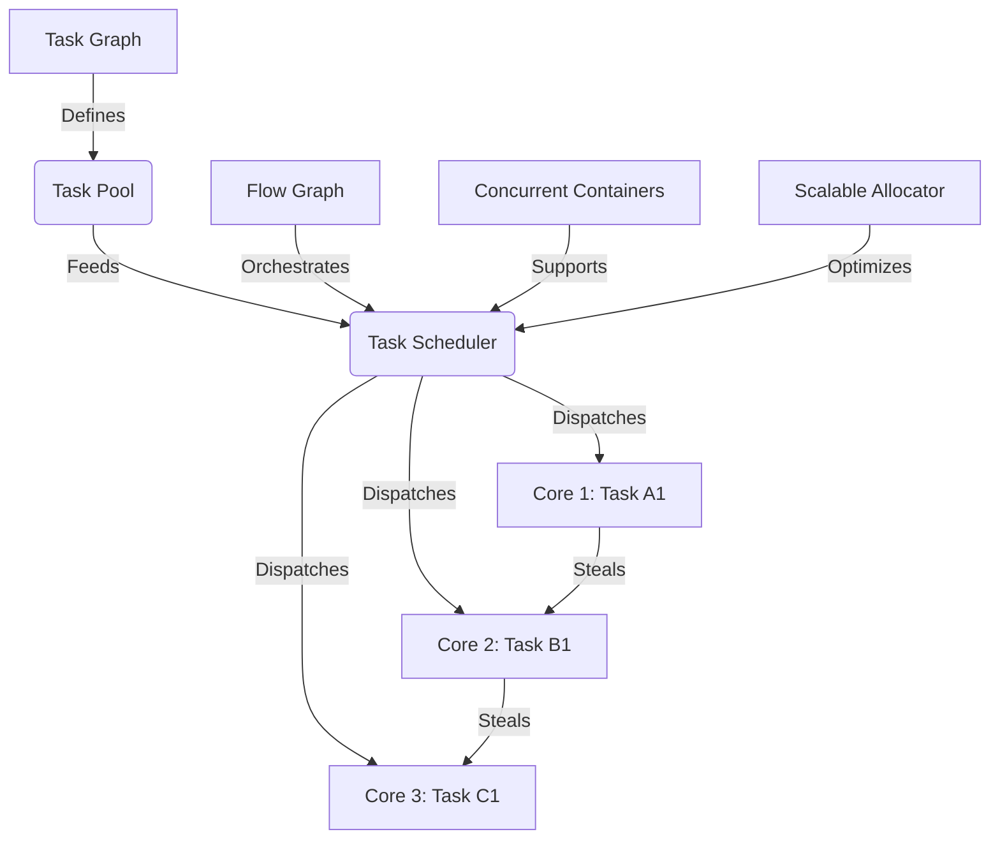

# Intel TBB Technical Notes

<!-- [Image Description: A rectangular diagram showcasing a complex multi-core system with eight cores, each executing tasks like "Task A1," "Task B2," etc. A "Task Scheduler" connects to a "Task Graph" with dependencies (arrows between tasks) and a "Task Pool." Additional components like "Concurrent Containers," "Flow Graph," and "Parallel Algorithms" are integrated, with annotations for "Work Stealing" and "Cache Affinity." The title "Intel TBB: Advanced Task-Based Parallelism" sits atop a detailed, technical layout in blue, green, and gray tones.] -->

## Quick Reference
- **One-sentence definition**: Intel TBB is a sophisticated C++ library for task-based parallelism that optimizes multi-core performance through dynamic scheduling and scalable abstractions.
- **Key use cases**: High-performance computing, real-time systems, and large-scale application optimization.
- **Prerequisites**: Advanced C++ (templates, smart pointers, concurrency), deep understanding of parallelism, and experience with multi-core systems.

## Table of Contents
1. [Introduction](#introduction)
2. [Core Concepts](#core-concepts)
    - [Fundamental Understanding](#fundamental-understanding)
    - [Visual Architecture](#visual-architecture)
3. [Implementation Details](#implementation-details)
    - [Advanced Topics](#advanced-topics)
4. [Real-World Applications](#real-world-applications)
    - [Industry Examples](#industry-examples)
    - [Hands-On Project](#hands-on-project)
5. [Tools & Resources](#tools--resources)
    - [Essential Tools](#essential-tools)
    - [Learning Resources](#learning-resources)
6. [References](#references)
7. [Appendix](#appendix)
    - [Glossary](#glossary)

## Introduction
- **What**: Intel TBB is a powerful C++ library that abstracts low-level threading into a task-based model, leveraging advanced scheduling and concurrency primitives for optimal multi-core execution.
- **Why**: It addresses the challenges of scalability, load balancing, and resource efficiency in complex parallel systems, outperforming manual threading in production environments.
- **Where**: Deployed in high-stakes domains like financial modeling, real-time graphics, distributed simulations, and enterprise software.

## Core Concepts

### Fundamental Understanding
- **Basic Principles**:
  - **Task Granularity**: Fine-tuned task sizing balances overhead and parallelism; too fine increases scheduling cost, too coarse limits core utilization.
  - **Dynamic Scheduling**: TBB’s work-stealing scheduler adapts to runtime conditions, maximizing throughput.
  - **Dependency Management**: Flow graphs handle task dependencies explicitly, enabling complex workflows.
- **Key Components**:
  - **Task Scheduler**: Employs work-stealing queues per thread, optimized for cache locality.
  - **Flow Graph**: A graph-based API for task dependencies and pipeline parallelism.
  - **Memory Allocators**: Scalable `tbb::scalable_allocator` reduces contention in parallel allocations.
- **Common Misconceptions**:
  - **"TBB eliminates all synchronization"**: It reduces it, but explicit synchronization (e.g., locks) may still be needed.
  - **"Performance scales linearly"**: Gains plateau due to memory bandwidth or contention.

### Visual Architecture

- **System Overview**: Tasks flow from a graph or pool to a scheduler, which dynamically assigns them to cores with work stealing.
- **Component Relationships**: Flow graphs define dependencies, containers ensure thread safety, and allocators enhance memory performance.

## Implementation Details

### Advanced Topics [Advanced]

[C++]
```cpp
#include <iostream>
#include <vector>
#include <tbb/parallel_for.h>
#include <tbb/parallel_reduce.h>
#include <tbb/task_group.h>
#include <tbb/flow_graph.h>
#include <tbb/scalable_allocator.h>

// Advanced example: Parallel pipeline with flow graph and custom allocator
int main() {
    const int size = 100000;
    std::vector<int, tbb::scalable_allocator<int>> data(size);
    for (int i = 0; i < size; i++) data[i] = i + 1;

    // Flow graph for pipelined computation
    tbb::flow::graph g;
    tbb::flow::function_node<int, int> square_node(g, tbb::flow::unlimited,
        [](int x) { return x * x; });
    tbb::flow::function_node<int, int> double_node(g, tbb::flow::unlimited,
        [](int x) { return x * 2; });
    tbb::flow::make_edge(square_node, double_node);

    // Task group for managing parallel tasks
    tbb::task_group tg;
    int sum = 0;
    tg.run([&]() {
        sum = tbb::parallel_reduce(
            tbb::blocked_range<size_t>(0, size), 0,
            [&](const tbb::blocked_range<size_t>& r, int local_sum) -> int {
                for (size_t i = r.begin(); i != r.end(); ++i) {
                    int squared = square_node.try_put_and_wait(data[i]);
                    local_sum += double_node.try_put_and_wait(squared);
                }
                return local_sum;
            },
            [](int x, int y) { return x + y; }
        );
    });
    tg.wait();

    std::cout << "Pipeline result: " << sum << std::endl;
    return 0;
}
```
- **System Design**:
  - **Flow Graph**: Models a pipeline where data is squared, then doubled, with explicit dependencies.
  - **Task Group**: Manages high-level parallelism alongside fine-grained tasks.
  - **Scalable Allocator**: Reduces memory contention in large-scale allocations.
- **Optimization Techniques**:
  - Use `blocked_range` with custom grain sizes (e.g., `tbb::blocked_range<size_t>(0, size, 1000)`) for cache efficiency.
  - Tune scheduler with `tbb::task_scheduler_init` for specific thread counts.
  - Leverage `flow::unlimited` concurrency for CPU-bound tasks, but cap for I/O-bound ones.
- **Production Considerations**:
  - Profile with Intel VTune to identify bottlenecks (e.g., memory bandwidth).
  - Handle exceptions in tasks using `tbb::captured_exception`.
  - Ensure thread safety with concurrent containers or atomic operations.

## Real-World Applications

### Industry Examples
- **Use Case**: Financial modeling (e.g., Monte Carlo simulations).
  - TBB parallelizes independent trials across cores.
  - **Implementation Pattern**: `parallel_for` with `scalable_allocator`.
  - **Success Metric**: 5x speedup on 8-core systems.
- **Use Case**: Real-time ray tracing in gaming.
  - Flow graphs manage rendering pipelines.
  - **Success Metric**: Latency reduced from 50ms to 10ms per frame.

### Hands-On Project
- **Project Goals**: Parallel matrix-vector multiplication with optimization.
- **Implementation Steps**:
  1. Define a 1000x1000 matrix and a 1000-element vector.
  2. Use `parallel_for` with custom partitioning and `scalable_allocator`.
  3. Validate against sequential result.
  ```cpp
  #include <iostream>
  #include <vector>
  #include <tbb/parallel_for.h>
  #include <tbb/scalable_allocator.h>

  int main() {
      const int n = 1000;
      std::vector<std::vector<double, tbb::scalable_allocator<double>>, 
                  tbb::scalable_allocator<std::vector<double>>> matrix(n, 
                  std::vector<double, tbb::scalable_allocator<double>>(n, 1.0));
      std::vector<double, tbb::scalable_allocator<double>> vec(n, 2.0);
      std::vector<double, tbb::scalable_allocator<double>> result(n, 0.0);

      tbb::parallel_for(tbb::blocked_range<size_t>(0, n, 64), [&](const auto& r) {
          for (size_t i = r.begin(); i != r.end(); ++i) {
              double sum = 0.0;
              for (size_t j = 0; j < n; ++j) {
                  sum += matrix[i][j] * vec[j];
              }
              result[i] = sum;
          }
      });

      std::cout << "Result[0]: " << result[0] << std::endl; // Should be 2000
      return 0;
  }
  ```
- **Validation Methods**: Compare with sequential dot product; measure speedup with profiling tools.

## Tools & Resources

### Essential Tools
- **Development Environment**: GCC/Clang with C++17, Visual Studio 2022.
- **Key Frameworks**: Intel TBB (latest stable release), Intel oneAPI for integration.
- **Testing Tools**: Intel VTune, ThreadSanitizer, perf.

### Learning Resources
- **Documentation**: [Intel TBB Flow Graph Guide](https://www.intel.com/content/www/us/en/developer/tools/oneapi/tbb.html).
- **Tutorials**: “Advanced TBB Optimization” on Intel Developer Zone.
- **Community Resources**: TBB GitHub issues, CppCon talks.

## References
- **Official Documentation**: Intel TBB API Reference.
- **Technical Papers**: “Work-Stealing in TBB” (Arch Robison, 2007).
- **Industry Standards**: C++20 concurrency extensions.

## Appendix

### Glossary
- **Flow Graph**: A TBB construct for task dependencies.
- **Grain Size**: The chunk size of work per task.
- **Scalable Allocator**: Memory manager optimized for parallel access.

---

This guide targets advanced users, diving into Intel TBB’s core concepts with production-grade examples and optimization strategies.

---
Gen-Tool: grok3 (March 2025)