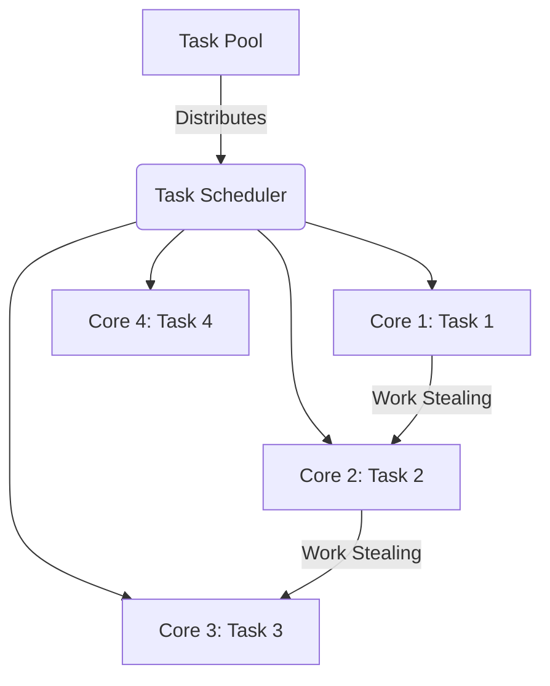

# Intel TBB Technical Notes

<!-- [Image Description: A rectangular diagram showing a simple multi-core CPU with four cores, each running a separate task labeled "Task 1" to "Task 4." Arrows indicate a task scheduler distributing work from a central "Task Pool" to the cores. The title "Intel TBB: Task-Based Parallelism" is displayed at the top, with a clean, beginner-friendly layout using blue and green tones.] -->

## Quick Reference
- **One-sentence definition**: Intel TBB is a C++ library that simplifies parallel programming by managing tasks instead of threads on multi-core systems.
- **Key use cases**: Speeding up CPU-bound tasks like data processing, simulations, and simple parallel algorithms.
- **Prerequisites**: Basic C++ knowledge (variables, loops, functions), a C++ compiler (e.g., GCC), and a multi-core system.

## Table of Contents
1. [Introduction](#introduction)
2. [Core Concepts](#core-concepts)
    - [Fundamental Understanding](#fundamental-understanding)
    - [Visual Architecture](#visual-architecture)
3. [Implementation Details](#implementation-details)
    - [Basic Implementation](#basic-implementation-beginner)
4. [Real-World Applications](#real-world-applications)
    - [Industry Examples](#industry-examples)
    - [Hands-On Project](#hands-on-project)
5. [Tools & Resources](#tools--resources)
    - [Essential Tools](#essential-tools)
    - [Learning Resources](#learning-resources)
6. [References](#references)
7. [Appendix](#appendix)
    - [Glossary](#glossary)

## Introduction
- **What**: Intel TBB (Threading Building Blocks) is a library for C++ that helps developers write programs that run faster by using multiple CPU cores. Instead of manually creating and managing threads, TBB focuses on breaking work into "tasks" and automatically distributes them across cores.
- **Why**: Writing parallel code with raw threads is hard and error-prone (e.g., race conditions, deadlocks). TBB makes it easier and safer, improving performance on modern multi-core CPUs.
- **Where**: Used in desktop applications, games, scientific tools, and small-scale data processing projects.

## Core Concepts

### Fundamental Understanding
- **Basic Principles**:
  - **Parallelism**: Running multiple tasks at the same time on different CPU cores.
  - **Tasks vs. Threads**: TBB lets you define "what to do" (tasks) instead of "how to do it" (threads). A scheduler handles the rest.
  - **Work Stealing**: Idle cores "steal" tasks from busy ones to keep all cores working.
- **Key Components**:
  - **Task Scheduler**: The brain of TBB that assigns tasks to cores.
  - **Parallel Algorithms**: Ready-made functions like `parallel_for` to split loops across cores.
  - **Containers**: Special data structures (e.g., `concurrent_vector`) safe for parallel use.
- **Common Misconceptions**:
  - **"TBB is just for experts"**: No, it’s beginner-friendly with simple APIs.
  - **"More cores = always faster"**: Speed depends on how well tasks can be split.

### Visual Architecture

- **System Overview**: The Task Scheduler takes tasks from a pool and assigns them to CPU cores.
- **Component Relationships**: Cores work independently but can steal tasks if idle, balancing the load.

## Implementation Details

### Basic Implementation [Beginner]

[C++]
```cpp
#include <iostream>
#include <tbb/parallel_for.h>

// Basic example: Squaring numbers in parallel
int main() {
    const int size = 10;
    int numbers[size] = {1, 2, 3, 4, 5, 6, 7, 8, 9, 10};

    // parallel_for splits the loop across cores
    tbb::parallel_for(0, size, [&](int i) {
        numbers[i] = numbers[i] * numbers[i]; // Square each number
    });

    // Print results
    for (int i = 0; i < size; i++) {
        std::cout << numbers[i] << " ";
    }
    std::cout << std::endl;

    return 0;
}
```
- **Step-by-Step Setup**:
  1. Install TBB (e.g., `sudo apt install libtbb-dev` on Ubuntu).
  2. Compile with `-ltbb`: `g++ -std=c++11 example.cpp -ltbb -o example`.
  3. Run: `./example`.
- **Code Walkthrough**:
  - `#include <tbb/parallel_for.h>`: Adds TBB’s parallel loop function.
  - `parallel_for(0, size, ...)`: Splits the range 0 to 9 into tasks for each core.
  - Lambda `[&](int i)`: Defines what each task does (squaring a number).
- **Common Pitfalls**:
  - Forgetting to link TBB (`-ltbb`) causes compile errors.
  - Using `std::cout` inside `parallel_for` can mix output; avoid it for now.

## Real-World Applications

### Industry Examples
- **Use Case**: Video editing software speeding up frame processing.
  - TBB splits rendering tasks across cores for faster previews.
  - **Success Metric**: Reduced rendering time (e.g., 10s to 3s).
- **Use Case**: Simple data analysis tools.
  - Parallel summing or averaging large datasets.

### Hands-On Project
- **Project Goals**: Calculate the sum of squares for numbers 1 to 100 in parallel.
- **Implementation Steps**:
  1. Create an array of 100 numbers.
  2. Use `parallel_for` to square each number.
  3. Sum the results (sequentially for simplicity).
  ```cpp
  #include <iostream>
  #include <tbb/parallel_for.h>

  int main() {
      const int size = 100;
      int numbers[size];
      for (int i = 0; i < size; i++) numbers[i] = i + 1;

      tbb::parallel_for(0, size, [&](int i) {
          numbers[i] = numbers[i] * numbers[i];
      });

      int sum = 0;
      for (int i = 0; i < size; i++) sum += numbers[i];
      std::cout << "Sum of squares: " << sum << std::endl;
      return 0;
  }
  ```
- **Validation Methods**: Check if `sum` matches the mathematical result (338,350 for 1² + 2² + ... + 100²).

## Tools & Resources

### Essential Tools
- **Development Environment**: GCC (Linux), Visual Studio (Windows).
- **Key Frameworks**: Intel TBB (install via package manager or download from GitHub).
- **Testing Tools**: Use `time` command (e.g., `time ./example`) to measure speedup.

### Learning Resources
- **Documentation**: [Intel TBB Official Docs](https://www.intel.com/content/www/us/en/developer/tools/oneapi/tbb.html).
- **Tutorials**: “TBB Tutorial” on Intel’s Developer Zone.
- **Community Resources**: Stack Overflow (tag: `tbb`), Reddit’s r/cpp.

## References
- **Official Documentation**: Intel TBB User Guide.
- **Technical Papers**: “Threading Building Blocks: A Task-Based Approach” (Intel whitepaper).
- **Industry Standards**: C++11 or later for lambda support.

## Appendix

### Glossary
- **Task**: A small unit of work in TBB.
- **Work Stealing**: When idle cores take tasks from busy ones.
- **Parallelism**: Running tasks at the same time on multiple cores.

---

This guide is designed for beginners, focusing on Intel TBB’s core concepts with simple examples and minimal complexity.

---
Gen-Tool: grok3 (March 2025)