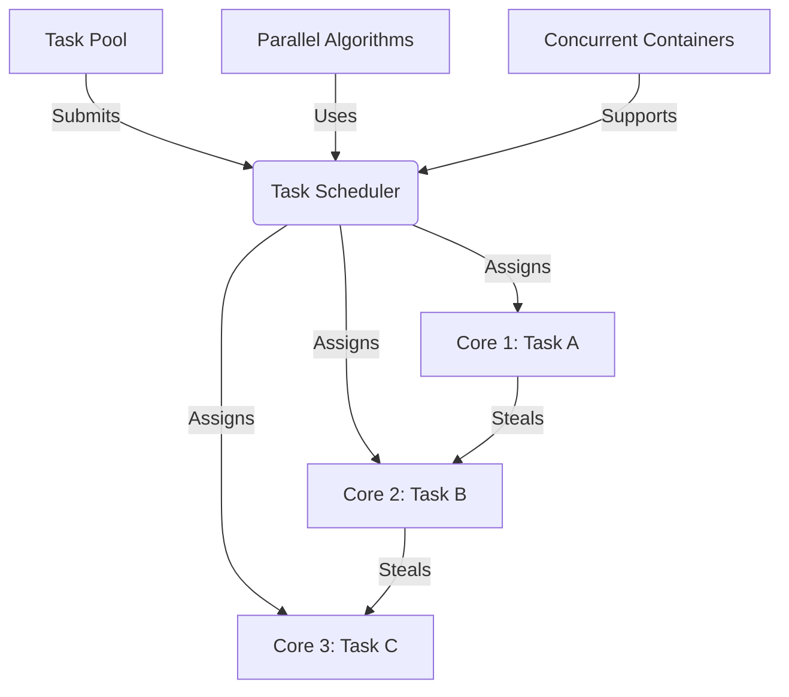

# Intel TBB Technical Notes

<!-- [Image Description: A rectangular diagram depicting a multi-core CPU with six cores, each labeled with tasks like "Task A," "Task B," etc. A central "Task Scheduler" connects to a "Task Pool" with arrows showing task distribution and work-stealing loops between cores. A sidebar highlights "Parallel Algorithms" (e.g., `parallel_for`, `parallel_reduce`) and "Concurrent Containers" in green and blue tones, with the title "Intel TBB: Intermediate Parallelism Concepts" at the top.] -->

## Quick Reference
- **One-sentence definition**: Intel TBB is a C++ library that abstracts thread management into task-based parallelism for efficient multi-core CPU utilization.
- **Key use cases**: Optimizing performance in data processing, simulations, and scalable application development.
- **Prerequisites**: Solid C++ knowledge (classes, templates, lambdas), familiarity with parallelism basics, and a multi-core system with TBB installed.

## Table of Contents
1. [Introduction](#introduction)
2. [Core Concepts](#core-concepts)
  - [Fundamental Understanding](#fundamental-understanding)
  - [Visual Architecture](#visual-architecture)
3. [Implementation Details](#implementation-details)
  - [Intermediate Patterns](#intermediate-patterns)
4. [Real-World Applications](#real-world-applications)
  - [Industry Examples](#industry-examples)
  - [Hands-On Project](#hands-on-project)
5. [Tools & Resources](#tools--resources)
  - [Essential Tools](#essential-tools)
  - [Learning Resources](#learning-resources)
6. [References](#references)
7. [Appendix](#appendix)
  - [Glossary](#glossary)

## Introduction
- **What**: Intel TBB is a high-level C++ library for parallel programming that simplifies the use of multi-core processors by focusing on tasks rather than explicit thread management.
- **Why**: It reduces the complexity of manual threading (e.g., avoiding race conditions, ensuring load balance) while providing scalable performance for intermediate-level applications.
- **Where**: Common in performance-critical software like game engines, scientific simulations, and mid-scale data analytics tools.

## Core Concepts

### Fundamental Understanding
- **Basic Principles**:
  - **Task-Based Parallelism**: Define independent tasks; TBB’s scheduler maps them to threads dynamically.
  - **Load Balancing**: Work stealing ensures even distribution across cores, adapting to workload changes.
  - **Scalability**: Performance improves with core count, assuming tasks are well-partitioned.
- **Key Components**:
  - **Task Scheduler**: Manages task execution and work stealing.
  - **Parallel Algorithms**: Functions like `parallel_for`, `parallel_reduce`, and `parallel_pipeline` for common patterns.
  - **Concurrent Containers**: Thread-safe data structures (e.g., `concurrent_queue`, `concurrent_vector`).
- **Common Misconceptions**:
  - **"TBB handles everything automatically"**: It simplifies threading, but task design still impacts performance.
  - **"More tasks = better"**: Too many small tasks increase overhead; granularity matters.

### Visual Architecture

- **System Overview**: The scheduler pulls tasks from a pool, assigns them to cores, and enables work stealing for balance.
- **Component Relationships**: Algorithms and containers integrate with the scheduler to optimize task execution.

## Implementation Details

### Intermediate Patterns [Intermediate]

[C++]
```cpp
#include <iostream>
#include <vector>
#include <tbb/parallel_for.h>
#include <tbb/parallel_reduce.h>
#include <tbb/blocked_range.h>

// Example: Parallel sum of squares with reduction
int main() {
    const int size = 10000;
    std::vector<int> numbers(size);
    for (int i = 0; i < size; i++) numbers[i] = i + 1;

    // Parallel computation of squares and sum
    int sum = tbb::parallel_reduce(
        tbb::blocked_range<size_t>(0, size), // Range to split
        0,                                   // Initial value
        [&](const tbb::blocked_range<size_t>& r, int local_sum) -> int {
            for (size_t i = r.begin(); i != r.end(); ++i) {
                local_sum += numbers[i] * numbers[i]; // Square and add
            }
            return local_sum;
        },
        [](int x, int y) { return x + y; } // Combine results
    );

    std::cout << "Sum of squares: " << sum << std::endl;
    return 0;
}
```
- **Design Patterns**:
  - **Reduction**: Use `parallel_reduce` to combine partial results (e.g., summing).
  - **Range-Based Partitioning**: `blocked_range` splits work into chunks for better cache efficiency.
- **Best Practices**:
  - Use `blocked_range` for contiguous data to minimize cache misses.
  - Avoid I/O (e.g., `std::cout`) inside parallel sections to prevent bottlenecks.
  - Match task size to workload: too small increases overhead, too large reduces parallelism.
- **Performance Considerations**:
  - Measure speedup with `time` or profiling tools (e.g., Intel VTune).
  - Test on different core counts to verify scalability.
  - Overhead is low for CPU-bound tasks but noticeable for tiny operations.

## Real-World Applications

### Industry Examples
- **Use Case**: Game physics engine.
  - TBB parallelizes collision detection across objects.
  - **Implementation Pattern**: `parallel_for` over object pairs.
  - **Success Metric**: Frames per second increase (e.g., 30 FPS to 60 FPS).
- **Use Case**: Image processing software.
  - Parallel filtering of pixel regions.
  - **Success Metric**: Processing time halved on multi-core systems.

### Hands-On Project
- **Project Goals**: Compute the average of squared values in a large dataset.
- **Implementation Steps**:
  1. Initialize a vector with 10,000 random numbers.
  2. Use `parallel_for` to square values and `parallel_reduce` to sum them.
  3. Calculate the average.
  ```cpp
  #include <iostream>
  #include <vector>
  #include <random>
  #include <tbb/parallel_for.h>
  #include <tbb/parallel_reduce.h>
  #include <tbb/blocked_range.h>

  int main() {
      const int size = 10000;
      std::vector<double> data(size);
      std::mt19937 rng(42);
      std::uniform_real_distribution<> dist(1.0, 100.0);
      for (int i = 0; i < size; i++) data[i] = dist(rng);

      // Square in parallel
      tbb::parallel_for(tbb::blocked_range<size_t>(0, size),
          [&](const tbb::blocked_range<size_t>& r) {
              for (size_t i = r.begin(); i != r.end(); ++i) {
                  data[i] = data[i] * data[i];
              }
          });

      // Sum in parallel
      double sum = tbb::parallel_reduce(
          tbb::blocked_range<size_t>(0, size), 0.0,
          [&](const tbb::blocked_range<size_t>& r, double local_sum) -> double {
              for (size_t i = r.begin(); i != r.end(); ++i) {
                  local_sum += data[i];
              }
              return local_sum;
          },
          [](double x, double y) { return x + y; }
      );

      double avg = sum / size;
      std::cout << "Average of squares: " << avg << std::endl;
      return 0;
  }
  ```
- **Validation Methods**: Compare with a sequential version to confirm correctness and measure speedup.

## Tools & Resources

### Essential Tools
- **Development Environment**: GCC, Clang, or Visual Studio with TBB support.
- **Key Frameworks**: Intel TBB (latest version from GitHub or package managers).
- **Testing Tools**: Intel VTune Profiler for performance analysis, `valgrind` for memory checks.

### Learning Resources
- **Documentation**: [Intel TBB Developer Guide](https://www.intel.com/content/www/us/en/developer/tools/oneapi/tbb.html).
- **Tutorials**: “Parallel Programming with TBB” on Intel’s site.
- **Community Resources**: GitHub TBB repository, C++ forums (e.g., Stack Overflow).

## References
- **Official Documentation**: Intel TBB API Reference.
- **Technical Papers**: “Task Scheduling in Intel TBB” (Intel whitepaper).
- **Industry Standards**: C++17 for modern features used in TBB.

## Appendix

### Glossary
- **Blocked Range**: A way to split data into chunks for parallel processing.
- **Reduction**: Combining partial results from parallel tasks.
- **Work Stealing**: Dynamic load balancing between cores.

---

This guide targets intermediate users, focusing on Intel TBB’s core concepts with practical patterns and performance insights. 


---
Gen-Tool: grok3 (March 2025)