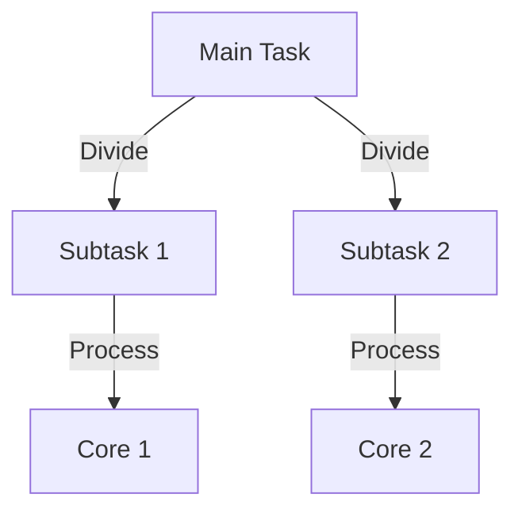

# Parallel Programming Technical Notes


## Quick Reference
- **One-sentence definition**: Parallel programming is the process of executing multiple tasks simultaneously to improve performance and efficiency.
- **Key use cases**: Scientific simulations, real-time data analysis, image and video processing, machine learning training.
- **Prerequisites**: Basic understanding of programming, familiarity with loops and functions, and awareness of computational resources like CPUs and GPUs.

## Table of Contents
- [Introduction](#introduction)
- [Core Concepts](#core-concepts)
  - [Fundamental Understanding](#fundamental-understanding)
  - [Visual Architecture](#visual-architecture)
- [Implementation Details](#implementation-details)
  - [Basic Implementation](#basic-implementation)
- [Real-World Applications](#real-world-applications)
- [Tools & Resources](#tools--resources)
- [References](#references)

## Introduction
- **What**: Parallel programming enables the simultaneous execution of computations by dividing tasks among multiple processors or cores.
- **Why**: It solves the problem of long computation times by leveraging hardware capabilities to perform tasks concurrently.
- **Where**: Used in areas like high-performance computing, graphics rendering, big data processing, and AI model training.

## Core Concepts
### Fundamental Understanding
- **Basic principles**:
  - Divide-and-conquer: Split tasks into smaller sub-tasks.
  - Synchronization: Coordinate tasks to avoid conflicts.
  - Shared vs. distributed memory: Understand resource allocation.
- **Key components**:
  - Threads, processes, and tasks.
  - CPU/GPU cores as execution units.
- **Common misconceptions**:
  - Parallel programming always improves speed (not true due to overhead).
  - More cores always mean better performance (depends on workload).

### Visual Architecture


## Implementation Details
### Basic Implementation
```python
# Example: Parallelizing a loop using multiprocessing in Python
from multiprocessing import Pool

def square(x):
    return x * x

if __name__ == "__main__":
    with Pool(4) as p:  # Use 4 parallel processes
        results = p.map(square, [1, 2, 3, 4])
    print(results)  # Output: [1, 4, 9, 16]
```
- **Step-by-step setup**:
  1. Install Python and necessary libraries.
  2. Understand task partitioning and `multiprocessing.Pool`.
  3. Run the code and analyze performance.
- **Common pitfalls**:
  - Deadlocks caused by improper synchronization.
  - Overhead from context switching.

## Real-World Applications
- **Use cases**:
  - Matrix multiplications in scientific computing.
  - Batch processing of images in machine learning pipelines.

## Tools & Resources
### Essential Tools
- Python `multiprocessing` and `concurrent.futures`.
- IDEs like PyCharm or VSCode.
- Profiling tools like cProfile.

### Learning Resources
- Official Python documentation.
- Tutorials on multiprocessing and threading.

## References
- [Python multiprocessing documentation](https://docs.python.org/3/library/multiprocessing.html)
- [Parallel Programming by Peter Pacheco.](https://github.com/afondiel/cs-books/blob/main/computer-science/parallel-computing/An-Introduction-to-Parallel-Programming-Morgan-Kaufmann-Peter-Pacheco-2ed-2020.pdf)
