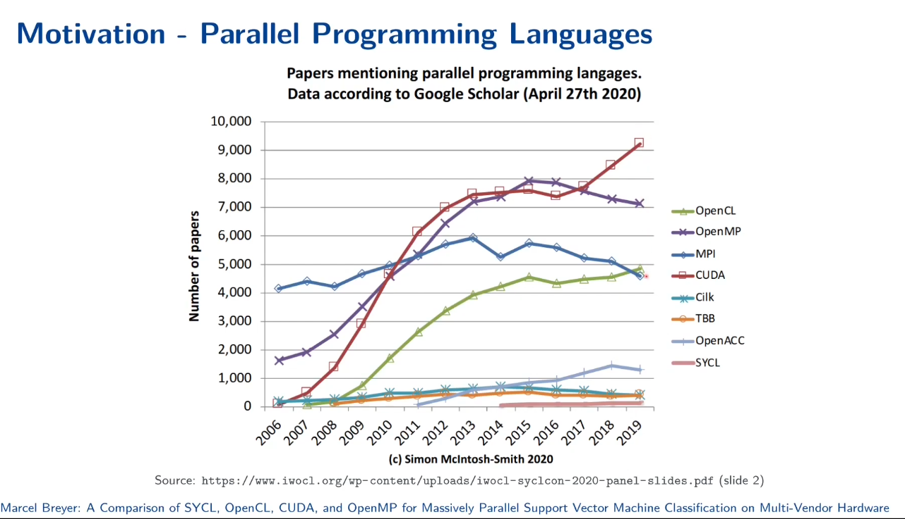

# Parallel Computing (PC) Notes



Src: [IWOCL](https://www.youtube.com/watch?v=-yphY7Rtltc)

## Overview

Parallel Computing (PC) state-of-the-art resources, core concepts, application examples.

## Quick Start

```
│  - readme.md (parallel-computing-guide.md)
│
├───resources/
│
├───concepts/
│  - parallel-computing-core-basics.md
│  - parallel-computing-core-intermediate.md
│  - parallel-computing-core-advanced.md
│
├───examples/
│  - implementation.md
│
└───industry-applications/
        └─── industry-links.md
```

## Related Notes

- [Software Optimization Engineering Notes](../algorithms/optimization/concepts/)
- [Supercomputing - Notes](../supercomputing-notes/)

## Contributing

Please refer to the [CONTRIBUTING.md](../../../CONTRIBUTING.md) file.
