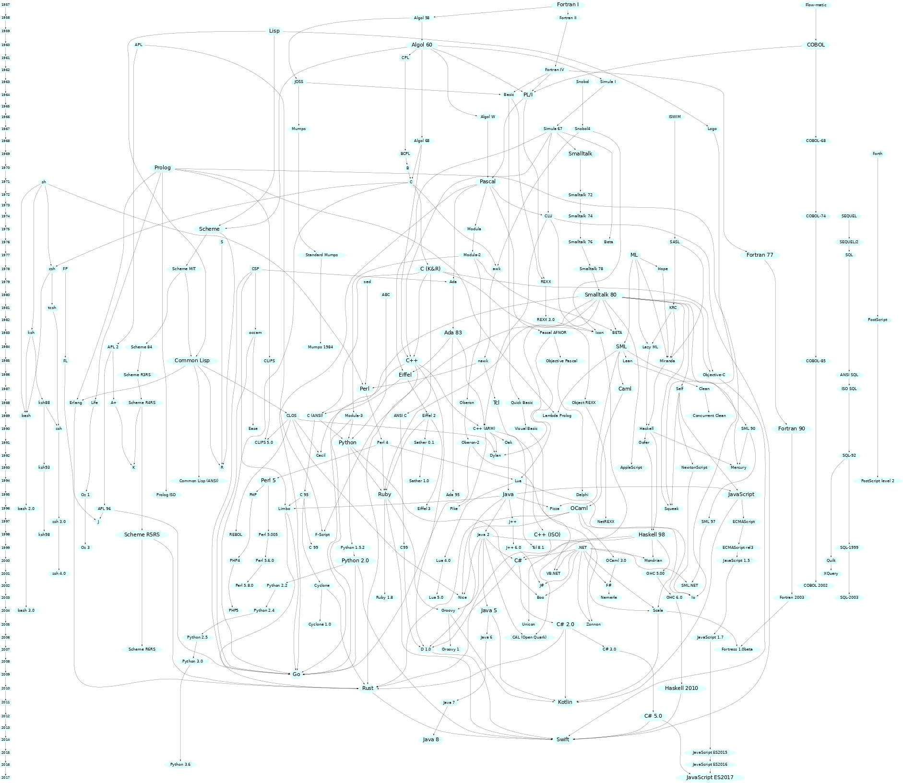

# Programming Languages

## Overview

[Credit to rigaux.org](http://rigaux.org/)

This is a "Hello World" resources for programming languages and data structures.

## Lab & Playground

`Compiler-Interpreter:`

- [Sololearn](https://www.sololearn.com/compiler-playground/cpp)
- [LeetCode](https://leetcode.com/)
- Replit
- Codesandbox
- [Online IDE - Beta](https://www.online-ide.com/)
- Github IDE
- VS Code Online
- Geeks for Geeks
- [CodinGame](https://www.codingame.com/home)

`Jupyter Notebook`:

- Google Colab
- MyBinder
- CoCalc
- Kaggle Kernels
- Deepnote
- JupyterLite
- Mercury
- Noteable

## Contributing

Please refer to this [file](../../CONTRIBUTING.md).

## References

- Collaborative Browser-based online IDE : [Google Colab vs. Jupyter Notebook vs. Kaggle vs. Replit Comparison Chart - SOURCEFORGE](https://sourceforge.net/software/compare/Google-Colab-vs-Jupyter-Notebook-vs-Kaggle-vs-Replit/)

