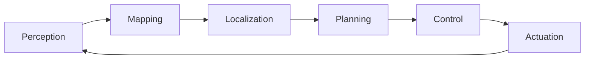

# **Robotics - Notes** 🤖

## **Table of Contents**
- [Introduction](#introduction)
- [Key Concepts](#key-concepts)
- [Applications](#applications)
- [Robotics System Architecture Pipeline](#robotics-system-architecture-pipeline)
- [Robotics Perception and Decision-Making Models](#robotics-perception-and-decision-making-models)
- [How Robotics Systems Work](#how-robotics-systems-work)
- [Types of Robotic Systems](#types-of-robotic-systems)
- [Practical Exercises](#practical-exercises)
- [Challenges & Limitations](#challenges--limitations)
- [Key Tools and Techniques](#key-tools-and-techniques)
- [Sample Code for Robot Control and Navigation](#sample-code-for-robot-control-and-navigation)
- [Advanced Exploration](#advanced-exploration)
- [Robotics Lab Projects](#robotics-lab-projects)
- [Continuous Learning Strategy](#continuous-learning-strategy)
- [References](#references)

---

## **Introduction**

Robotics is an interdisciplinary field that integrates mechanical engineering, electronics, computer science, and AI to design and operate autonomous systems capable of performing complex tasks across various industries (eg: Robots).

---

## **Key Concepts**
- **Actuators and Sensors**: Robots use actuators (e.g., motors) to produce motion and sensors (e.g., cameras, LIDAR) to perceive their environment.
- **Perception**: Enables robots to interpret sensory data to understand their surroundings. Techniques include computer vision, sonar, and tactile sensing.
- **Control Systems**: Algorithms that direct a robot’s actions based on goals and sensor data.
- **Navigation and Path Planning**: Techniques like SLAM (Simultaneous Localization and Mapping) help robots find paths in unknown environments.
- **Autonomy Levels**: Ranges from simple, remote-controlled machines to fully autonomous systems capable of complex decision-making.
- **Human-Robot Interaction (HRI)**: Studies how robots can interact with humans safely and efficiently.

---

## **Applications**
- **Manufacturing**: Robotics enhances precision, speed, and safety in tasks like assembly and welding.
- **Healthcare**: Robotic systems assist in surgeries, diagnostics, and patient care, improving outcomes and accessibility.
- **Agriculture**: Robots perform crop monitoring, harvesting, and pesticide spraying, optimizing labor and resources.
- **Service Industry**: Robots in retail and hospitality enhance customer service, e.g., by providing assistance or inventory monitoring.
- **Defense and Exploration**: Robots enable remote exploration and surveillance in hazardous or inaccessible environments.

---

## Related Notes

- **[AUTONOMOUS AGENTS](../ai/ai-agents-notes)**
- **[ROBOTICS VISION](../computer-vision-notes/industry/robotics/)**
---

## **Robotics System Architecture Pipeline**



---

## **Robotics Perception and Decision-Making Models**
1. **SLAM (Simultaneous Localization and Mapping)**: A technique for creating maps in an unknown environment while tracking the robot's location within it.
2. **Probabilistic Roadmaps (PRM)**: For path planning, PRM uses random sampling to navigate complex spaces.
3. **Markov Decision Processes (MDP)**: Defines decision-making problems in stochastic environments, useful for autonomous navigation.
4. **Reinforcement Learning (RL)**: Robots learn optimal behaviors through trial and error based on rewards, useful in dynamic, uncertain environments.
5. **Kalman Filtering**: Estimates a robot's location by combining noisy sensor data for applications like GPS and visual tracking.

---

## **How Robotics Systems Work**
1. **Sensors Gather Data**: Sensors like cameras, LIDAR, and IMUs (Inertial Measurement Units) collect environmental data.
2. **Data Processing**: Algorithms process sensor data for object recognition, localization, and environmental mapping.
3. **Planning and Decision-Making**: Based on the current map and location, robots plan optimal paths or actions using models like A* or Dijkstra’s algorithm.
4. **Control Execution**: Control systems translate high-level plans into motor commands.
5. **Feedback Loop**: Robots continuously update plans based on new sensor data, adapting to changes.

---

## **Types of Robotic Systems**
- **Industrial Robots**: Designed for repetitive, high-precision tasks (e.g., welding arms).
- **Autonomous Mobile Robots (AMRs)**: Navigate and perform tasks in dynamic environments (e.g., warehouse robots).
- **Collaborative Robots (Cobots)**: Work safely alongside humans in tasks like assembly and quality control.
- **Medical Robots**: Provide assistance in surgery, rehabilitation, and diagnostics.
- **Humanoid Robots**: Robots that mimic human form and movement, often used in research and HRI studies.
- **Agricultural Robots**: Specialized for tasks like crop monitoring, harvesting, and soil analysis.

---

## **Practical Exercises**
1. **SLAM Implementation**: Use LIDAR data to implement SLAM and generate a map of a room or small environment.
2. **Object Detection with OpenCV**: Build a basic object recognition system to detect common items.
3. **Path Planning in a Maze**: Implement an A* algorithm to navigate a maze based on simulated sensor data.
4. **Reinforcement Learning Navigation**: Create a reinforcement learning model to train a robot to reach a goal.
5. **Manipulation Task**: Control a robotic arm to perform a simple pick-and-place task using inverse kinematics.

---

## **Challenges & Limitations**
- **Power Consumption**: Many robots are battery-operated, limiting their operational time and capabilities.
- **Computational Requirements**: Real-time processing of sensor data requires substantial computational resources.
- **Environment Variability**: Real-world environments can be unpredictable, challenging robot autonomy.
- **Safety Concerns**: Robots must be designed to avoid harm to humans, especially in collaborative settings.
- **Sensor Noise and Inaccuracy**: Sensor data can be noisy or distorted, complicating tasks like localization and mapping.

---

### **Key Tools and Techniques**
- **Robotic Operating System (ROS)**: A middleware that facilitates development of robotics applications.
- **Simulation Environments**: Gazebo, V-REP, and [pybullet - Bullet Real-Time Physics Simulation](https://pybullet.org/wordpress/) for testing robotics algorithms in virtual settings.
- **SLAM Libraries**: Google Cartographer and RTAB-Map for mapping and localization.
- **Computer Vision Libraries**: OpenCV and PyTorch for visual perception and recognition.
- **Path Planning Algorithms**: A*, Dijkstra, and RRT (Rapidly-exploring Random Tree) for navigation in complex environments.
- OpenCV
- [Webots by Cyberbotics](https://cyberbotics.com/)
- Eigen 
- Orocos
- [Unity ML Agents](https://github.com/Unity-Technologies/ml-agents)
- [awesome-robotframework - Great Resources!](https://github.com/fkromer/awesome-robotframework) 
---

## Robotics Datasets

- Robot Arm Pushing Dataset
- Robot Arm Grasping Dataset
- Dataset Of Daily Interactive Manipulation
- Fukuoka Datasets For Place Categorisation
- MultiDrone Public DataSet
- Complex Urban Dataset With Multi-Level Sensors From Highly Diverse Urban
- ...

Src: 
- [10 Open-Source Datasets To Learn Robotics](https://analyticsindiamag.com/10-open-source-datasets-to-learn-robotics/)
- [Paper with code - BAIR Robot Pushing - 220 dataset](https://paperswithcode.com/datasets?q=BAIR%20Robot%20Pushing)

## **Hello World: Sample Code for Robot Navigation Using A* Path Planning**

```python
import heapq
import numpy as np

def a_star(grid, start, goal):
    rows, cols = grid.shape
    open_set = []
    heapq.heappush(open_set, (0, start))
    came_from = {start: None}
    g_score = {start: 0}
    
    while open_set:
        _, current = heapq.heappop(open_set)
        
        if current == goal:
            path = []
            while current:
                path.append(current)
                current = came_from[current]
            return path[::-1]
        
        for dx, dy in [(-1, 0), (1, 0), (0, -1), (0, 1)]:
            neighbor = (current[0] + dx, current[1] + dy)
            if 0 <= neighbor[0] < rows and 0 <= neighbor[1] < cols and grid[neighbor] == 0:
                tentative_g_score = g_score[current] + 1
                if neighbor not in g_score or tentative_g_score < g_score[neighbor]:
                    g_score[neighbor] = tentative_g_score
                    f_score = tentative_g_score + np.linalg.norm(np.array(neighbor) - np.array(goal))
                    heapq.heappush(open_set, (f_score, neighbor))
                    came_from[neighbor] = current
    return []

# Example usage:
grid = np.zeros((10, 10))
grid[5, 1:8] = 1  # Add obstacle
start, goal = (0, 0), (9, 9)
path = a_star(grid, start, goal)
print("Path:", path)
```

---

## **Advanced Exploration**
1. **Develop a Full SLAM Pipeline**: Using ROS, implement a full SLAM system integrating LIDAR and odometry data.
2. **Reinforcement Learning for Obstacle Avoidance**: Train a model to adaptively avoid obstacles in a dynamic environment.
3. **Human-Robot Interaction**: Experiment with NLP and gesture recognition for improving HRI.

---

## **Robotics Lab Projects**
1. **Build a Mobile Robot Simulation**: Using ROS and Gazebo, build a simulated AMR that can navigate a warehouse.
2. **Manipulation with a Robotic Arm**: Program a robotic arm to perform pick-and-place tasks.
3. **SLAM with a TurtleBot**: Use a TurtleBot to explore a room autonomously and generate a map.

---

## **Go farther**
- **Hands-on Projects**: Experiment with robot kits or simulators to implement real-world applications.
- **Research Papers**: Read top robotics journals like *IEEE Transactions on Robotics* and *Journal of Field Robotics*.
- **Competitive Robotics**: Participate in competitions (e.g., RoboCup, DARPA Robotics Challenge) to refine skills.

---

## Robotics Companies leading the Wave

- [Boston Dynamics](https://www.bostondynamics.com/)
- [Tesla](tesla.com/AI)
- ...

## Robotics Conferences

- [2023 32nd IEEE International Conference on Robot and Human Interactive Communication (RO-MAN)](https://www.ieee-ras.org/conferences-workshops/technical-committees/robot-human-interactive-communication/ro-man)
- [2023 28th International Conference on Automation and Computing (ICAC)](https://icac2023.bcu.ac.uk/)
- [2023 European Conference on Mobile Robots (ECMR)](http://www.ecmr2023.org/)
- [2023 62nd Annual Conference of the Society of Instrument and Control Engineers (SICE)](https://www.sice.or.jp/conference/sice2023/)
- [2023 5th International Conference on Robotics and Computer Vision (ICRCV)](http://www.icrcv.org/)
- [2023 International Conference on Rehabilitation Robotics (ICORR)](https://icorr2023.org/)
- [2023 IEEE/RSJ International Conference on Intelligent Robots and Systems (IROS)](https://www.iros2023.org/)
- [2023 International Conference on Manipulation, Automation and Robotics at Small Scales (MARSS)](http://marss-conference.org/)
- [2023 23rd International Conference on Control, Automation and Systems (ICCAS)](http://icros.org/)
- [2023 6th International Conference on Robotics, Control and Automation Engineering (RCAE)](http://www.rcae.org/)
- [2023 11th International Conference on Control, Mechatronics and Automation (ICCMA)](https://www.iccma.org/)
- [2023 IEEE International Conference on Development and Learning (ICDL)](https://ieee-cog.org/icdl/)
- [2023 IEEE International Symposium on Safety, Security, and Rescue Robotics (SSRR)](https://ssrrobot.org/)
- [2023 6th International Conference on Mechatronics, Robotics and Automation (ICMRA)](http://www.icmra.org/)
- [2023 8th International Conference on Robotics and Automation Engineering (ICRAE)](http://www.icrae.org/)
- [2023 International Symposium on Micro-NanoMehatronics and Human Science (MHS)](http://mhs2023.org/)
- [2023 5th International Conference on Control and Robotics (ICCR)](https://iccr2023.org/)
- [2023 International Symposium on Multi-Robot and Multi-Agent Systems (MRS)](https://www.roboticsconference.org/)
- [2023 IEEE International Conference on Robotics and Biomimetics (ROBIO)](https://www.ieee-ras.org/conferences-workshops/technical-committees/robotics-and-biomimetics/robio)
- [2023 21st International Conference on Advanced Robotics (ICAR)](http://www.icar2023.org/)
- [2023 8th International Conference on Control, Robotics and Cybernetics (CRC)](http://www.iccrc.org/)
- [2023 8th International Conference on Mechanical Engineering and Robotics Research (ICMERR)](http://www.icmerr.org/)
- [2023 Seventh IEEE International Conference on Robotic Computing (IRC)](https://irc.asia/)
- [2023 IEEE-RAS 22nd International Conference on Humanoid Robots (Humanoids)](https://humanoids2023.org/)
- [2023 2nd International Conference on Automation, Robotics and Computer Engineering (ICARCE)](http://www.icarce.org/)
- [2023 3rd International Conference on Robotics, Automation and Artificial Intelligence (RAAI)](https://www.icorai.org/)
- [2024 IEEE/SICE International Symposium on System Integration (SII)](http://www.sii2024.org/)
- [2024 IEEE Haptics Symposium (HAPTICS)](http://hapticssymposium.org/)
- [2024 IEEE 7th International Conference on Soft Robotics (RoboSoft)](https://robosoft2024.org/)
- [2024 IEEE International Conference on Robotics and Automation (ICRA)](https://www.icra2024.org/)
- [2024 IEEE International Conference on Advanced Robotics and Its Social Impacts (ARSO)](http://www.arso2024.org/)
- [2024 International Conference on Unmanned Aircraft Systems (ICUAS)](https://www.icuas.com/)
- [2024 13th International Workshop on Robot Motion and Control (RoMoCo)](http://www.romoco.put.poznan.pl/)
- [2024 IEEE International Conference on Advanced Intelligent Mechatronics (AIM)](https://www.ieee-aim2024.org/)
- [2024 IEEE 20th International Conference on Automation Science and Engineering (CASE)](https://www.ieee-ras.org/conferences-workshops/technical-committees/robotics-and-automation-society/conferences/case)
- [2024 IEEE-RAS 23rd International Conference on Humanoid Robots (Humanoids)](https://www.humanoids2024.org/)
- [2025 IEEE/SICE International Symposium on System Integration (SII)](https://sii2025.org/)
- [2025 IEEE International Conference on Robotics and Automation (ICRA)](https://www.icra2025.org/)


## **Summary**

Robotics is a rapidly evolving field with interdisciplinary applications that range from industrial automation to healthcare and beyond. These notes aim to provide a robust foundation for understanding robotics and developing practical solutions.


- *Introduction to Autonomous Robots* by Correll, Bekris, et al.
- *Probabilistic Robotics* by Sebastian Thrun, Wolfram Burgard, and Dieter Fox
- *Robotics: Modelling, Planning and Control* by Siciliano et al.


## References 

Wikipedia:  
- [Robotics](https://en.wikipedia.org/wiki/Robotics)

Jornal of field of robotics
- https://onlinelibrary.wiley.com/journal/15564967

ROS: 
- https://www.ros.org/
- https://fr.wikipedia.org/wiki/Robot_Operating_System

NVIDIA: 
- [NVIDIA Deep Learning Institute](https://www.nvidia.com/en-us/training/)
- [NVIDIA CNN course](https://developer.nvidia.com/discover/convolutional-neural-network)

[Holonomic-nonholonomic-constraints-robot](https://www.mecharithm.com/holonomic-nonholonomic-constraints-robots/)

[STATE ESTIMATION FOR ROBOTICS by Timothy D. Barfoot](https://github.com/afondiel/Self-Driving-Cars-Specialization-Coursera/blob/31b9199a9fb46fac5dc1c68af0702ae8e1cd233c/Course2-State-Estimation-and-Localization-for-Self-Driving-Cars/resources/w3/doc/STATE-ESTIMATION-FOR-ROBOTICS-Timothy-D.-Barfoot.pdf)

Lecture & Research:
- Berkeley:
  - [BAIR - AI Lab](https://bair.berkeley.edu/) 
  - [UC Berkeley CS188 Intro to AI -- Course Materials](http://ai.berkeley.edu/home.html)

- MIT: 
  - MIT CSAIL - Research Lab: 
    - [How AI image generators could help robots](https://news.mit.edu/2022/how-ai-image-generators-could-help-robots-yilun-du-1027)
    - [An easier way to teach robots new skills](https://news.mit.edu/2022/teach-pick-robots-new-task-0425)
  - [Intelligent Robotics and Autonomous Agents series - MIT](https://mitpress.mit.edu/series/intelligent-robotics-and-autonomous-agents-series/)


[Brown University CS lectures](https://cs.brown.edu/people/tdean/courses/cs148/02/architectures.html)
