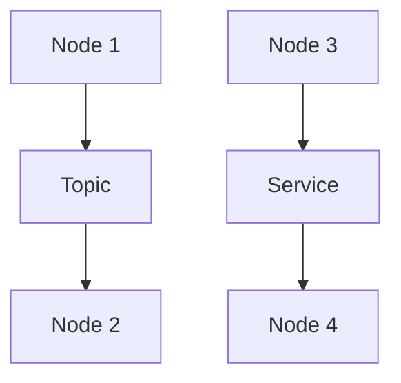

# ROS (Robot Operating System) Technical Notes
<!-- [Illustration showing a high-level overview of ROS, including nodes, topics, messages, and services.] -->

## Quick Reference
- One-sentence definition: ROS (Robot Operating System) is a flexible framework for writing robot software, providing tools and libraries to help developers create complex and robust robot applications.
- Key use cases: Robotics research, autonomous vehicles, industrial automation, and drones.
- Prerequisites:  
  - Advanced: Deep understanding of robotics, Linux, Python, and experience with ROS.

## Table of Contents
1. Introduction  
2. Core Concepts  
   - Fundamental Understanding  
   - Visual Architecture  
3. Implementation Details  
   - Advanced Topics  
4. Real-World Applications  
   - Industry Examples  
   - Hands-On Project  
5. Tools & Resources  
6. References  
7. Appendix  

---

## Introduction
### What: Core Definition and Purpose
ROS (Robot Operating System) is a flexible framework for writing robot software. It provides a collection of tools, libraries, and conventions that aim to simplify the task of creating complex and robust robot behavior across a wide variety of robotic platforms.

### Why: Problem It Solves/Value Proposition
ROS simplifies the development of robot software by providing a standardized communication infrastructure, reusable components, and a rich ecosystem of tools and libraries. It enables developers to focus on building robot functionality rather than low-level system integration.

### Where: Application Domains
ROS is widely used in:
- Robotics Research: Developing and testing new algorithms and behaviors.
- Autonomous Vehicles: Building self-driving cars and drones.
- Industrial Automation: Automating manufacturing and logistics.
- Drones: Developing autonomous flight and navigation systems.

---

## Core Concepts
### Fundamental Understanding
- **Basic Principles**:  
  - Nodes: Independent processes that perform computation.  
  - Topics: Named buses over which nodes exchange messages.  
  - Messages: Data structures used to communicate between nodes.  
  - Services: Request-reply interactions between nodes.  

- **Key Components**:  
  - Master: Facilitates communication between nodes.  
  - Packages: Organizational units for ROS code.  
  - Workspace: Directory where ROS packages are developed.  

- **Common Misconceptions**:  
  - ROS is an operating system: ROS is a middleware framework, not an OS.  
  - ROS is only for research: ROS is also used in industrial and commercial applications.  

### Visual Architecture


---

## Implementation Details
### Advanced Topics [Advanced]
```python
#!/usr/bin/env python
import rospy
from std_msgs.msg import String
from geometry_msgs.msg import Twist
from nav_msgs.msg import Odometry
import tf

# Define a callback function to handle incoming messages
def callback(data):
    rospy.loginfo(rospy.get_caller_id() + " I heard %s", data.data)
    # Create a Twist message to control a robot
    cmd_vel = Twist()
    cmd_vel.linear.x = 0.5
    cmd_vel.angular.z = 0.5
    pub.publish(cmd_vel)

# Initialize the node
rospy.init_node('listener', anonymous=True)

# Subscribe to the 'chatter' topic
rospy.Subscriber('chatter', String, callback)

# Create a publisher for the 'cmd_vel' topic
pub = rospy.Publisher('cmd_vel', Twist, queue_size=10)

# Create a TF listener
listener = tf.TransformListener()

# Keep the node running
rate = rospy.Rate(10)  # 10Hz
while not rospy.is_shutdown():
    try:
        # Get the transform between two frames
        (trans, rot) = listener.lookupTransform('/base_link', '/map', rospy.Time(0))
        rospy.loginfo("Transform: %s, %s", trans, rot)
    except (tf.LookupException, tf.ConnectivityException, tf.ExtrapolationException):
        continue

    rate.sleep()
```

- **System Design**:  
  - TF (Transform Library): Manage coordinate transformations between different frames.  
  - Advanced Message Types: Use complex message types like `Odometry` for detailed robot state information.  

- **Optimization Techniques**:  
  - Use efficient data structures and algorithms for real-time performance.  
  - Optimize message frequency and data processing to reduce latency.  

- **Production Considerations**:  
  - Implement robust error handling and recovery mechanisms.  
  - Use distributed computing for large-scale systems.  

---

## Real-World Applications
### Industry Examples
- **Robotics Research**: Developing and testing new algorithms and behaviors.  
- **Autonomous Vehicles**: Building self-driving cars and drones.  
- **Industrial Automation**: Automating manufacturing and logistics.  
- **Drones**: Developing autonomous flight and navigation systems.  

### Hands-On Project
- **Project Goals**: Build a ROS application to control and localize a robot in a simulated environment.  
- **Implementation Steps**:  
  1. Create a ROS package.  
  2. Write a publisher node to send control commands.  
  3. Write a subscriber node to receive sensor data.  
  4. Implement a TF listener to manage coordinate transformations.  
  5. Simulate the robot in Gazebo and verify control and localization.  
- **Validation Methods**: Check the robot's behavior and localization accuracy in the simulation.  

---

## Tools & Resources
### Essential Tools
- **Development Environment**: Linux, Python, ROS.  
- **Key Frameworks**: ROS, Gazebo, RViz.  
- **Testing Tools**: rostest, unittest.  

### Learning Resources
- **Documentation**: [ROS Documentation](http://wiki.ros.org/).  
- **Tutorials**: "ROS Beginner Tutorials" by ROS.  
- **Community Resources**: ROS Answers, GitHub repositories.  

---

## References
- Official documentation: [ROS Documentation](http://wiki.ros.org/).  
- Technical papers: "ROS: an open-source Robot Operating System" by Quigley et al.  
- Industry standards: ROS applications in robotics and autonomous systems.  

---

## Appendix
### Glossary
- **Node**: An independent process that performs computation.  
- **Topic**: A named bus over which nodes exchange messages.  
- **Message**: A data structure used to communicate between nodes.  

### Setup Guides
- Install ROS: Follow the official ROS installation guide for your Linux distribution.  

### Code Templates
- Advanced ROS node template available on GitHub.  
