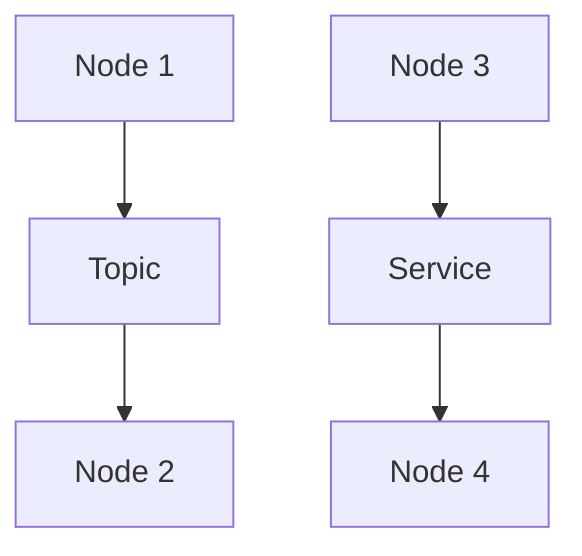

# ROS (Robot Operating System) Technical Notes
<!-- [Illustration showing a high-level overview of ROS, including nodes, topics, messages, and services.] -->

## Quick Reference
- One-sentence definition: ROS (Robot Operating System) is a flexible framework for writing robot software, providing tools and libraries to help developers create complex and robust robot applications.
- Key use cases: Robotics research, autonomous vehicles, industrial automation, and drones.
- Prerequisites:  
  - Beginner: Basic understanding of Linux, Python, and robotics concepts.

## Table of Contents
## Table of Contents
1. [Introduction](#introduction)  
  - [What: Core Definition and Purpose](#what-core-definition-and-purpose)  
  - [Why: Problem It Solves/Value Proposition](#why-problem-it-solvesvalue-proposition)  
  - [Where: Application Domains](#where-application-domains)  
2. [Core Concepts](#core-concepts)  
  - [Fundamental Understanding](#fundamental-understanding)  
  - [Visual Architecture](#visual-architecture)  
3. [Implementation Details](#implementation-details)  
  - [Basic Implementation [Beginner]](#basic-implementation-beginner)  
4. [Real-World Applications](#real-world-applications)  
  - [Industry Examples](#industry-examples)  
  - [Hands-On Project](#hands-on-project)  
5. [Tools & Resources](#tools--resources)  
  - [Essential Tools](#essential-tools)  
  - [Learning Resources](#learning-resources)  
6. [References](#references)  
7. [Appendix](#appendix)  
  - [Glossary](#glossary)  
  - [Setup Guides](#setup-guides)  
  - [Code Templates](#code-templates)  

---

## Introduction
### What: Core Definition and Purpose
ROS (Robot Operating System) is a flexible framework for writing robot software. It provides a collection of tools, libraries, and conventions that aim to simplify the task of creating complex and robust robot behavior across a wide variety of robotic platforms.

### Why: Problem It Solves/Value Proposition
ROS simplifies the development of robot software by providing a standardized communication infrastructure, reusable components, and a rich ecosystem of tools and libraries. It enables developers to focus on building robot functionality rather than low-level system integration.

### Where: Application Domains
ROS is widely used in:
- Robotics Research: Developing and testing new algorithms and behaviors.
- Autonomous Vehicles: Building self-driving cars and drones.
- Industrial Automation: Automating manufacturing and logistics.
- Drones: Developing autonomous flight and navigation systems.

---

## Core Concepts
### Fundamental Understanding
- **Basic Principles**:  
  - Nodes: Independent processes that perform computation.  
  - Topics: Named buses over which nodes exchange messages.  
  - Messages: Data structures used to communicate between nodes.  
  - Services: Request-reply interactions between nodes.  

- **Key Components**:  
  - Master: Facilitates communication between nodes.  
  - Packages: Organizational units for ROS code.  
  - Workspace: Directory where ROS packages are developed.  

- **Common Misconceptions**:  
  - ROS is an operating system: ROS is a middleware framework, not an OS.  
  - ROS is only for research: ROS is also used in industrial and commercial applications.  

### Visual Architecture


---

## Implementation Details
### Basic Implementation [Beginner]
```python
#!/usr/bin/env python
import rospy
from std_msgs.msg import String

# Define a callback function to handle incoming messages
def callback(data):
    rospy.loginfo(rospy.get_caller_id() + " I heard %s", data.data)

# Initialize the node
rospy.init_node('listener', anonymous=True)

# Subscribe to the 'chatter' topic
rospy.Subscriber('chatter', String, callback)

# Keep the node running
rospy.spin()
```

- **Step-by-Step Setup**:  
  1. Initialize a ROS node using `rospy.init_node`.  
  2. Subscribe to a topic using `rospy.Subscriber`.  
  3. Define a callback function to handle incoming messages.  
  4. Keep the node running using `rospy.spin`.  

- **Code Walkthrough**:  
  - The node subscribes to the 'chatter' topic and listens for messages.  
  - The callback function logs the received messages.  
  - The node remains active and continues to listen for new messages.  

- **Common Pitfalls**:  
  - Node Naming: Ensure unique node names to avoid conflicts.  
  - Topic Names: Use consistent topic names across nodes.  

---

## Real-World Applications
### Industry Examples
- **Robotics Research**: Developing and testing new algorithms and behaviors.  
- **Autonomous Vehicles**: Building self-driving cars and drones.  
- **Industrial Automation**: Automating manufacturing and logistics.  
- **Drones**: Developing autonomous flight and navigation systems.  

### Hands-On Project
- **Project Goals**: Build a simple ROS application to publish and subscribe to messages.  
- **Implementation Steps**:  
  1. Create a ROS package.  
  2. Write a publisher node to send messages.  
  3. Write a subscriber node to receive messages.  
  4. Run the nodes and verify communication.  
- **Validation Methods**: Check the logged messages in the terminal.  

---

## Tools & Resources
### Essential Tools
- **Development Environment**: Linux, Python, ROS.  
- **Key Frameworks**: ROS, Gazebo, RViz.  
- **Testing Tools**: rostest, unittest.  

### Learning Resources
- **Documentation**: [ROS Documentation](http://wiki.ros.org/).  
- **Tutorials**: "ROS Beginner Tutorials" by ROS.  
- **Community Resources**: ROS Answers, GitHub repositories.  

---

## References
- Official documentation: [ROS Documentation](http://wiki.ros.org/).  
- Technical papers: "ROS: an open-source Robot Operating System" by Quigley et al.  
- Industry standards: ROS applications in robotics and autonomous systems.  

---

## Appendix
### Glossary
- **Node**: An independent process that performs computation.  
- **Topic**: A named bus over which nodes exchange messages.  
- **Message**: A data structure used to communicate between nodes.  

### Setup Guides
- Install ROS: Follow the official ROS installation guide for your Linux distribution.  

### Code Templates
- Basic ROS node template available on GitHub.  
