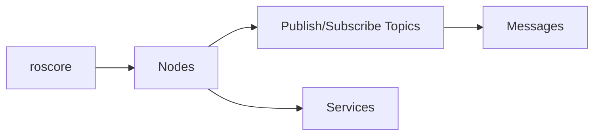

# ROS (Robot Operating System) Technical Notes

## Quick Reference
- **Definition:** ROS is an open-source framework for building robotic applications, providing tools and libraries for message passing, hardware abstraction, and modular development.  
- **Key Use Cases:** Robotics control, simulation, autonomous navigation, sensor data processing.  
- **Prerequisites:**  
  - Familiarity with basic programming (Python or C++).  
  - Understanding of Linux commands and basic concepts.  

## Table of Contents
1. [Introduction](#introduction)  
2. [Core Concepts](#core-concepts)  
   - [Fundamental Understanding](#fundamental-understanding)  
   - [Visual Architecture](#visual-architecture)  
3. [Implementation Details](#implementation-details)  
   - [Basic Implementation](#basic-implementation)  
4. [Real-World Applications](#real-world-applications)  
   - [Industry Examples](#industry-examples)  
   - [Hands-On Project](#hands-on-project)  
5. [Tools & Resources](#tools--resources)  
   - [Essential Tools](#essential-tools)  
   - [Learning Resources](#learning-resources)  
6. [References](#references)  
7. [Appendix](#appendix)  

## Introduction
### What  
ROS is a flexible framework designed to simplify the development of robotic systems, offering reusable libraries and tools to help developers design, simulate, and deploy robotic applications.  

### Why  
- **Standardization:** Provides a unified framework for robotic software development.  
- **Modularity:** Enables reusability through packages and nodes.  
- **Community Support:** Backed by a large ecosystem of developers, researchers, and industry leaders.  

### Where  
ROS is widely used in:  
- **Research:** Prototyping and testing algorithms in robotics labs.  
- **Industry:** Autonomous vehicles, industrial robots, drones, and warehouse automation.  
- **Education:** Teaching robotics and automation principles.  

## Core Concepts
### Fundamental Understanding
- **Basic Principles:**  
  - **Node:** A process in ROS that performs computation.  
  - **Topics:** Channels for communication between nodes using a publish/subscribe model.  
  - **Messages:** Data format used to exchange information between nodes.  
  - **Master:** Centralized service that manages nodes and their communications.  
  - **Launch Files:** XML files to start multiple nodes simultaneously.  
- **Key Components:**  
  - `roscore`: The central command and control structure.  
  - `rviz`: Visualization tool for robot models and sensor data.  
  - `rosbag`: Utility for recording and playing back data.  
- **Common Misconceptions:**  
  - "ROS only supports Python"—ROS supports both Python and C++ natively.  
  - "ROS is a standalone operating system"—ROS is a middleware framework that runs on Linux (typically Ubuntu).  

### Visual Architecture

- **System Overview:** The relationship between `roscore`, nodes, topics, services, and messages.  

## Implementation Details
### Basic Implementation
#### Example: Writing a Simple Publisher and Subscriber
**Publisher Code:**
```python
import rospy
from std_msgs.msg import String

def talker():
    pub = rospy.Publisher('chatter', String, queue_size=10)
    rospy.init_node('talker', anonymous=True)
    rate = rospy.Rate(1)  # 1 Hz
    while not rospy.is_shutdown():
        hello_str = "Hello ROS at %s" % rospy.get_time()
        rospy.loginfo(hello_str)
        pub.publish(hello_str)
        rate.sleep()

if __name__ == '__main__':
    try:
        talker()
    except rospy.ROSInterruptException:
        pass
```

**Subscriber Code:**
```python
import rospy
from std_msgs.msg import String

def callback(data):
    rospy.loginfo("I heard %s", data.data)

def listener():
    rospy.init_node('listener', anonymous=True)
    rospy.Subscriber('chatter', String, callback)
    rospy.spin()

if __name__ == '__main__':
    listener()
```
- **Steps:**  
  1. Create a publisher node (`talker`).  
  2. Create a subscriber node (`listener`).  
  3. Start the ROS master with `roscore`.  
  4. Run both scripts to see the messages being published and subscribed.  

## Real-World Applications
### Industry Examples
- **Autonomous Navigation:** ROS packages like `move_base` for path planning and obstacle avoidance.  
- **Robotic Arms:** Using ROS control frameworks for precision in manufacturing.  
- **Drones:** Managing flight paths and sensor data with ROS nodes.  

### Hands-On Project
#### Project: Simulating a Turtle Robot
- **Goal:** Use the `turtlesim` package to control a virtual turtle robot via ROS.  
- **Steps:**  
  1. Start the ROS master: `roscore`.  
  2. Launch `turtlesim`: `rosrun turtlesim turtlesim_node`.  
  3. Write a Python script to send velocity commands to the turtle using ROS topics.  
```python
import rospy
from geometry_msgs.msg import Twist

def move_turtle():
    rospy.init_node('move_turtle', anonymous=True)
    pub = rospy.Publisher('/turtle1/cmd_vel', Twist, queue_size=10)
    rate = rospy.Rate(10)
    while not rospy.is_shutdown():
        vel_msg = Twist()
        vel_msg.linear.x = 2.0
        vel_msg.angular.z = 1.0
        pub.publish(vel_msg)
        rate.sleep()

if __name__ == '__main__':
    try:
        move_turtle()
    except rospy.ROSInterruptException:
        pass
```

## Tools & Resources
### Essential Tools
- **ROS Distribution:** Install the latest stable version (e.g., ROS Noetic for Ubuntu 20.04).  
- **Visualization:** `rviz` for visualizing robot and sensor data.  
- **Simulation:** `Gazebo` for simulating real-world environments.  

### Learning Resources
- **Documentation:**  
  - [ROS Wiki](http://wiki.ros.org).  
  - [ROS Tutorials](http://wiki.ros.org/ROS/Tutorials).  
- **Books:**  
  - *Programming Robots with ROS* by Quigley, Gerkey, and Smart.  
- **Community Resources:**  
  - ROS Discourse for beginner discussions.  
  - GitHub repositories with sample ROS projects.  

## References
- [Official ROS Documentation](http://wiki.ros.org/).  
- [ROS Cheat Sheet](https://www.ros.org/cheatsheet/).  
- *A Gentle Introduction to ROS* by Jason M. O'Kane.  

## Appendix
- **Glossary:**  
  - **Node:** A single process that performs computation in ROS.  
  - **Topic:** A channel for communication between nodes.  
  - **Message:** The data exchanged between nodes.  
- **Setup Guides:**  
  - Installing ROS Noetic on Ubuntu.  
  - Setting up a workspace with `catkin`.  
- **Code Templates:**  
  - Templates for basic publishers, subscribers, and service calls.  
