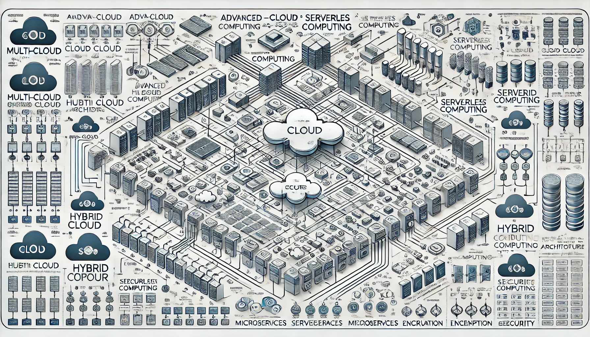

# Cloud Computing Technical Notes



## Introduction

Cloud computing has evolved into a sophisticated ecosystem of technologies and services that form the backbone of modern digital infrastructure. At its core, cloud computing delivers on-demand access to a shared pool of configurable computing resources over the Internet, enabling organizations to scale and innovate rapidly without the constraints of traditional IT infrastructure.

## Core Concepts

### Advanced Service Models

Beyond the traditional IaaS, PaaS, and SaaS models, advanced cloud computing introduces:

1. **Function as a Service (FaaS)**: Serverless computing model where developers can run individual functions without managing server infrastructure.
2. **Container as a Service (CaaS)**: Provides container orchestration as a managed service, facilitating microservices architecture.
3. **Database as a Service (DBaaS)**: Offers fully managed database solutions, including NoSQL and distributed databases.

### Sophisticated Deployment Models

Advanced cloud deployments often involve complex architectures:

1. **Multi-Cloud**: Utilizes services from multiple cloud providers to optimize performance, cost, and avoid vendor lock-in.
2. **Hybrid Cloud**: Integrates private and public cloud resources, often including on-premises infrastructure, to balance control and scalability.
3. **Edge Computing**: Extends cloud capabilities to the network edge, reducing latency for IoT and real-time applications.

### Architectural Patterns

Modern cloud architectures leverage several key patterns:

1. **Microservices**: Decomposes applications into small, independent services that can be developed, deployed, and scaled independently.
2. **Event-Driven Architecture**: Utilizes events to trigger and communicate between decoupled services, enhancing scalability and responsiveness.
3. **Serverless Architecture**: Builds applications using managed services and FaaS, minimizing infrastructure management overhead.

## Implementation Details

### Advanced Implementation Strategies

1. **Infrastructure as Code (IaC)**:
   Use declarative languages to define and manage cloud infrastructure:

```yaml
# Example Terraform configuration for a multi-region deployment
provider "aws" {
  region = "us-west-2"
}

resource "aws_instance" "web_server" {
  count         = 3
  ami           = "ami-0c55b159cbfafe1f0"
  instance_type = "t2.micro"
  tags = {
    Name = "WebServer-${count.index + 1}"
  }
}

resource "aws_lb" "front_end" {
  name               = "front-end-lb"
  internal           = false
  load_balancer_type = "application"
  subnets            = ["subnet-12345678", "subnet-87654321"]
}
```

2. **Containerization and Orchestration**:
   Implement microservices using containers and manage them with orchestration platforms:

```yaml
# Example Kubernetes deployment
apiVersion: apps/v1
kind: Deployment
metadata:
  name: nginx-deployment
spec:
  replicas: 3
  selector:
    matchLabels:
      app: nginx
  template:
    metadata:
      labels:
        app: nginx
    spec:
      containers:
      - name: nginx
        image: nginx:1.14.2
        ports:
        - containerPort: 80
```

3. **Serverless Computing**:
   Develop event-driven, scalable applications without managing servers:

```python
# Example AWS Lambda function
import json

def lambda_handler(event, context):
    # Parse the input
    body = json.loads(event['body'])
    name = body['name']
    
    # Process the data
    response = f"Hello, {name}!"
    
    # Return the result
    return {
        'statusCode': 200,
        'body': json.dumps({'message': response})
    }
```

## Advanced Concepts

### Cloud-Native Technologies

1. **Service Mesh**: Implements a dedicated infrastructure layer for service-to-service communication in microservices architectures.
2. **Chaos Engineering**: Deliberately introduces failures in a controlled environment to build resilient systems.
3. **GitOps**: Applies Git workflows to infrastructure management, ensuring consistency and traceability.

### Performance Optimization

1. **Global Load Balancing**: Distributes traffic across multiple regions for optimal performance and disaster recovery.
2. **Content Delivery Networks (CDNs)**: Caches content at edge locations to reduce latency and improve user experience.
3. **Predictive Autoscaling**: Uses machine learning to anticipate demand and scale resources proactively.

### Security and Compliance

1. **Zero Trust Security Model**: Assumes no trust by default, requiring verification for every access attempt.
2. **Data Sovereignty**: Ensures compliance with regional data protection laws through geo-fencing and data residency controls.
3. **Continuous Compliance Monitoring**: Implements automated checks to ensure ongoing adherence to regulatory standards.

## Real-World Applications

### Industry Examples

1. **Financial Services**: Implementing real-time fraud detection using serverless architectures and machine learning.
2. **Healthcare**: Leveraging hybrid cloud for secure patient data management while utilizing public cloud for non-sensitive workloads.
3. **Media and Entertainment**: Using multi-cloud strategies for content delivery and rendering farm management in film production.

### Advanced Project: Multi-Region, Multi-Cloud Microservices Deployment

1. Design a microservices architecture for a global e-commerce platform.
2. Implement services across multiple cloud providers (e.g., AWS, Azure, GCP) for redundancy and performance optimization.
3. Set up a service mesh for inter-service communication and traffic management.
4. Implement a CI/CD pipeline with blue-green deployments for zero-downtime updates.
5. Configure global load balancing and CDN for optimal content delivery.
6. Implement advanced monitoring and alerting using distributed tracing and log aggregation.

## Appendix

### Glossary

- **Kubernetes**: An open-source container orchestration platform for automating deployment, scaling, and management of containerized applications.
- **Terraform**: An infrastructure as code software tool that enables defining and provisioning data center infrastructure using a declarative configuration language.
- **Service Mesh**: A dedicated infrastructure layer for facilitating service-to-service communications between microservices, often using a sidecar proxy.

## References

- [1] https://www.geeksforgeeks.org/cloud-deployment-models/
- [2] https://nzocloud.com/blog/cloud-computing-architecture/
- [3] https://iaeme.com/MasterAdmin/Journal_uploads/IJETR/VOLUME_9_ISSUE_2/IJETR_09_02_036.pdf
- [4] https://newsletter.techworld-with-milan.com/p/what-are-the-main-cloud-design-patterns
- [5] https://www.fynd.academy/blog/cloud-computing-case-study
- [6] https://www.appliedcloudcomputing.com/case-study/
- [7] https://cloud.google.com/learn/what-is-cloud-architecture
- [8] https://pmc.ncbi.nlm.nih.gov/articles/PMC6642572/
- [9] https://cloud.google.com/architecture/framework/performance-optimization
- [10] https://destcert.com/resources/domain-1-cloud-concepts-architecture-and-design/
- [11] https://bluexp.netapp.com/blog/cvo-blg-cloud-computing-deployment-models-and-architectures
- [12] https://www.geeksforgeeks.org/architecture-of-cloud-computing/
- [13] https://blog.cloudnloud.com/cloud-architecture-service-models-and-designs
- [14] https://www.coursera.org/learn/cloud-architecture-design-patterns
- [15] https://cloud.google.com/discover/types-of-cloud-computing
- [16] https://www.keencomputer.com/solutions/cloud-computing/333-architecting-the-cloud-a-comprehensive-guide
- [17] https://cloud.google.com/architecture/hybrid-multicloud-secure-networking-patterns/architecture-patterns
- [18] http://www2.centre-cired.fr/%5Ew/text/exe?TEXT=client+solution+architects.pdf
- [19] https://www.jaroeducation.com/blog/types-of-cloud-services-and-deployment-models/
- [20] https://genai.works/courses/cloud-architecture-design-patterns
- [21] https://learn.microsoft.com/sr-cyrl-rs/azure/architecture/patterns/
- [22] https://acris.aalto.fi/ws/portalfiles/portal/133624477/2023178919.pdf
- [23] https://docs.aws.amazon.com/prescriptive-guidance/latest/cloud-design-patterns/introduction.html
- [24] https://docs.aws.amazon.com/pdfs/prescriptive-guidance/latest/cloud-design-patterns/cloud-design-patterns.pdf
- [25] https://www.a-cx.com/cloud-design-patterns
- [26] https://www.oreilly.com/library/view/design-patterns-for/9781492090700/ch04.html
- [27] https://www.linkedin.com/pulse/cloud-design-patterns-implementation-part-1-arthur-sergeyan
- [28] https://www.researchgate.net/publication/358918593_Implementation_Technologies_of_an_Advanced_Cloud-based_System_for_Distribution_Operations
- [29] https://spot.io/resources/cloud-cost/cloud-cost-optimization-15-ways-to-optimize-your-cloud/
- [30] https://wedareyou.tourismthailand.org/papersCollection/Resources/_pdfs/Cloud_Computing_Patterns_Fundamentals_To_Design_Build_And_Manage_Cloud_Applications.- pdf
- [31] https://www.researchgate.net/publication/262020816_An_explanatory_case_study_on_cloud_computing_applications_in_the_built_environment
- [32] https://www.knowledgehut.com/blog/cloud-computing/cloud-computing-case-studies
- [33] https://kloudcourse.in/cloud-computing-case-studies/
- [34] https://www.linkedin.com/pulse/how-cloud-computing-transforms-business-operations-real-world-qrq7e
- [35] https://learn.microsoft.com/en-us/azure/well-architected/performance-efficiency/design-patterns
- [36] https://learn.microsoft.com/en-us/azure/well-architected/performance-efficiency/scale-partition
- [37] https://blog.supportlobby.com/www-yourwebsite-com-cloud-computing-case-studies/
- [38] https://www.uturndata.com/case-studies/
- [39] https://securetechinstitute.com/cloud-computing-case-studies-real-world-examples-for-beginners/