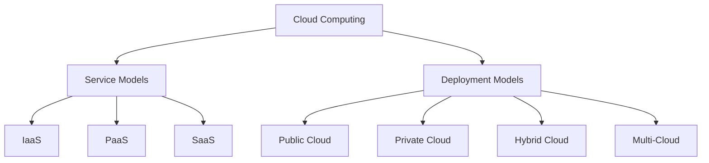

# Cloud Computing Technical Notes


## Quick Reference
- Cloud computing is a model that enables on-demand access to a shared pool of configurable computing resources over the Internet.
- Key use cases: Hosting applications, data storage, and providing scalable computing power.
- Prerequisites: Basic understanding of the Internet and general computing concepts.

## Introduction

Cloud computing refers to the delivery of computing services—including servers, storage, databases, networking, software, and analytics—over the Internet (the cloud). This model allows users to access and manage these resources without needing to own or maintain physical hardware. Cloud computing has transformed how businesses operate by providing flexible resources that can scale according to demand.

## Core Concepts

### Fundamental Understanding

1. **Definition**: Cloud computing provides on-demand access to computing resources via the Internet, allowing users to rent rather than purchase hardware or software.

2. **Characteristics**:
   - **On-demand self-service**: Users can provision resources automatically without human intervention from the service provider.
   - **Broad network access**: Services are available over the network and can be accessed through standard mechanisms (e.g., laptops, smartphones).
   - **Resource pooling**: Resources are pooled to serve multiple consumers using a multi-tenant model.
   - **Rapid elasticity**: Resources can be quickly scaled up or down based on demand.
   - **Measured service**: Resource usage is monitored, controlled, and reported for transparency.

### Service Models

Cloud computing is typically categorized into three primary service models:

1. **Infrastructure as a Service (IaaS)**:
   - Provides virtualized computing resources over the Internet.
   - Users have control over operating systems and applications while managing storage and networking.
   - Examples: Amazon EC2, Google Compute Engine.

2. **Platform as a Service (PaaS)**:
   - Offers a platform allowing customers to develop, run, and manage applications without dealing with infrastructure management.
   - Ideal for developers who want to focus on coding without worrying about underlying hardware.
   - Examples: Google App Engine, Microsoft Azure App Service.

3. **Software as a Service (SaaS)**:
   - Delivers software applications over the Internet on a subscription basis.
   - Users access applications via web browsers without needing installation or maintenance.
   - Examples: Salesforce, Dropbox, Microsoft Office 365.

### Deployment Models

Cloud deployment models define how cloud services are delivered and managed. The primary models include:

1. **Public Cloud**:
   - Services are provided over the public Internet and shared among multiple users or organizations.
   - Managed by third-party providers like AWS or Google Cloud.
   - Cost-effective and scalable but may have less control over security.

2. **Private Cloud**:
   - Exclusive cloud infrastructure operated solely for one organization.
   - Offers greater control over security and compliance but can be more expensive to maintain.

3. **Hybrid Cloud**:
   - Combines public and private clouds, allowing data and applications to be shared between them.
   - Enables businesses to leverage both environments for flexibility and efficiency.

4. **Multi-Cloud**:
   - Utilizes multiple cloud services from different providers simultaneously.
   - Enhances redundancy and allows organizations to optimize costs based on specific service offerings.

### Visual Architecture



## Implementation Details

### Basic Implementation

To utilize cloud computing effectively:

1. **Choose a Service Model** based on your needs (IaaS for infrastructure needs, PaaS for application development, SaaS for software access).
2. **Select a Deployment Model** that aligns with your organizational requirements (public for cost-effectiveness, private for security).
3. **Accessing Services** via web interfaces or APIs provided by cloud service providers.

```python
# Example of accessing a cloud service using Python
import requests

# Example API call to a hypothetical cloud service
response = requests.get('https://api.cloudprovider.com/data')
data = response.json()
print(data)
```

This code snippet demonstrates how to make an API call to retrieve data from a cloud service.

## Real-World Applications

### Industry Examples

Cloud computing is widely used across various sectors:

- **E-commerce**: Hosting online stores and managing inventory through cloud platforms.
- **Healthcare**: Storing patient records securely in the cloud while ensuring compliance with regulations.
- **Education**: Providing online learning platforms that scale with user demand.

### Hands-On Project

**Project: Setting up a simple web application in the cloud**

1. Choose a PaaS provider (e.g., Heroku).
2. Create an account and set up a new application.
3. Deploy a simple web application using provided templates or frameworks.
4. Monitor application performance through the provider's dashboard.

## Tools & Resources

### Essential Tools

- Cloud platforms: Amazon Web Services (AWS), Microsoft Azure, Google Cloud Platform (GCP)
- Development tools: Docker for containerization, Git for version control
- Monitoring tools: New Relic, Datadog for performance tracking

### Learning Resources

- Online courses: "Introduction to Cloud Computing" on Coursera
- Books: "Cloud Computing for Dummies" by Judith Hurwitz
- Documentation: Official documentation from AWS, Azure, or GCP for hands-on tutorials

## Appendix

### Glossary

- **IaaS (Infrastructure as a Service)**: Virtualized computing resources provided over the Internet.
- **PaaS (Platform as a Service)**: A platform allowing developers to build applications without managing underlying infrastructure.
- **SaaS (Software as a Service)**: Software delivered over the Internet on a subscription basis.

## References

- [1] https://moldstud.com/articles/p-cloud-engineering-from-foundations-to-advanced-concepts
- [2] https://spacelift.io/blog/cloud-deployment-models
- [3] https://www.geeksforgeeks.org/cloud-computing-tutorial/
- [4] https://cloudvisor.co/blog/cloud-deployment-models-public-private-hybrid-or-multi-cloud/
- [5] https://blp.ieee.org/how-to-learn-cloud-computing-a-definitive-guide-2023/
- [6] https://www.cloudwards.net/cloud-deployment-models/
- [7] https://www.polymtl.ca/programmes/cours/advanced-concepts-cloud-computing
- [8] https://www.simform.com/blog/cloud-deployment-models/
- [9] https://digitalcloud.training/aws-cloud-computing-concepts/
- [10] https://launchdarkly.com/blog/cloud-deployment-models-explaining-and-comparing-the/