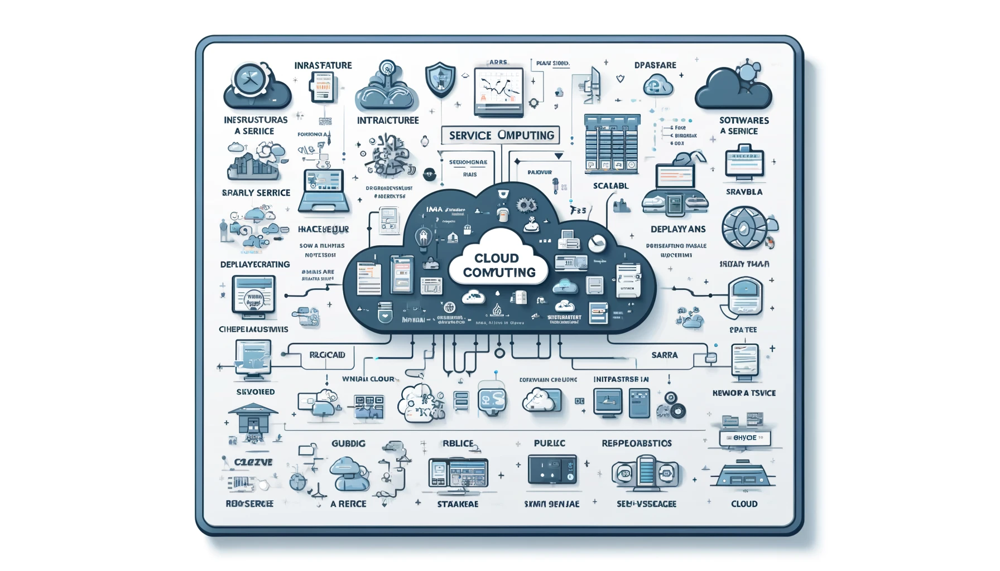

# Cloud Computing - Notes



## Overview

Cloud Computing core concepts for real-world applications.

## Quick Start

```
│   cloud-guide.md
│
├───resources
│
├───concepts
│       cloud-core-intermediate.md
│       cloud-core-advanced.md
│       cloud-core-basics.md
│
├───examples
│       implementation.md
│
└───industry-applications
        industry-links.md
```
## Related Notes
- [Edge Computing - Notes](../edge-computing/)
- [Edge AI - Notes](../edge-ai/)

## Contributing

Please refer to the [CONTRIBUTING.md](../CONTRIBUTING.md) file.

