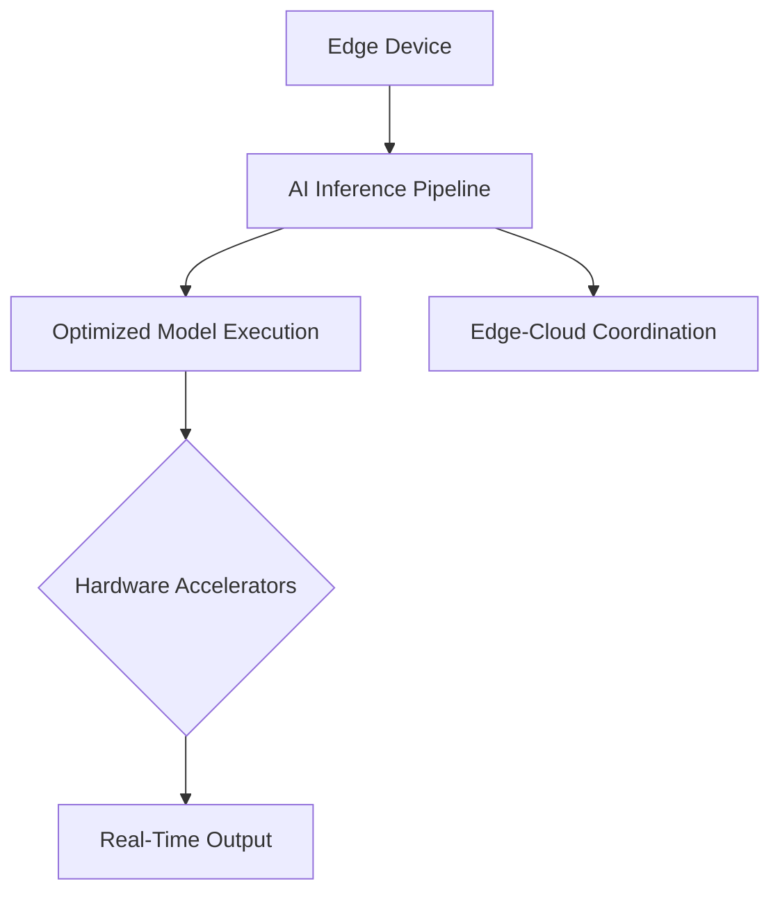

# Edge AI Technical Notes - Advanced

## Quick Reference
- **Definition:** Edge AI executes AI inference directly on edge devices, providing real-time, autonomous decision-making at the data source with minimal reliance on cloud infrastructure.
- **Key Use Cases:** Autonomous vehicles, predictive maintenance, industrial automation, robotics.
- **Prerequisites:**  
  - Strong understanding of AI/ML architectures.  
  - Familiarity with edge hardware constraints and optimization techniques.  
  - Proficiency in deploying and managing large-scale AI systems.

## Table of Contents
1. [Introduction](#introduction)
2. [Core Concepts](#core-concepts)  
   - [Advanced Understanding](#advanced-understanding)  
   - [Visual Architecture](#visual-architecture)  
3. [Implementation Details](#implementation-details)  
   - [Advanced Topics](#advanced-topics)  
4. [Real-World Applications](#real-world-applications)  
   - [Industry Examples](#industry-examples)  
   - [Hands-On Project](#hands-on-project)  
5. [Tools & Resources](#tools--resources)  
   - [Essential Tools](#essential-tools)  
   - [Learning Resources](#learning-resources)  
6. [References](#references)  
7. [Appendix](#appendix)

## Introduction
### What  
Edge AI processes and analyzes data at the edge of the network using optimized AI models, enabling systems to operate independently in real-time without continuous cloud connectivity.

### Why  
- **Latency:** Enables millisecond-level decision-making critical for systems like robotics and autonomous vehicles.  
- **Bandwidth:** Reduces costs by processing data locally instead of transmitting it to the cloud.  
- **Privacy:** Enhances data security by keeping sensitive information on the device.  
- **Resilience:** Ensures system functionality in environments with poor connectivity.

### Where  
Edge AI finds application across industries:  
- **Automotive:** Autonomous navigation, ADAS systems.  
- **Healthcare:** Real-time diagnostics and monitoring devices.  
- **Industrial IoT:** Predictive maintenance, anomaly detection.  
- **Retail:** Customer behavior analytics, inventory tracking.

## Core Concepts
### Advanced Understanding
- **Key Principles:**  
  - **Model Compression:** Techniques like quantization-aware training and sparsity-aware optimization to reduce size and improve inference speed.  
  - **Hardware-Specific Optimization:** Leveraging accelerators such as NVIDIA TensorRT, Google Edge TPU, and FPGAs.  
  - **Distributed Intelligence:** Edge-cloud collaborative systems for scalable AI applications.  
- **Key Components:**  
  - **Custom Edge Architectures:** Tailored solutions combining hardware, middleware, and software for edge deployments.  
  - **Dynamic Model Loading:** On-demand deployment of models based on resource availability.  
  - **On-Device Learning:** Adapting models in real-time using incremental updates.  
- **Common Misconceptions:**  
  - Optimized models always sacrifice accuracy — proper optimization preserves core performance.  
  - Edge AI replaces cloud AI entirely — they are complementary, particularly for data aggregation and large-scale training.

### Visual Architecture

- **System Overview:** The architecture optimizes real-time inference pipelines while maintaining optional cloud coordination.  
- **Component Relationships:** The pipeline integrates tightly with accelerators to meet performance requirements and dynamically interacts with cloud systems for updates and large-scale data processing.

## Implementation Details
### Advanced Topics
#### Example: Dynamic Optimization for Multi-Model Edge Inference  
```python
from onnxruntime import InferenceSession, SessionOptions, ExecutionProvider

# Load and configure multiple models
model_paths = ["model1.onnx", "model2.onnx"]
sessions = []

for model_path in model_paths:
    options = SessionOptions()
    # Use TensorRT for hardware acceleration
    options.execution_providers = ["TensorrtExecutionProvider"]
    sessions.append(InferenceSession(model_path, options))

# Dynamic model selection based on input data
def infer(input_data):
    if is_case_1(input_data):
        return sessions[0].run(None, {"input": input_data})
    else:
        return sessions[1].run(None, {"input": input_data})

print("Dynamic multi-model edge inference initialized.")
```
- **Patterns Covered:**  
  - **Dynamic Inference Pipelines:** Switching models based on use case or resource constraints.  
  - **Hardware-Aware Execution:** Selecting accelerators dynamically for optimal performance.  
  - **Resource Scaling:** Adjusting compute workloads for heterogeneous devices.  
- **Best Practices:**  
  - Use profiling tools to benchmark performance across edge devices.  
  - Monitor energy consumption to optimize for battery-operated devices.  
- **Optimization Techniques:**  
  - Implement parallel execution with tools like OpenMP or CUDA.  
  - Apply automated retraining pipelines for on-device model fine-tuning.

## Real-World Applications
### Industry Examples
- **Autonomous Vehicles:** Multi-camera perception with real-time obstacle detection and tracking.  
- **Industrial IoT:** Simultaneous anomaly detection and predictive analytics for machinery.  
- **Robotics:** Real-time navigation and SLAM (Simultaneous Localization and Mapping).  

### Hands-On Project
#### Project: Real-Time Multi-Camera Object Tracking  
- **Goal:** Build a system for tracking objects in real-time across multiple camera feeds on NVIDIA Jetson Xavier.  
- **Implementation Steps:**  
  1. Set up NVIDIA DeepStream SDK for multi-stream processing.  
  2. Deploy and optimize YOLOv8 models for real-time inference.  
  3. Develop a dynamic scheduling algorithm for resource allocation.  
- **Validation Methods:**  
  - Measure processing latency and FPS across all streams.  
  - Evaluate tracking accuracy using ground-truth datasets.  

## Tools & Resources
### Essential Tools
- **Development Environment:** Docker containers, JetPack SDK.  
- **Key Frameworks:** TensorRT, PyTorch Mobile, ONNX Runtime.  
- **Testing Tools:** Profiling and benchmarking with NVIDIA Nsight or TensorFlow Profiler.  

### Learning Resources
- **Documentation:**  
  - TensorRT Optimization Guide.  
  - ONNX Runtime for Edge Devices.  
- **Tutorials:**  
  - Advanced Model Optimization Techniques.  
  - Building Edge AI Pipelines with DeepStream SDK.  
- **Community Resources:**  
  - Edge AI GitHub repositories.  
  - NVIDIA Developer Forum.  

## References
- Technical papers on model compression and hardware-specific optimizations.  
- Industry benchmarks comparing edge inference frameworks.  
- Standardization efforts for edge AI, including ONNX and MLPerf Tiny.

## Appendix
- **Glossary:**  
  - **Dynamic Inference:** Selecting and executing models dynamically based on runtime data or constraints.  
  - **Distributed Intelligence:** Combining edge and cloud resources for a hybrid AI architecture.  
- **Setup Guides:** Deploying and optimizing AI pipelines on NVIDIA Jetson Xavier.  
- **Code Templates:** Pre-configured scripts for multi-model inference.
