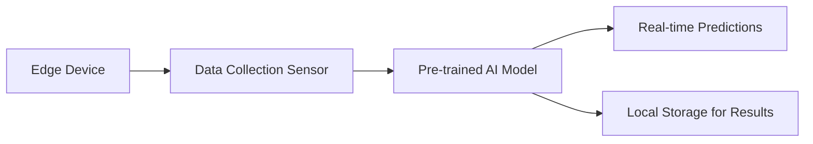

# Edge AI Technical Notes - Basics

## Quick Reference
- **Definition:** Edge AI refers to deploying artificial intelligence algorithms on edge devices (e.g., IoT devices, smartphones) rather than centralized servers or cloud systems.
- **Key Use Cases:** Real-time video analytics, predictive maintenance, smart home automation, autonomous vehicles.
- **Prerequisites:** 
  - Basic understanding of AI/ML concepts.
  - Familiarity with edge devices and their limitations.

## Table of Contents
1. [Introduction](#introduction)
2. [Core Concepts](#core-concepts)
   - [Fundamental Understanding](#fundamental-understanding)
   - [Visual Architecture](#visual-architecture)
3. [Implementation Details](#implementation-details)
   - [Basic Implementation](#basic-implementation)
4. [Real-World Applications](#real-world-applications)
   - [Industry Examples](#industry-examples)
   - [Hands-On Project](#hands-on-project)
5. [Tools & Resources](#tools--resources)
   - [Essential Tools](#essential-tools)
   - [Learning Resources](#learning-resources)
6. [References](#references)

## Introduction
### What  
Edge AI integrates AI models directly into hardware devices for local decision-making without needing constant internet connectivity. 

### Why  
It addresses challenges like latency, bandwidth, and data privacy by processing data near its source.

### Where  
Edge AI is widely used in:
- Consumer devices like smartphones and wearables.
- Industrial IoT systems for predictive maintenance.
- Smart cities for traffic and crowd management.

## Core Concepts
### Fundamental Understanding
- **Basic Principles:**  
  - Edge AI emphasizes localized processing to avoid reliance on the cloud.  
  - It involves lightweight AI models optimized for constrained devices.  
  - Combines hardware acceleration (e.g., GPUs, TPUs) with optimized algorithms.  
- **Key Components:**  
  - **Edge Device:** Device where AI is deployed (e.g., Raspberry Pi, NVIDIA Jetson Nano).  
  - **AI Model:** Typically small, efficient versions of neural networks like MobileNet or TinyML models.  
  - **Deployment Framework:** Tools to package and deploy models, e.g., TensorFlow Lite, ONNX Runtime.  
- **Common Misconceptions:**  
  - Edge AI is not entirely independent; it often complements cloud systems for updates or complex tasks.  
  - Edge devices are not limited to basic computations; they can perform sophisticated tasks within their constraints.

### Visual Architecture

- **System Overview:** Data flows from sensors to an edge device for processing.  
- **Component Relationships:** The edge device processes the AI model, outputs results locally, and may communicate selectively with the cloud.

## Implementation Details
### Basic Implementation
#### Example: Deploying an Image Classifier on Raspberry Pi
```python
import tensorflow as tf
from tensorflow.keras.models import load_model
import cv2

# Load pre-trained model
model = load_model("mobilenet_v2.h5")

# Load input image
image = cv2.imread("test_image.jpg")
image_resized = cv2.resize(image, (224, 224)) / 255.0
image_array = image_resized.reshape(1, 224, 224, 3)

# Make a prediction
prediction = model.predict(image_array)
print(f"Prediction: {prediction}")
```

- **Step-by-Step Setup:**  
  1. Install TensorFlow on Raspberry Pi.  
  2. Pre-train or download a lightweight model like MobileNetV2.  
  3. Process real-world data, e.g., images from a camera.  
- **Common Pitfalls:**  
  - Overloading edge devices with large models.  
  - Failing to optimize models for hardware constraints.

## Real-World Applications
### Industry Examples
- **Healthcare:** Early detection of health anomalies in wearable devices.  
- **Retail:** Shelf monitoring systems for stock levels.  
- **Agriculture:** Monitoring soil and crop health with drones.  

### Hands-On Project
#### Project: Smart Home Object Detection System
- **Goals:** Detect and classify objects in a room using a camera and Raspberry Pi.  
- **Implementation Steps:**  
  1. Set up a camera module and capture live video.  
  2. Deploy a pre-trained object detection model (e.g., YOLO Lite).  
  3. Display bounding boxes and labels on detected objects.  
- **Validation Methods:** Test on real-world objects and compare results.

## Tools & Resources
### Essential Tools
- **Development Environment:** Python, Jupyter Notebook.  
- **Frameworks:** TensorFlow Lite, PyTorch Mobile.  
- **Testing Tools:** Edge Impulse Studio, Postman (for API testing).

### Learning Resources
- **Documentation:** TensorFlow Lite [docs](https://www.tensorflow.org/lite).  
- **Tutorials:** Google’s AI at the Edge course.  
- **Community Resources:** Forums like Edge AI Developer Group, Stack Overflow.

## References
- TensorFlow Lite official documentation.  
- Papers on Edge AI optimization techniques.  
- Industry standards for IoT and edge computing.

## Appendix
- **Glossary:**  
  - **Edge Device:** Hardware capable of local computation.  
  - **Latency:** Time delay in data processing and response.  
- **Setup Guides:** Raspberry Pi initial setup instructions.  
- **Code Templates:** Pre-configured Python scripts for common tasks.
