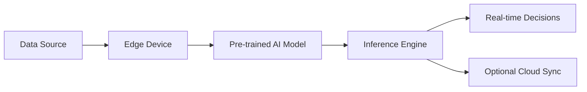

# Edge AI Technical Notes - Intermediate

## Quick Reference
- **Definition:** Edge AI enables artificial intelligence to run on edge devices, allowing real-time data processing without relying on centralized cloud infrastructure.
- **Key Use Cases:** Real-time object detection, predictive maintenance, speech recognition, autonomous systems.
- **Prerequisites:**  
  - Strong grasp of AI/ML basics.  
  - Familiarity with edge hardware and its constraints.  
  - Experience with model deployment frameworks.

## Table of Contents
1. [Introduction](#introduction)
2. [Core Concepts](#core-concepts)
   - [Fundamental Understanding](#fundamental-understanding)
   - [Visual Architecture](#visual-architecture)
3. [Implementation Details](#implementation-details)
   - [Intermediate Patterns](#intermediate-patterns)
4. [Real-World Applications](#real-world-applications)
   - [Industry Examples](#industry-examples)
   - [Hands-On Project](#hands-on-project)
5. [Tools & Resources](#tools--resources)
   - [Essential Tools](#essential-tools)
   - [Learning Resources](#learning-resources)
6. [References](#references)

## Introduction
### What  
Edge AI integrates AI models directly into edge devices, enabling autonomous, real-time decision-making at the source of data.

### Why  
- Reduces latency and bandwidth costs by avoiding cloud dependency.  
- Enhances data privacy by processing data locally.  
- Offers robustness in environments with limited or unreliable connectivity.

### Where  
Edge AI is used in diverse domains:  
- **Smart Cities:** Traffic management, crowd analytics.  
- **Healthcare:** Wearable diagnostics, remote monitoring.  
- **Industrial IoT:** Equipment monitoring, anomaly detection.

## Core Concepts
### Fundamental Understanding
- **Key Principles:**  
  - Models must balance accuracy and computational efficiency to fit edge hardware constraints.  
  - Hardware accelerators like GPUs, TPUs, or NPUs enhance processing capabilities.  
  - Optimization techniques like quantization and pruning are critical for edge deployment.  
- **Key Components:**  
  - **Edge Hardware:** Devices such as NVIDIA Jetson, Coral Dev Board.  
  - **Model Optimization:** Techniques to compress and speed up AI models.  
  - **Deployment Pipelines:** Tools for integrating models into edge devices.  
- **Common Misconceptions:**  
  - Edge AI is not a replacement for cloud AI; it complements it for hybrid systems.  
  - Optimized models do not always lead to significant performance losses if done correctly.

### Visual Architecture

- **System Overview:** Edge AI processes incoming data locally, provides decisions in real-time, and syncs selectively with the cloud when necessary.  
- **Component Relationships:** Data flows through sensors to edge devices, which run the AI models via inference engines.

## Implementation Details
### Intermediate Patterns
#### Example: Optimizing an Image Classifier for Edge Deployment
```python
import tensorflow as tf

# Load a pre-trained model
model = tf.keras.applications.MobileNetV2(weights="imagenet")

# Convert to TensorFlow Lite format
converter = tf.lite.TFLiteConverter.from_keras_model(model)
converter.optimizations = [tf.lite.Optimize.DEFAULT]  # Enable default optimizations
tflite_model = converter.convert()

# Save the optimized model
with open("mobilenet_v2_optimized.tflite", "wb") as f:
    f.write(tflite_model)

print("Model successfully converted for edge deployment.")
```

- **Patterns Covered:**  
  - **Model Quantization:** Reducing model precision (e.g., float32 → int8) for smaller size and faster inference.  
  - **Pruning:** Removing redundant weights in neural networks.  
  - **Hardware Acceleration:** Leveraging device-specific accelerators like Edge TPUs.  
- **Best Practices:**  
  - Test the optimized model on both simulated and real edge devices.  
  - Profile performance metrics like latency, throughput, and power consumption.  
- **Performance Considerations:**  
  - Use profiling tools like TensorFlow Profiler or NVIDIA Nsight.  
  - Balance model size vs. accuracy for the target use case.

## Real-World Applications
### Industry Examples
- **Automotive:** Driver monitoring systems and real-time navigation.  
- **Retail:** Automated checkout and customer analytics using in-store cameras.  
- **Agriculture:** Drone-based crop health monitoring with onboard AI.  

### Hands-On Project
#### Project: Real-Time Object Detection System
- **Goal:** Develop a system to detect objects in video feeds using a pre-trained YOLO model on NVIDIA Jetson Nano.  
- **Implementation Steps:**  
  1. Install DeepStream SDK for video processing on Jetson Nano.  
  2. Convert the YOLO model to TensorRT for optimized inference.  
  3. Implement a pipeline to process live video feeds and display detection results.  
- **Validation Methods:**  
  - Evaluate detection speed and accuracy on diverse test scenarios.  
  - Profile GPU utilization and memory usage.

## Tools & Resources
### Essential Tools
- **Development Environment:** Docker, Jupyter Notebooks.  
- **Key Frameworks:** TensorFlow Lite, PyTorch Mobile, NVIDIA TensorRT.  
- **Testing Tools:**  
  - Model optimization: Netron (for visualizing models).  
  - Profiling: TensorFlow Profiler, NVIDIA Nsight Systems.

### Learning Resources
- **Documentation:**  
  - TensorFlow Lite: [Official Docs](https://www.tensorflow.org/lite).  
  - NVIDIA Jetson: [Getting Started](https://developer.nvidia.com/embedded-computing).  
- **Tutorials:**  
  - Model Optimization Techniques for Edge AI.  
  - Deploying AI on Jetson Nano.  
- **Community Resources:**  
  - Edge AI Developers Forum.  
  - Relevant GitHub repositories.

## References
- TensorFlow Lite and TensorRT optimization papers.  
- NVIDIA’s DeepStream and Jetson technical documentation.  
- Benchmark studies for edge AI model performance.

## Appendix
- **Glossary:**  
  - **Quantization:** Process of reducing the precision of model parameters to make models smaller and faster.  
  - **Pruning:** Removing unimportant weights in a neural network to reduce size and computation.  
- **Setup Guides:** Setting up NVIDIA Jetson devices.  
- **Code Templates:** Scripts for converting and testing optimized models.
