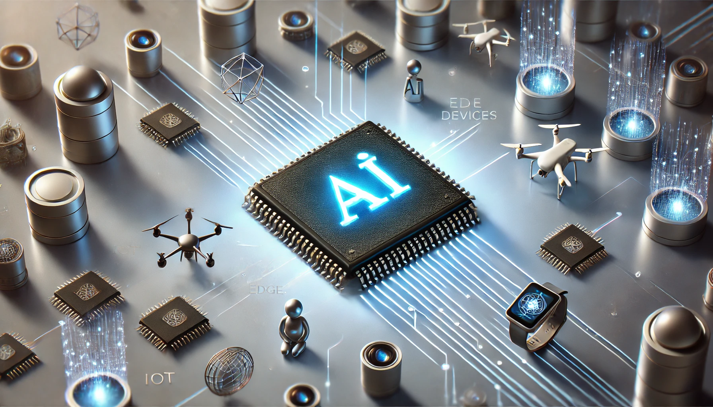

# AI-Chips for Edge AI Technical Notes

## Quick Reference
- AI chips for Edge AI are specialized hardware components designed to accelerate AI processing on edge devices.
- Key use cases: Real-time data processing, IoT devices, autonomous systems, smart cameras.
- Prerequisites: Basic understanding of AI, edge computing, and computer hardware.

## Introduction

AI chips for Edge AI are specialized hardware components designed to enhance the performance and efficiency of artificial intelligence algorithms on edge devices. These chips enable AI processing directly on local devices, allowing for real-time data analysis and decision-making without constant reliance on cloud infrastructure[1][5].

## Core Concepts

### Fundamental Understanding

AI chips for Edge AI work by optimizing the execution of AI algorithms, particularly deep learning models, on resource-constrained devices. They offer several benefits:

1. Increased processing speed for AI tasks
2. Reduced latency in decision-making
3. Improved energy efficiency
4. Enhanced data privacy and security

Edge AI systems typically consist of four main elements:
- Edge devices (e.g., IoT devices, smart cameras)
- AI models optimized for edge hardware
- Specialized AI chips (accelerators)
- Software frameworks for development and deployment[1]

### Visual Architecture

## Implementation Details

### Basic Implementation

AI chips for Edge AI come in various forms, including:

1. Graphics Processing Units (GPUs): Specialized for rapid processing and image handling[5].
2. Tensor Processing Units (TPUs): Purpose-built for AI workloads, like Google's Coral Edge TPU[5].
3. Application-Specific Integrated Circuits (ASICs): Custom-designed for specific AI tasks[2].
4. Field-Programmable Gate Arrays (FPGAs): Flexible chips that can be reprogrammed for different AI algorithms[2].

These chips are designed to handle AI tasks efficiently on edge devices, enabling faster processing and decision-making without relying on cloud connectivity[1][5].

## Real-World Applications

Edge AI chips find applications in various industries:
- Autonomous vehicles for real-time decision making
- Smart home devices for local voice recognition
- Industrial IoT for predictive maintenance
- Healthcare monitoring systems for instant analysis
- Retail for real-time customer analytics[1][4]

## Tools & Resources

### Essential Tools
- Edge AI development platforms (e.g., NVIDIA Jetson, Google Edge TPU)
- Edge AI software frameworks (e.g., TensorFlow Lite, ONNX Runtime)

### Learning Resources
- Online courses on edge computing and AI
- Hardware manufacturer documentation
- Edge AI community forums and blogs[1]

By leveraging AI chips for Edge AI, developers can create more efficient, responsive, and secure AI applications that process data closer to its source, reducing latency and improving overall system performance[1][5].

## References
- [1] https://www.scaleoutsystems.com/edge-computing-and-ai
- [2] https://www.wevolver.com/article/what-is-edge-ai
- [3] https://docs.edgeimpulse.com/docs/edge-ai-hardware/edge-ai-hardware
- [4] https://theaitrack.com/ai-infrastructure-guide/
- [5] https://viso.ai/edge-ai/ai-hardware-accelerators-overview/
- [6] https://stm32ai.st.com/edge-ai-hardware/
- [7] https://www.restack.io/p/edge-ai-answer-beginners-guide-development-cat-ai
- [8] https://www.asianometry.com/p/the-hard-problems-of-edge-ai-hardware
- [9] https://www.flexential.com/resources/blog/beginners-guide-ai-edge-computing
- [10] https://xailient.com/blog/what-is-edge-ai-hardware-and-why-is-it-so-important/