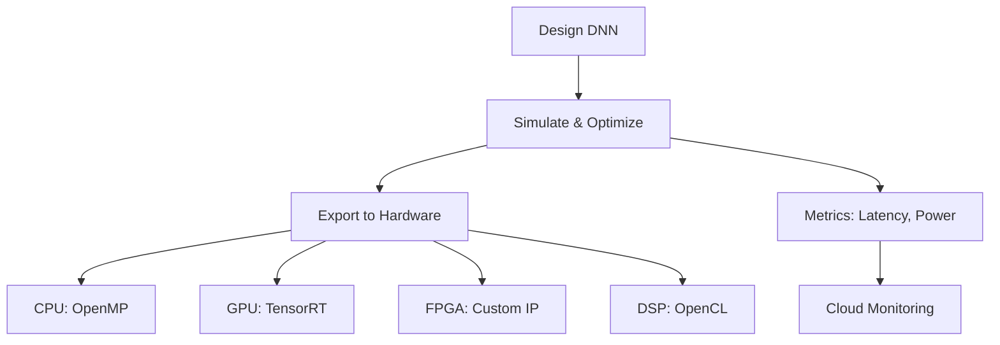

# Deploy with Aidge Technical Notes

<!-- [A rectangular image showcasing an advanced deployment pipeline with Aidge: on the left, a complex neural network editor with detailed layer configurations and parameter tuning options; in the center, a multi-pane simulation interface displaying real-time metrics (e.g., latency, throughput, power consumption) alongside optimization controls like quantization and pruning; on the right, a production-ready deployment scene with a cluster of hardware targets (CPU, GPU, FPGA, DSP) connected to a cloud dashboard, featuring code snippets, hardware-specific optimizations, and deployment logs, all set against a sleek, futuristic background with the Aidge logo prominently displayed.] -->

## Quick Reference
- **One-sentence definition**: Deploying with Aidge leverages an open-source platform to design, optimize, and deploy highly efficient deep neural networks (DNNs) across diverse hardware targets, tailored for production-grade embedded systems.
- **Key use cases**: Deploying DNNs in autonomous vehicles, real-time edge AI for industrial IoT, and scalable robotics applications.
- **Prerequisites**: Proficiency in Python and C++, deep understanding of DNN architectures and hardware acceleration, experience with system-level optimization and deployment workflows.

## Table of Contents
- [Introduction](#introduction)
- [Core Concepts](#core-concepts)
  - [Fundamental Understanding](#fundamental-understanding)
  - [Visual Architecture](#visual-architecture)
- [Implementation Details](#implementation-details)
  - [Advanced Topics](#advanced-topics)
- [Real-World Applications](#real-world-applications)
  - [Industry Examples](#industry-examples)
  - [Hands-On Project](#hands-on-project)
- [Tools & Resources](#tools--resources)
  - [Essential Tools](#essential-tools)
  - [Learning Resources](#learning-resources)
- [References](#references)
- [Appendix](#appendix)
  - [Glossary](#glossary)

## Introduction
- **What**: Deploying with Aidge, based at [https://gitlab.eclipse.org/eclipse/aidge/aidge](https://gitlab.eclipse.org/eclipse/aidge/aidge), is the process of designing, simulating, optimizing, and deploying sophisticated DNNs onto hardware targets (e.g., CPUs, GPUs, FPGAs, DSPs) with a focus on production-ready embedded systems.
- **Why**: It tackles the challenge of achieving high performance, low latency, and minimal resource usage in real-world AI deployments, offering advanced users tools to fine-tune models and integrate them into complex systems.
- **Where**: Deployed in high-stakes domains like autonomous driving, industrial automation, aerospace, and large-scale IoT networks.

## Core Concepts

### Fundamental Understanding
- **Basic Principles**: Deployment with Aidge involves advanced DNN design, multi-stage optimization (e.g., quantization, pruning, kernel fusion), and deployment across heterogeneous hardware, emphasizing scalability and real-time constraints.
- **Key Components**: 
  - **Network Design**: Crafting task-specific, scalable DNN architectures.
  - **Simulation**: Benchmarking with production-like workloads and constraints.
  - **Hardware Export**: Generating optimized, hardware-specific code (e.g., TensorRT for GPUs, custom IP for FPGAs).
- **Common Misconceptions**: Advanced users might overestimate Aidge’s automation—while powerful, it requires strategic intervention for optimal system-level performance.

### Visual Architecture

- **System Overview**: A pipeline integrating design, optimization, and multi-target deployment with real-time monitoring.
- **Component Relationships**: Optimization drives hardware-specific exports, with metrics feeding back into system tuning and cloud oversight.

## Implementation Details

### Advanced Topics [Advanced]

[Python & C++]
```python
# Example: Optimizing and deploying a DNN for production with Aidge
from aidge_core import Model
from aidge_optimization import Quantizer, KernelFusion  # Hypothetical advanced modules

# Load a complex model
model = Model.import_onnx("complex_model.onnx")  # Replace with your ONNX file

# Simulate with production workload
input_batch = [load_batch_data()]  # Custom function for batch data
output = model.run(input_batch)
print("Baseline performance:", measure_latency(output))

# Optimize: Quantization + Kernel Fusion
quantizer = Quantizer(model, precision="int8")  # Reduce to 8-bit integers
quantized_model = quantizer.quantize()
fusion = KernelFusion(quantized_model)
optimized_model = fusion.fuse_kernels()  # Combine operations for efficiency

# Export to GPU with TensorRT
optimized_model.export("tensorrt", "prod_model.trt", optimization_level="O3")
print("Deployed to prod_model.trt")
```

[C++ snippet for integration]
```cpp
// Example: Running the deployed model on GPU
#include "tensorrt_model.h"
int main() {
    TensorRTModel model("prod_model.trt");
    float* input = prepare_input_batch();  // Custom data prep
    float* output = model.infer(input);
    log_performance(output);  // Custom logging
    return 0;
}
```

- **System Design**: Use a modular pipeline with optimization stages (quantization, fusion) and hardware-specific backends.
- **Optimization Techniques**: Apply int8 quantization for speed, fuse kernels to reduce overhead, and leverage hardware intrinsics.
- **Production Considerations**: Ensure fault tolerance (e.g., error handling), scalability (batch processing), and monitoring integration.

## Real-World Applications

### Industry Examples
- **Use Case**: Deploying a real-time object detection system in an autonomous vehicle.
- **Implementation Pattern**: Optimize a YOLOv5 model with quantization and TensorRT export for GPU, integrate with vehicle sensors.
- **Success Metrics**: <50ms inference latency, 95% mAP, operates within 10W power budget.

### Hands-On Project
- **Project Goals**: Deploy a multi-object tracking DNN for an industrial robot arm on an FPGA.
- **Implementation Steps**:
  1. Design a custom CNN-RNN hybrid in Aidge.
  2. Optimize with pruning, quantization, and custom IP synthesis.
  3. Export to FPGA with HDL code generation.
  4. Integrate with robot control system and test with live camera feed.
- **Validation Methods**: Achieve <20ms latency, >90% tracking accuracy, verify FPGA resource usage (<80% LUTs).

## Tools & Resources

### Essential Tools
- **Development Environment**: Python 3.7+, C++17, advanced IDE (e.g., CLion).
- **Key Frameworks**: Aidge_core, TensorRT, OpenCL, Vivado (for FPGA).
- **Testing Tools**: NVIDIA Nsight Systems, Xilinx Vitis, custom profiling scripts.

### Learning Resources
- **Documentation**: [Eclipse Aidge Docs](https://eclipse.dev/aidge/) for advanced APIs.
- **Tutorials**: Custom export guides at [Aidge GitLab](https://gitlab.eclipse.org/eclipse/aidge/aidge).
- **Community Resources**: [Aidge GitLab Issues](https://gitlab.eclipse.org/groups/eclipse/aidge/-/issues), industry forums (e.g., Embedded Vision Summit).

## References
- [Eclipse Aidge GitLab](https://gitlab.eclipse.org/eclipse/aidge/aidge)
- [TensorRT Developer Guide](https://docs.nvidia.com/deeplearning/tensorrt/)
- [FPGA Design with Vivado](https://www.xilinx.com/support/documentation)

## Appendix

### Glossary
- **Kernel Fusion**: Combining multiple DNN operations into a single kernel to reduce overhead.
- **TensorRT**: NVIDIA’s library for optimizing and running DNNs on GPUs.
- **HDL**: Hardware Description Language (e.g., VHDL) for FPGA programming.