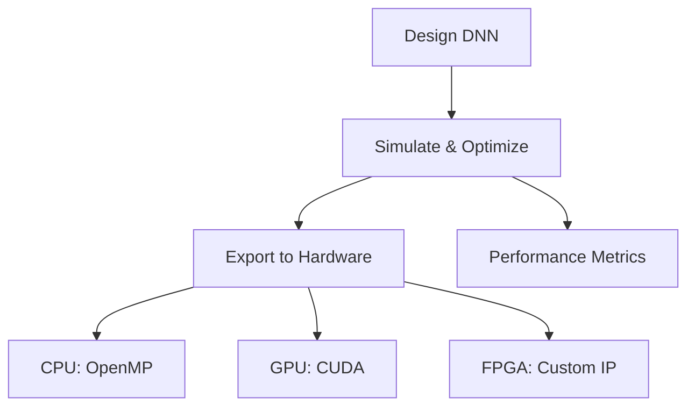

# Deploy with Aidge Technical Notes

<!-- [A rectangular image illustrating an intermediate-level deployment workflow with Aidge: on the left, a detailed neural network design interface with multiple layers and parameters displayed; in the center, a simulation dashboard showing performance graphs (e.g., latency, accuracy) and optimization options; on the right, a multi-device deployment scene featuring a CPU, GPU, and FPGA with code snippets and hardware-specific configurations, all connected by arrows indicating a streamlined process, set against a modern, tech-inspired background with the Aidge logo subtly integrated.] -->

## Quick Reference
- **One-sentence definition**: Deploying with Aidge is the process of using an open-source platform to design, optimize, and deploy deep neural networks (DNNs) across various hardware targets, with a focus on performance and embedded systems.
- **Key use cases**: Optimizing DNNs for edge devices, integrating AI into robotics systems, and benchmarking performance across hardware platforms.
- **Prerequisites**: Working knowledge of Python and neural networks, basic understanding of hardware constraints (e.g., memory, compute power), and familiarity with setting up development environments.

## Table of Contents
- [Introduction](#introduction)
- [Core Concepts](#core-concepts)
  - [Fundamental Understanding](#fundamental-understanding)
  - [Visual Architecture](#visual-architecture)
- [Implementation Details](#implementation-details)
  - [Intermediate Patterns](#intermediate-patterns)
- [Real-World Applications](#real-world-applications)
  - [Industry Examples](#industry-examples)
  - [Hands-On Project](#hands-on-project)
- [Tools & Resources](#tools--resources)
  - [Essential Tools](#essential-tools)
  - [Learning Resources](#learning-resources)
- [References](#references)
- [Appendix](#appendix)
  - [Glossary](#glossary)

## Introduction
- **What**: Deploying with Aidge involves leveraging the Aidge platform ([https://gitlab.eclipse.org/eclipse/aidge/aidge](https://gitlab.eclipse.org/eclipse/aidge/aidge)) to design, simulate, optimize, and deploy DNNs onto hardware targets like CPUs, GPUs, and FPGAs, emphasizing efficiency for embedded systems.
- **Why**: It addresses the need for balancing performance and resource constraints in AI deployment, providing intermediate users with tools to refine models and adapt them to specific hardware, enhancing speed and scalability over basic setups.
- **Where**: Applied in semi-professional projects, small-scale production systems, and intermediate development for IoT, robotics, automotive edge computing, and smart devices.

## Core Concepts

### Fundamental Understanding
- **Basic Principles**: Deployment with Aidge builds on designing DNNs, simulating them for validation, and exporting them to hardware, with an intermediate focus on optimizing topology and performance trade-offs (e.g., accuracy vs. latency).
- **Key Components**: 
  - **Network Design**: Configuring layers and parameters for specific tasks.
  - **Simulation**: Evaluating models with metrics like throughput and power usage.
  - **Hardware Export**: Generating optimized code for targets using frameworks like OpenCL or CUDA.
- **Common Misconceptions**: Intermediate users might assume Aidge handles all optimization automatically—it aids the process, but manual tuning (e.g., pruning, quantization) is often needed for best results.

### Visual Architecture

- **System Overview**: The diagram shows a workflow with optimization as a key step, feeding into multi-target deployment.
- **Component Relationships**: Simulation informs optimization, which tailors the export process for specific hardware, tracked by performance metrics.

## Implementation Details

### Intermediate Patterns [Intermediate]

[Python]
```python
# Example: Optimizing and deploying a CNN with Aidge
from aidge_core import Model
from aidge_optimization import Pruner  # Hypothetical optimization module

# Load and configure a CNN model
model = Model.import_onnx("cnn_model.onnx")  # Replace with your ONNX file

# Simulate with sample data
input_data = [[0.1, 0.2, 0.3, 0.4]]  # Example input
output = model.run(input_data)
print("Initial output:", output)

# Apply pruning to reduce model size
pruner = Pruner(model)
pruned_model = pruner.prune(sparsity=0.3)  # Remove 30% of weights
pruned_output = pruned_model.run(input_data)
print("Pruned output:", pruned_output)

# Export optimized model to GPU with CUDA
pruned_model.export("cuda", "optimized_model.cu", optimization_level="O2")
print("Model exported to optimized_model.cu")
```

- **Design Patterns**: Use modular optimization (e.g., pruning for sparsity) to balance accuracy and efficiency, followed by targeted export.
- **Best Practices**: Validate post-optimization performance, choose hardware-specific optimizations (e.g., CUDA for GPUs), and test on target devices.
- **Performance Considerations**: Pruning reduces memory footprint but may lower accuracy—simulate extensively to find the sweet spot.

## Real-World Applications

### Industry Examples
- **Use Case**: Deploying an optimized speech recognition model on an IoT smart speaker.
- **Implementation Pattern**: Design a lightweight RNN, prune for size, export to CPU with OpenMP, and integrate with audio input.
- **Success Metrics**: <200ms latency, >90% word accuracy, fits within 50MB memory.

### Hands-On Project
- **Project Goals**: Deploy an optimized image classifier for a drone’s edge processor (e.g., NVIDIA Jetson).
- **Implementation Steps**:
  1. Set up Aidge with Python and CUDA support.
  2. Import a pre-trained CNN (e.g., MobileNet ONNX).
  3. Optimize with pruning and quantization.
  4. Export to CUDA and deploy on Jetson.
  5. Test with sample aerial images.
- **Validation Methods**: Measure inference time (<100ms) and accuracy (>85%) on device.

## Tools & Resources

### Essential Tools
- **Development Environment**: Python 3.7+, IDE like PyCharm or VS Code.
- **Key Frameworks**: Aidge_core, Aidge_optimization (if available), ONNX, CUDA toolkit.
- **Testing Tools**: NVIDIA Nsight (for GPU profiling), pytest for Python tests.

### Learning Resources
- **Documentation**: [Eclipse Aidge Docs](https://eclipse.dev/aidge/) for API and optimization guides.
- **Tutorials**: “Training a Simple Neural Network” at [Tutorial Index](https://eclipse.dev/aidge/source/Tutorial/index.html).
- **Community Resources**: [Aidge GitLab Discussions](https://gitlab.eclipse.org/groups/eclipse/aidge/-/boards) for peer advice.

## References
- [Eclipse Aidge GitLab](https://gitlab.eclipse.org/eclipse/aidge/aidge)
- [Eclipse Aidge Documentation](https://eclipse.dev/aidge/)
- [CUDA Programming Guide](https://docs.nvidia.com/cuda/)

## Appendix

### Glossary
- **Pruning**: Removing less important weights from a DNN to reduce size.
- **Quantization**: Reducing precision of weights (e.g., float32 to int8) for efficiency.
- **CUDA**: NVIDIA’s parallel computing platform for GPU acceleration.