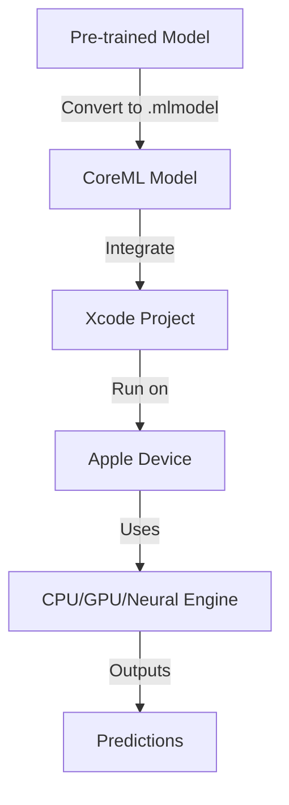

# CoreML Technical Notes
<!-- A rectangular image showing a simplified workflow of CoreML, with an iOS device displaying a machine learning app interface, a neural network diagram in the background, and arrows indicating data flow from model creation to deployment on Apple devices. -->

## Quick Reference
- **Definition**: CoreML is Apple’s framework for integrating machine learning models into iOS, macOS, watchOS, and tvOS apps.
- **Key Use Cases**: Image recognition, natural language processing, and predictive analytics in mobile apps.
- **Prerequisites**: Basic Swift programming knowledge, Xcode installed, and familiarity with iOS app development basics.

## Table of Contents
1. Introduction
2. Core Concepts
3. Implementation Details
4. Real-World Applications
5. Tools & Resources
6. References
7. Appendix

## Introduction
### What
CoreML is a framework provided by Apple that allows developers to integrate pre-trained machine learning models into apps for on-device inference, enabling fast and privacy-focused predictions.

### Why
CoreML solves the problem of running machine learning models efficiently on Apple devices without requiring extensive machine learning expertise, offering low latency and offline capabilities.

### Where
CoreML is used in mobile apps for tasks like image classification (e.g., identifying objects in photos), text analysis (e.g., sentiment analysis), and recommendation systems (e.g., personalized content).

## Core Concepts
### Fundamental Understanding
- **Basic Principles**: CoreML enables on-device machine learning by converting pre-trained models into a format optimized for Apple’s hardware, leveraging CPU, GPU, and Neural Engine for performance.
- **Key Components**:
  - **MLModel**: The core object representing a trained machine learning model.
  - **Vision**: A framework for image-based tasks, often used with CoreML.
  - **Neural Engine**: Apple’s dedicated hardware for accelerating ML tasks.
- **Common Misconceptions**:
  - CoreML trains models: No, it only runs pre-trained models.
  - Requires cloud connectivity: CoreML models run offline on-device.
  - Only for advanced developers: Beginners can use pre-trained models with minimal setup.

### Visual Architecture

- **System Overview**: A pre-trained model is converted to CoreML format, integrated into an Xcode project, and executed on-device using Apple’s hardware for predictions.
- **Component Relationships**: The MLModel interacts with Vision or other frameworks to process input (e.g., images, text) and produce outputs (e.g., classifications, predictions).

## Implementation Details
### Basic Implementation
```swift
// Import CoreML framework
import CoreML
import Vision

// Load the CoreML model
guard let model = try? VNCoreMLModel(for: MyModel().model) else {
    fatalError("Failed to load CoreML model")
}

// Create a Vision request
let request = VNCoreMLRequest(model: model) { request, error in
    guard let results = request.results as? [VNClassificationObservation],
          let topResult = results.first else {
        print("No predictions")
        return
    }
    print("Prediction: \(topResult.identifier), Confidence: \(topResult.confidence)")
}

// Process an image
let handler = VNImageRequestHandler(url: imageURL, options: [:])
try? handler.perform([request])
```
- **Step-by-Step Setup**:
  1. Install Xcode from the Mac App Store.
  2. Download a pre-trained CoreML model (e.g., from Apple’s developer site or convert a model using `coremltools`).
  3. Drag the `.mlmodel` file into your Xcode project.
  4. Add CoreML and Vision frameworks to your project.
  5. Write code to load the model and process inputs (e.g., images).
- **Code Walkthrough**:
  - The code loads a CoreML model and creates a Vision request to process an image.
  - Results are returned as classifications with confidence scores.
- **Common Pitfalls**:
  - Forgetting to add the `.mlmodel` file to the Xcode project.
  - Not handling errors gracefully (e.g., invalid input data).
  - Using unsupported model types (CoreML supports specific formats like neural networks).

## Real-World Applications
### Industry Examples
- **Use Case**: Image recognition in a photo app to identify objects (e.g., “dog” or “cat”).
- **Implementation Pattern**: Use a pre-trained model like MobileNetV2 with Vision for image classification.
- **Success Metrics**: High accuracy in predictions and low latency (<100ms) for user satisfaction.

### Hands-On Project
- **Project Goals**: Build a simple iOS app that uses CoreML to classify images as “cat” or “dog.”
- **Implementation Steps**:
  1. Create a new Xcode iOS project (Single View App).
  2. Download a pre-trained CoreML model (e.g., MobileNetV2).
  3. Add a button to select an image from the photo library.
  4. Use the above code to process the image and display the result in a label.
- **Validation Methods**: Test with sample cat/dog images and verify the app correctly identifies them with high confidence.

## Tools & Resources
### Essential Tools
- **Development Environment**: Xcode 16 or later.
- **Key Frameworks**: CoreML, Vision.
- **Testing Tools**: iOS Simulator (included with Xcode) or an iOS device.

### Learning Resources
- **Documentation**: Apple’s CoreML documentation (developer.apple.com/documentation/coreml).
- **Tutorials**: Apple’s “Getting Started with CoreML” tutorial.
- **Community Resources**: Stack Overflow, Apple Developer Forums.

## References
- Apple Developer: CoreML Documentation (developer.apple.com/documentation/coreml).
- WWDC Sessions: “Introducing CoreML” (2017).
- CoreML Model Zoo: developer.apple.com/machine-learning/models/.

## Appendix
### Glossary
- **MLModel**: CoreML’s format for machine learning models.
- **Vision**: Framework for image processing tasks.
- **Neural Engine**: Apple’s hardware for ML acceleration.

### Setup Guides
- Install Xcode: Download from Mac App Store.
- Add CoreML Model: Drag `.mlmodel` into Xcode’s Project Navigator.