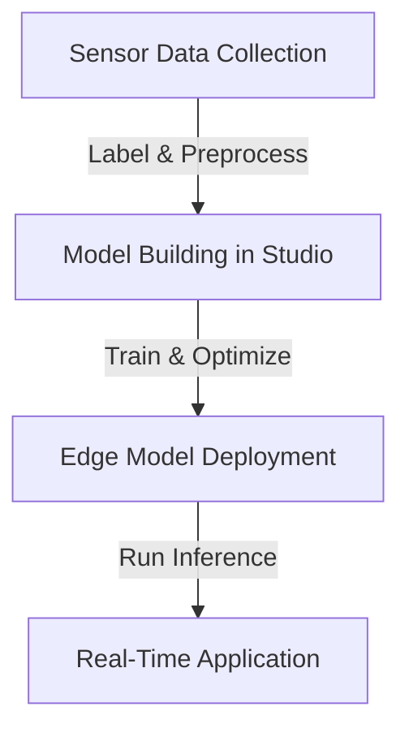

# Imagimob DeepCraft Technical Notes
<!-- A rectangular image showing a simplified workflow of Imagimob DeepCraft, with an edge device like a sensor capturing data, a laptop interface displaying model building blocks, and arrows indicating the process from data collection to AI model deployment on tiny devices for applications like gesture recognition. -->

## Quick Reference
- **Definition**: Imagimob DeepCraft is an edge AI software suite for developing and deploying machine learning models on resource-constrained devices, focusing on sensor data like IMUs for applications such as gesture recognition and activity monitoring.
- **Key Use Cases**: Building AI models for wearables, IoT sensors, and embedded systems to enable real-time inference without cloud dependency.
- **Prerequisites**: Basic Python knowledge, familiarity with machine learning concepts, and a computer with access to sensors or sample data.

## Table of Contents
1. Introduction
2. Core Concepts
3. Implementation Details
4. Real-World Applications
5. Tools & Resources
6. References
7. Appendix

## Introduction
### What
Imagimob DeepCraft is a platform that enables users to create, train, and deploy AI models for edge devices, specializing in tinyML applications using sensor data.

### Why
DeepCraft simplifies the development of efficient AI models for low-power devices, reducing the need for extensive ML expertise and enabling fast prototyping to production deployment.

### Where
DeepCraft is used in IoT, wearables, industrial monitoring, and smart home devices for on-device intelligence.

## Core Concepts
### Fundamental Understanding
- **Basic Principles**: DeepCraft focuses on end-to-end workflows for tinyML, from data collection to model optimization, emphasizing low-power consumption and real-time performance on edge hardware.
- **Key Components**:
  - **Studio**: Graphical interface for building and training models.
  - **Ready Models**: Pre-built models for common tasks like fall detection or gesture recognition.
  - **Accelerators**: Starter projects with data and configurations for specific use cases.
- **Common Misconceptions**:
  - Requires advanced ML knowledge: DeepCraft's interface makes it accessible for beginners.
  - Only for specific hardware: Supports various MCUs and sensors.
  - Cloud-dependent: Designed for edge-only inference.

### Visual Architecture

- **System Overview**: Data from sensors is processed in the studio to build models, which are optimized and deployed to edge devices for inference.
- **Component Relationships**: Data drives model training, studio handles development, deployment enables application.

## Implementation Details
### Basic Implementation
```python
# Example using DeepCraft's Python API (simplified; actual API may vary)
import deepcraft  # Assuming DeepCraft Python library

# Load sample accelerator project
project = deepcraft.load_accelerator('gesture_recognition')

# Add your data
project.add_data('my_gestures.csv', labels=['wave', 'circle', 'stop'])

# Train model
model = project.train(epochs=50, batch_size=32)

# Optimize for target MCU
optimized_model = model.optimize(target='arm_cortex_m4')

# Deploy (generate C code)
optimized_model.export('gesture_model.c')
```
- **Step-by-Step Setup**:
  1. Install DeepCraft Studio from the official website.
  2. Download a starter accelerator (e.g., gesture recognition).
  3. Import your sensor data and labels.
  4. Train and deploy the model to hardware.
- **Code Walkthrough**:
  - Load a pre-configured project, add data, train, optimize for edge, and export code.
- **Common Pitfalls**:
  - Data format issues: Ensure CSV matches expected columns (e.g., accelerometer data).
  - Hardware compatibility: Check target MCU support.
  - Overfitting: Use validation splits in training.

## Real-World Applications
### Industry Examples
- **Use Case**: Gesture recognition in wearables for controlling devices.
- **Implementation Pattern**: Use IMU data to train models for hand gestures.
- **Success Metrics**: High accuracy (>90%) with low power usage.

### Hands-On Project
- **Project Goals**: Build a simple gesture detector using DeepCraft.
- **Implementation Steps**:
  1. Install Studio and load gesture accelerator.
  2. Collect IMU data for 3 gestures.
  3. Train and evaluate the model.
  4. Deploy to a microcontroller.
- **Validation Methods**: Test accuracy on new data; measure inference time.

## Tools & Resources
### Essential Tools
- **Development Environment**: DeepCraft Studio, Python for scripting.
- **Key Frameworks**: Built-in ML tools in Studio.
- **Testing Tools**: Arduino or similar for deployment testing.

### Learning Resources
- **Documentation**: DeepCraft docs on developer.imagimob.com.
- **Tutorials**: YouTube series on DeepCraft Studio.
- **Community Resources**: Infineon forums, Imagimob blog.

## References
- Imagimob Website: www.imagimob.com/deepcraft.
- Documentation: developer.imagimob.com.
- Infineon Page: www.infineon.com/deepcraft.

## Appendix
### Glossary
- **TinyML**: Machine learning on tiny devices.
- **IMU**: Inertial Measurement Unit (sensors for motion).
- **Edge AI**: AI running on devices, not cloud.

### Setup Guides
- Download Studio: From imagimob.com.
- System Requirements: Windows/Mac with Python 3+.