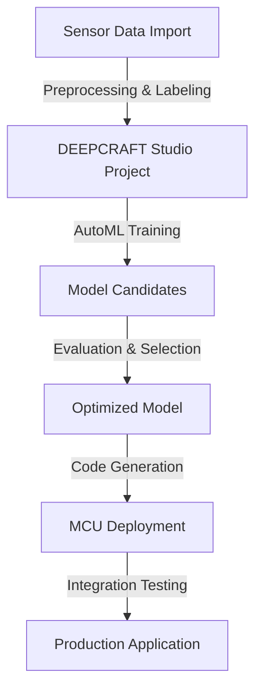

# Imagimob DEEPCRAFT Technical Notes

<!-- A rectangular image illustrating an intermediate DEEPCRAFT workflow, featuring a sensor-equipped wearable device capturing motion data, the DEEPCRAFT Studio interface with data preprocessing tools, AutoML model selection, optimization settings for MCU targets, and deployment to embedded hardware, with arrows showing integration with CI/CD pipelines and performance metrics. -->

## Quick Reference
- **Definition**: Imagimob DEEPCRAFT is a comprehensive edge AI platform for developing, optimizing, and deploying machine learning models on resource-constrained devices, specializing in sensor-based applications like IMU data processing.
- **Key Use Cases**: Real-time activity recognition in wearables, predictive maintenance in industrial IoT, and gesture control in smart devices.
- **Prerequisites**: Proficiency in machine learning workflows, experience with sensor data handling, and familiarity with embedded systems programming.

## Table of Contents
1. Introduction
2. Core Concepts
3. Implementation Details
4. Real-World Applications
5. Tools & Resources
6. References
7. Appendix

## Introduction
### What
Imagimob DEEPCRAFT (formerly Imagimob Studio) is an end-to-end software suite for building AI models tailored for edge devices, supporting data labeling, AutoML, optimization, and code generation for MCUs.

### Why
DEEPCRAFT streamlines the tinyML development process by automating model selection and optimization, ensuring efficient performance on low-power hardware while maintaining high accuracy.

### Where
DEEPCRAFT is applied in IoT ecosystems for sensor-driven AI, including health monitoring wearables, industrial automation, and consumer electronics with motion intelligence.

## Core Concepts
### Fundamental Understanding
- **Basic Principles**: DEEPCRAFT leverages AutoML for architecture search, focuses on quantization and pruning for edge optimization, and supports seamless transition from prototyping to production deployment.
- **Key Components**:
  - **Data Preprocessor**: Tools for filtering, segmentation, and feature extraction from time-series sensor data.
  - **AutoML Engine**: Automated hyperparameter tuning and model architecture selection.
  - **Optimizer**: Quantization (INT8), pruning, and hardware-specific adaptations.
  - **Code Generator**: Exports C/C++ code for MCU integration.
- **Common Misconceptions**:
  - AutoML replaces expertise: It accelerates iteration but requires domain knowledge for data quality.
  - Edge-only focus: Supports hybrid cloud-edge workflows for training.
  - Limited to IMUs: Handles various sensors like microphones and cameras.

### Visual Architecture

- **System Overview**: Sensor data is imported and preprocessed in the studio, trained via AutoML, optimized, and deployed as code to MCUs for production.
- **Component Relationships**: Preprocessing feeds training, AutoML generates candidates, optimization ensures efficiency, deployment enables application.

## Implementation Details
### Intermediate Patterns
```c
// Example generated C code for MCU inference (simplified from DEEPCRAFT export)
#include "deepcraft_model.h"  // Generated header

void setup() {
  // Initialize sensors (e.g., IMU)
  init_imu();
}

void loop() {
  float input_data[INPUT_SIZE];  // e.g., 3-axis accel + gyro
  read_sensor_data(input_data);
  
  // Preprocess (normalization, windowing)
  normalize_data(input_data);
  
  // Run inference
  int prediction = deepcraft_infer(input_data);  // Model call
  
  // Act on prediction (e.g., gesture detected)
  if (prediction == GESTURE_WAVE) {
    trigger_action();
  }
  
  delay(50);  // Sampling rate
}
```
- **Design Patterns**:
  - **Data Pipeline**: Automated segmentation and feature extraction (e.g., FFT, MFCC) for time-series.
  - **AutoML Workflow**: Hyperparameter sweeps with cross-validation for robust models.
  - **Hardware Integration**: Generate platform-specific code with HAL abstractions.
- **Best Practices**:
  - Balance dataset classes to avoid bias in classification tasks.
  - Use transfer learning from Ready Models for faster convergence.
  - Profile power consumption during optimization iterations.
- **Performance Considerations**:
  - Target <1ms inference on MCUs via quantization.
  - Optimize window sizes for real-time vs. accuracy trade-offs.
  - Monitor overfitting with validation sets from diverse conditions.

## Real-World Applications
### Industry Examples
- **Use Case**: Fall detection in elderly care wearables.
- **Implementation Pattern**: Use IMU data with AutoML for anomaly detection, optimize for battery life.
- **Success Metrics**: >95% detection accuracy, <10mW power draw.

### Hands-On Project
- **Project Goals**: Develop a custom gesture recognition model for an MCU.
- **Implementation Steps**:
  1. Create a project in DEEPCRAFT Studio with gesture accelerator.
  2. Import labeled IMU data, preprocess with filters.
  3. Run AutoML to select best architecture.
  4. Optimize and generate C code for deployment.
- **Validation Methods**: Test on hardware; measure latency and accuracy.

## Tools & Resources
### Essential Tools
- **Development Environment**: DEEPCRAFT Studio (Windows/Mac), MCU dev boards.
- **Key Frameworks**: Built-in AutoML, supports TensorFlow Lite Micro.
- **Testing Tools**: Oscilloscope for power profiling, debuggers for MCUs.

### Learning Resources
- **Documentation**: DEEPCRAFT developer portal (developer.imagimob.com).
- **Tutorials**: Video series on model optimization.
- **Community Resources**: Imagimob forums, tinyML talks.

## References
- DEEPCRAFT Docs: developer.imagimob.com.
- Imagimob Website: www.imagimob.com/deepcraft.
- TinyML Book: "TinyML" by Warden & Situnayake.

## Appendix
### Glossary
- **AutoML**: Automated Machine Learning for model search.
- **Quantization**: Reducing model precision for efficiency.
- **MCU**: Microcontroller Unit for edge devices.

### Setup Guides
- Install Studio: Download from imagimob.com.
- Hardware: Use supported boards like STM32 or Nordic.