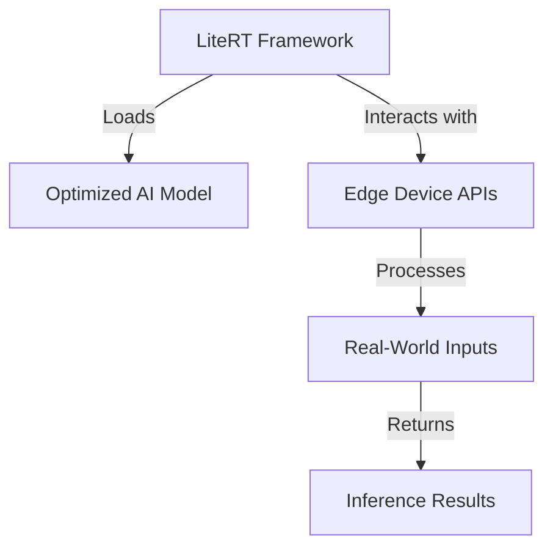

# DEEPCRAFT Technical Notes  

## Quick Reference  
- **One-sentence definition**: LiteRT is a lightweight runtime framework optimized for deploying machine learning models on edge devices with minimal resource consumption.  
- **Key use cases**: IoT devices, robotics, and real-time embedded systems requiring fast and efficient AI inference.  
- **Prerequisites**: Familiarity with basic machine learning concepts and working knowledge of Python.

## Table of Contents  
1. [Introduction](#introduction)
2. [Core Concepts](#core-concepts)
   - [LiteRT Overview](#lite-rt-overview)
   - [Key Features](#key-features)
   - [Common Misconceptions](#common-misconceptions)
3. [Visual Architecture](#visual-architecture)
   - [System Overview Diagram](#system-overview-diagram)
   - [Component Relationships](#component-relationships)
4. [Implementation Details](#implementation-details)
   - [Basic Deployment Example](#basic-deployment-example)
   - [Common Pitfalls and Solutions](#common-pitfalls-and-solutions)
5. [Tools & Resources](#tools--resources)
6. [References](#references)

## Introduction  
### What  
LiteRT is an ultra-lightweight runtime designed for deploying AI models on resource-constrained devices. Its modular design makes it suitable for a wide range of edge applications.  

### Why  
Deploying AI with LiteRT enables highly efficient, low-latency inference on devices where resources like memory and processing power are limited.  

### Where  
LiteRT is commonly used in:  
- **IoT**: Smart sensors, smart home automation.  
- **Robotics**: Path planning, object detection.  
- **Healthcare**: Portable diagnostic devices.  

## Core Concepts  
### LiteRT Overview  
- **Lightweight Runtime**: Small memory footprint, suitable for microcontrollers and low-power devices.  
- **Multi-Platform Support**: Compatible with various operating systems and architectures.  
- **Easy Integration**: Provides simple APIs for loading and running machine learning models.  

### Key Features  
1. **Dynamic Model Loading**: Models can be loaded and executed on the fly.  
2. **Optimized Inference**: Utilizes quantization and pruning for efficiency.  
3. **Cross-Language Support**: APIs available for Python, C++, and other languages.  

### Common Misconceptions  
- **Myth**: LiteRT is only for extremely simple models.  
  - **Fact**: LiteRT supports complex models when optimized for edge deployment.  
- **Myth**: LiteRT is limited to specific hardware.  
  - **Fact**: LiteRT runs on a wide range of architectures, from ARM processors to x86.  

## Visual Architecture  
### System Overview Diagram



### Component Relationships  
- **AI Model**: Pre-trained and optimized for LiteRT.  
- **LiteRT Framework**: Facilitates model loading, execution, and inference.  
- **Edge Device APIs**: Interfaces for sensors and actuators on the target device.  

## Implementation Details  
### Basic Deployment Example  

#### Step 1: Optimize a Pre-Trained Model  
Use a framework like TensorFlow Lite to optimize a model for LiteRT:  
```python
import tensorflow as tf

# Convert a model to TensorFlow Lite
model = tf.keras.models.load_model("my_model.h5")
converter = tf.lite.TFLiteConverter.from_keras_model(model)
tflite_model = converter.convert()

# Save the optimized model
with open("model.tflite", "wb") as f:
    f.write(tflite_model)
```

#### Step 2: Deploy with LiteRT  
Install LiteRT and run the model:  
```python
import litert

# Load LiteRT runtime
runtime = litert.Runtime()

# Load the optimized model
model_path = "model.tflite"
model = runtime.load_model(model_path)

# Run inference
input_data = [1.0, 2.0, 3.0]  # Replace with actual input
output = model.run(input_data)

print("Inference result:", output)
```

#### Step 3: Integrate with Edge Device  
Add APIs to interact with device sensors or actuators:  
```python
# Simulate reading data from a sensor
def get_sensor_data():
    return [0.5, 0.8, 1.2]

# Perform inference using LiteRT
sensor_data = get_sensor_data()
output = model.run(sensor_data)
print("Processed output:", output)
```

### Common Pitfalls and Solutions  
1. **Incorrect Model Format**: Ensure the model is converted to `.tflite` format.  
   - **Solution**: Verify the conversion process using TensorFlow Lite tools.  
2. **Unsupported Operations**: Some complex layers may not be supported.  
   - **Solution**: Use quantization or simplify the model architecture.  

## Tools & Resources  
### Essential Tools  
- **LiteRT Framework**: Download from the official LiteRT repository.  
- **TensorFlow Lite**: For optimizing models.  
- **Edge Device Simulator**: Test inference before deployment.  

### Learning Resources  
- [LiteRT Documentation](https://litert.docs.example)  
- [TensorFlow Lite Tutorials](https://www.tensorflow.org/lite)  
- [Edge AI Development Communities](https://forum.edgeai.org)  

## References  
- [LiteRT Official Guide](https://litert.docs.example)  
- [Efficient AI Deployment on Edge Devices](https://arxiv.org/abs/edge-ai-2024)  
- [TensorFlow Lite Conversion Guide](https://www.tensorflow.org/lite/convert)  
 