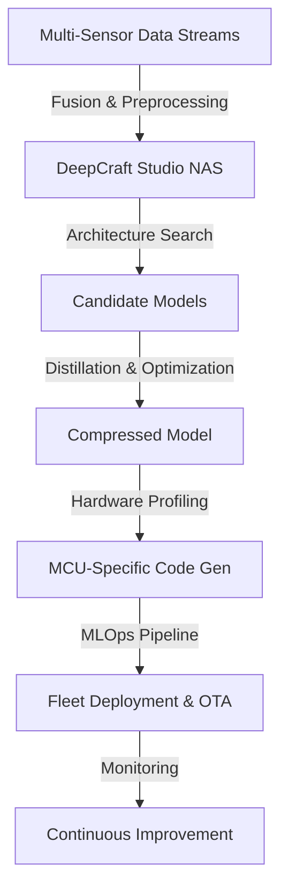

# Imagimob DeepCraft Technical Notes

<!-- A rectangular image illustrating an advanced Imagimob DeepCraft workflow, featuring multi-sensor fusion on edge devices, the Studio interface with custom neural architecture search, advanced optimization techniques like NAS and knowledge distillation, integration with MLOps pipelines, real-time inference profiling on MCUs, and deployment to production fleets with OTA updates. -->

## Quick Reference
- **Definition**: Imagimob DeepCraft is an advanced edge AI platform for end-to-end tinyML development, incorporating neural architecture search (NAS), multi-sensor fusion, hardware-aware optimization, and MLOps integration for scalable deployment on constrained devices.
- **Key Use Cases**: Mission-critical applications in industrial IoT for anomaly detection, advanced gesture recognition in AR/VR, and predictive health monitoring in medical wearables.
- **Prerequisites**: Expert-level knowledge in tinyML, embedded systems, neural network optimization, and MLOps practices.

## Table of Contents
1. Introduction
2. Core Concepts
3. Implementation Details
4. Real-World Applications
5. Tools & Resources
6. References
7. Appendix

## Introduction
### What
Imagimob DeepCraft is a sophisticated software ecosystem for designing, optimizing, and deploying neural networks on ultra-low-power MCUs, supporting advanced techniques like NAS, knowledge distillation, and hardware-in-the-loop simulation.

### Why
DeepCraft addresses production challenges in tinyML by providing automated NAS for optimal architectures, advanced compression for <100KB models, and seamless MLOps for fleet management and OTA updates.

### Where
DeepCraft is utilized in high-stakes environments like automotive sensor fusion, industrial predictive maintenance, and defense applications requiring robust, low-latency edge intelligence.

## Core Concepts
### Fundamental Understanding
- **Basic Principles**: DeepCraft employs hardware-aware NAS to explore efficient architectures, uses knowledge distillation for model compression, and integrates sensor fusion for multi-modal inputs, ensuring deterministic real-time performance on MCUs.
- **Key Components**:
  - **NAS Engine**: Customizable search spaces for CNNs, RNNs, and transformers tailored to MCU constraints.
  - **Fusion Module**: Kalman-filter based or neural fusion for IMU, audio, and environmental sensors.
  - **Optimizer Suite**: Advanced quantization (INT4/8), structured pruning, and distillation with teacher-student frameworks.
  - **MLOps Toolkit**: CI/CD integration, model versioning, and OTA deployment with A/B testing.
- **Common Misconceptions**:
  - NAS is fully automated: Requires careful search space design and hardware profiling.
  - Compression sacrifices accuracy: Distillation maintains performance in production.
  - Single-sensor focus: Multi-modal fusion is key for robust applications.

### Visual Architecture

- **System Overview**: Multi-sensor data drives NAS in the studio, generating candidates optimized via distillation, profiled for hardware, and deployed through MLOps with monitoring.
- **Component Relationships**: Fusion enhances data quality for NAS, optimization ensures efficiency, MLOps handles scaling and updates.

## Implementation Details
### Advanced Topics
```c
// Advanced MCU integration with generated code (simplified)
#include "deepcraft_model.h"  // NAS-generated model
#include "kalman_fusion.h"   // Custom fusion lib

volatile float sensor_buffer[SENSOR_WINDOW];  // Ring buffer for multi-sensor
uint8_t model_input[INPUT_SIZE];             // Quantized input

void isr_sensor_update() {
  // Read multi-sensor data (IMU + mic)
  read_imu_mic(sensor_buffer);
  
  // Kalman fusion for state estimation
  fuse_kalman(sensor_buffer, fused_state);
  
  // Quantize and prepare input
  int8_quantize(fused_state, model_input);
  
  // Run inference (optimized assembly if needed)
  int prediction = deepcraft_infer(model_input);  // NAS-optimized call
  
  // Handle prediction with confidence
  if (prediction_confidence(prediction) > THRESHOLD) {
    trigger_event(prediction);
  }
}

int main() {
  init_hardware();  // MCU setup
  enable_sensor_isr();  // Real-time interrupts
  
  while(1) {
    // Low-power wait; inference in ISR
    low_power_mode();
  }
}
```
- **System Design**:
  - **Multi-Modal Pipelines**: Fuse sensors at feature level for NAS input.
  - **Hardware-Aware NAS**: Constrain search by MCU specs (RAM, flash, cycles).
  - **Distillation Frameworks**: Teacher models on cloud, students for edge.
- **Optimization Techniques**:
  - **INT4 Quantization**: With activation-aware scaling for precision.
  - **Structured Pruning**: Channel-wise removal guided by sensitivity analysis.
  - **Knowledge Distillation**: Temperature-scaled softmax for soft targets.
- **Production Considerations**:
  - **Real-Time Guarantees**: ISR-based inference for deterministic latency.
  - **Fleet Management**: OTA with version control and rollback.
  - **Security**: Model encryption and secure boot integration.

## Real-World Applications
### Industry Examples
- **Use Case**: Predictive maintenance in industrial machinery using vibration analysis.
- **Implementation Pattern**: Multi-sensor fusion with NAS-optimized models, deployed via MLOps.
- **Success Metrics**: 99% uptime, 20% reduction in failures, <1ms latency.

### Hands-On Project
- **Project Goals**: Develop a custom multi-sensor anomaly detector with NAS.
- **Implementation Steps**:
  1. Define NAS search space in DeepCraft Studio.
  2. Import fused sensor data, run AutoML with distillation.
  3. Profile on target MCU, generate optimized code.
  4. Integrate with MLOps for simulated fleet deployment.
- **Validation Methods**: Benchmark power/latency; A/B test accuracies.

## Tools & Resources
### Essential Tools
- **Development Environment**: DeepCraft Studio Pro, MCU toolchains (ARM/Keil).
- **Key Frameworks**: TensorFlow Lite Micro, custom NAS libs.
- **Testing Tools**: Power analyzers, RTOS debuggers.

### Learning Resources
- **Documentation**: Advanced DEEPCRAFT guides (developer.imagimob.com/advanced).
- **Tutorials**: NAS for tinyML webinars.
- **Community Resources**: tinyML Foundation, Imagimob enterprise forums.

## References
- DEEPCRAFT Advanced Docs: developer.imagimob.com.
- NAS Papers: "Efficient Neural Architecture Search" (ENAS).
- TinyML Summit: tinyml.org.

## Appendix
### Glossary
- **NAS**: Neural Architecture Search for automated design.
- **Knowledge Distillation**: Transferring knowledge from large to small models.
- **OTA**: Over-The-Air updates for deployed models.

### Setup Guides
- Studio Pro: Contact Imagimob for enterprise license.
- MCU Integration: Follow hardware-specific guides.