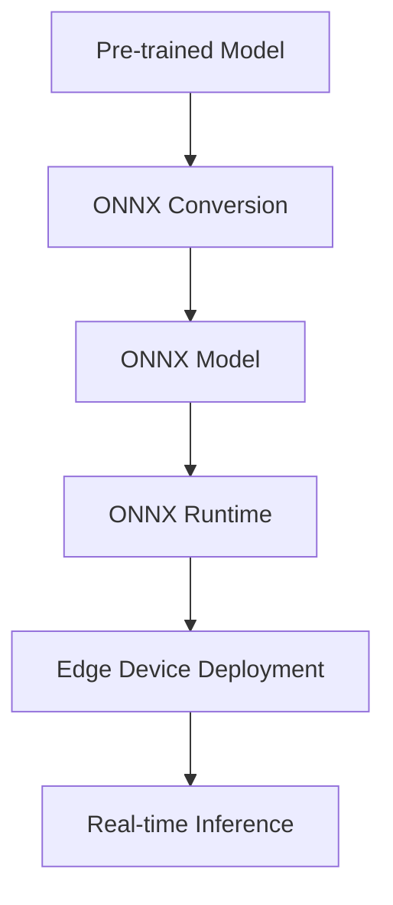

# ONNX Technical Notes - [Basics] 
<!-- [Image description: A rectangular diagram showing a simple edge device (e.g., Raspberry Pi) receiving a pre-trained AI model exported to ONNX format. Arrows indicate the flow from model training to ONNX conversion and deployment, with labels for key steps like export and inference, set against a minimalistic technical background.] -->

## Quick Reference  
- **One-sentence definition**: Deploying AI on edge devices with ONNX involves converting pre-trained models into the Open Neural Network Exchange (ONNX) format for efficient, portable inference on resource-constrained hardware.  
- **Key use cases**: Image classification on IoT devices, basic voice recognition, edge-based anomaly detection.  
- **Prerequisites**: Basic knowledge of AI models, Python, and edge hardware (e.g., Raspberry Pi or similar).  

## Table of Contents  
1. Introduction  
2. Core Concepts  
   - Fundamental Understanding  
   - Visual Architecture  
3. Implementation Details  
   - Basic Implementation  
4. Real-World Applications  
   - Industry Examples  
   - Hands-On Project  
5. Tools & Resources  
   - Essential Tools  
   - Learning Resources  
6. References  
7. Appendix  

## Introduction  
- **What**: Deploying AI with ONNX means exporting pre-trained models into a standardized format that can run on various edge devices using compatible runtimes.  
- **Why**: It provides portability across frameworks and hardware, enabling lightweight inference without cloud dependency.  
- **Where**: Used in smart sensors, low-power IoT devices, and entry-level edge systems.  

## Core Concepts  
### Fundamental Understanding  
- **Basic principles**: ONNX standardizes model representation, allowing edge devices to run optimized inference with minimal overhead (e.g., using ONNX Runtime).  
- **Key components**:  
  - Pre-trained model (e.g., PyTorch, TensorFlow).  
  - ONNX format and tools (e.g., ONNX Runtime).  
  - Edge hardware (e.g., Raspberry Pi, Intel NUC).  
- **Common misconceptions**:  
  - "ONNX is complex" – It simplifies deployment across platforms.  
  - "Edge needs heavy optimization" – ONNX works out-of-the-box for basic tasks.  

### Visual Architecture  

- **System overview**: A model is converted to ONNX and deployed for edge inference.  
- **Component relationships**: ONNX bridges training frameworks and edge runtimes.  

## Implementation Details  
### Basic Implementation  
```python  
# Basic ONNX inference  
import onnxruntime as ort  
import numpy as np  

# Load ONNX model  
session = ort.InferenceSession("model.onnx")  

# Prepare input (assumes model expects 1x3x224x224 input)  
input_name = session.get_inputs()[0].name  
input_data = np.random.randn(1, 3, 224, 224).astype(np.float32)  

# Run inference  
output_name = session.get_outputs()[0].name  
result = session.run([output_name], {input_name: input_data})  
```  
- **Step-by-step setup**:  
  1. Install ONNX Runtime (`pip install onnxruntime`).  
  2. Export a model to ONNX (e.g., from PyTorch: `torch.onnx.export()`).  
  3. Run inference on an edge device.  
- **Code walkthrough**: Loads an ONNX model and performs inference with dummy data.  
- **Common pitfalls**: Mismatched input shapes, missing runtime dependencies.  

## Real-World Applications  
### Industry Examples  
- **Use case**: Smart thermostat with anomaly detection.  
- **Implementation pattern**: ONNX model on Raspberry Pi.  
- **Success metrics**: <500ms inference, low power draw.  

### Hands-On Project  
- **Project goals**: Deploy an image classifier on Raspberry Pi.  
- **Implementation steps**:  
  1. Train a simple CNN (e.g., on CIFAR-10).  
  2. Export to ONNX using PyTorch or TensorFlow.  
  3. Run inference on Pi with a test image.  
- **Validation methods**: Accuracy >80%, inference <1s.  

## Tools & Resources  
### Essential Tools  
- **Development environment**: Python 3.8+, ONNX Runtime.  
- **Key frameworks**: PyTorch/TensorFlow (for export), ONNX.  
- **Testing tools**: Raspberry Pi, sample datasets (e.g., CIFAR-10).  

### Learning Resources  
- **Documentation**: ONNX Getting Started (onnx.ai).  
- **Tutorials**: "Exporting to ONNX" (PyTorch Docs).  
- **Community resources**: ONNX GitHub, Stack Overflow.  

## References  
- ONNX Website: [onnx.ai].  
- ONNX Runtime: [onnxruntime.ai].  
- "ONNX: Open Neural Network Exchange" (ONNX Blog).  

## Appendix  
- **Glossary**:  
  - ONNX: Open Neural Network Exchange format.  
  - Runtime: Software to execute ONNX models.  
- **Setup guides**: "Install ONNX Runtime on Pi" (onnxruntime.ai).  
- **Code templates**: Basic inference script (above).  

