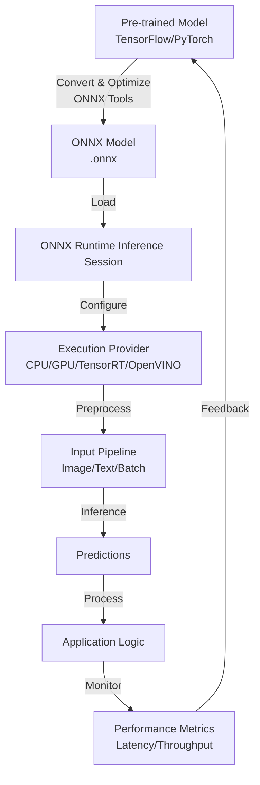

# ONNX Runtime Technical Notes
A rectangular image depicting an advanced ONNX Runtime deployment pipeline, showcasing a cross-platform application (web, mobile, server) with a complex neural network architecture, a model optimization workflow using ONNX tools, real-time inference with hardware acceleration (CPU/GPU/TPU), and a performance dashboard displaying latency, throughput, and resource utilization metrics.

## Quick Reference
- **Definition**: ONNX Runtime is an open-source, high-performance inference engine for executing ONNX models across diverse platforms and hardware accelerators.
- **Key Use Cases**: Scalable real-time inference in production-grade applications, including computer vision, natural language processing, and edge device deployments.
- **Prerequisites**: Advanced proficiency in Python or C++, deep understanding of machine learning model optimization, experience with cross-platform deployment, and familiarity with hardware accelerators.

## Table of Contents
1. Introduction
2. Core Concepts
3. Implementation Details
4. Real-World Applications
5. Tools & Resources
6. References
7. Appendix

## Introduction
### What
ONNX Runtime is a cross-platform inference engine that optimizes and executes ONNX models, supporting a wide range of hardware accelerators (e.g., CUDA, TensorRT, DirectML) and platforms (e.g., mobile, web, server).

### Why
ONNX Runtime enables efficient, scalable, and portable machine learning inference, minimizing latency, maximizing hardware utilization, and ensuring compatibility across ecosystems without vendor lock-in.

### Where
ONNX Runtime is deployed in mission-critical applications, such as real-time video analytics in edge devices, large-scale NLP in cloud services, and embedded ML in IoT systems.

## Core Concepts
### Fundamental Understanding
- **Basic Principles**: ONNX Runtime provides a unified API to run ONNX models, leveraging execution providers for hardware-specific optimization and supporting advanced features like quantization and graph optimization.
- **Key Components**:
  - **ONNX Model**: A portable .onnx file encapsulating model architecture and weights.
  - **Inference Session**: The runtime environment for model execution, configurable with session options and providers.
  - **Execution Providers**: Hardware-specific backends (e.g., CUDA, TensorRT, OpenVINO) for optimized inference.
  - **Graph Optimization**: Techniques like node fusion and constant folding to enhance performance.
- **Common Misconceptions**:
  - ONNX Runtime is only for deep learning: It supports diverse models, including tree-based and linear models.
  - Limited scalability: ONNX Runtime handles high-throughput scenarios with multi-threading and batching.
  - No customizability: Developers can extend ONNX Runtime with custom operators and execution providers.

### Visual Architecture

- **System Overview**: A pre-trained model is converted to ONNX format, optimized, loaded into an inference session, executed with a hardware-specific provider, and monitored for performance to inform iterative improvements.
- **Component Relationships**: The inference session orchestrates model execution, integrates with preprocessing pipelines, and leverages hardware acceleration, feeding predictions to application logic with real-time monitoring.

## Implementation Details
### Advanced Topics
```python
import onnxruntime as ort
import numpy as np
import cv2
from concurrent.futures import ThreadPoolExecutor

# Configure optimized inference session
options = ort.SessionOptions()
options.graph_optimization_level = ort.GraphOptimizationLevel.ORT_ENABLE_ALL
options.intra_op_num_threads = 8
options.inter_op_num_threads = 4
providers = ["CUDAExecutionProvider", "CPUExecutionProvider"]  # Fallback to CPU if CUDA unavailable
session = ort.InferenceSession("model.onnx", sess_options=options, providers=providers)

# Advanced preprocessing pipeline
def preprocess_batch(image_paths):
    batch = []
    for path in image_paths:
        img = cv2.imread(path)
        img = cv2.resize(img, (224, 224))
        img = cv2.cvtColor(img, cv2.COLOR_BGR2RGB)
        img = img.astype(np.float32) / 255.0
        img = np.transpose(img, (2, 0, 1))
        batch.append(img)
    return np.stack(batch, axis=0)

# Asynchronous batch inference
def run_inference(image_paths):
    input_name = session.get_inputs()[0].name
    batch_data = preprocess_batch(image_paths)
    
    with ThreadPoolExecutor() as executor:
        future = executor.submit(session.run, None, {input_name: batch_data})
        outputs = future.result()
    
    return [np.argmax(output, axis=1) for output in outputs]

# Example usage
image_paths = ["image1.jpg", "image2.jpg"]
predictions = run_inference(image_paths)
for i, pred in enumerate(predictions):
    print(f"Image {i+1} Prediction: {pred}, Confidence: {outputs[0][i][pred[0]]}")
```
- **System Design**:
  - **Modular Pipeline**: Encapsulate preprocessing, inference, and post-processing in reusable modules.
  - **Asynchronous Execution**: Use `ThreadPoolExecutor` for parallel inference on large datasets.
  - **Dynamic Provider Selection**: Prioritize GPU providers with CPU fallback for robustness.
- **Optimization Techniques**:
  - **Graph Optimization**: Enable full graph optimization (`ORT_ENABLE_ALL`) for node fusion and constant folding.
  - **Model Quantization**: Use ONNX quantization tools to reduce model size and inference time.
  - **Batching**: Process inputs in batches to maximize throughput on high-performance hardware.
- **Production Considerations**:
  - **Error Handling**: Implement robust error handling for model loading, input validation, and provider failures.
  - **Performance Monitoring**: Use tools like `tracemalloc` or external profilers to track memory and latency.
  - **Scalability**: Configure session options for multi-threading and optimize for specific hardware (e.g., CUDA, TensorRT).

## Real-World Applications
### Industry Examples
- **Use Case**: Real-time video analytics in an autonomous vehicle system for object detection.
- **Implementation Pattern**: Deploy a YOLOv7 ONNX model with ONNX Runtime using TensorRT provider for GPU-accelerated inference.
- **Success Metrics**: Achieve <30ms inference per frame, >95% detection accuracy, and <2% resource overhead in production.

### Hands-On Project
- **Project Goals**: Develop a scalable web service for real-time video-based object detection using ONNX Runtime.
- **Implementation Steps**:
  1. Install ONNX Runtime with GPU support: `pip install onnxruntime-gpu`.
  2. Convert a pre-trained model (e.g., YOLOv7) to ONNX with quantization using `onnxoptimizer`.
  3. Create a FastAPI service with an endpoint to process video frames.
  4. Implement the above code for batch inference on video frames with CUDA provider.
  5. Monitor latency and throughput using Prometheus or custom logging.
- **Validation Methods**: Test with sample video streams, verify detection accuracy (>95%), and ensure latency <50ms per frame.

## Tools & Resources
### Essential Tools
- **Development Environment**: Python 3.8+, Visual Studio Code, or PyCharm.
- **Key Frameworks**: ONNX Runtime, OpenCV, numpy, FastAPI for web services.
- **Testing Tools**: NVIDIA Nsight, cProfile, ONNX Model Zoo, hardware-specific profilers.

### Learning Resources
- **Documentation**: ONNX Runtime documentation (onnxruntime.ai/docs).
- **Tutorials**: “Advanced ONNX Runtime Optimization” on ONNX official site.
- **Community Resources**: ONNX Runtime GitHub discussions, ML conferences like NeurIPS.

## References
- OnnxRuntime Documentation: onnxruntime.ai/docs.
- ONNX Model Zoo: github.com/onnx/models.
- Technical Papers: “ONNX Runtime: Performance Tuning” (Microsoft Research).
- Industry Standards: ONNX specification (onnx.ai).

## Appendix
### Glossary
- **ONNX**: Open Neural Network Exchange format for interoperable ML models.
- **Inference Session**: ONNX Runtime’s runtime for model execution.
- **Execution Provider**: Hardware-specific backend for optimized inference.

### Setup Guides
- Install ONNX Runtime: `pip install onnxruntime-gpu`.
- Optimize Model: Use `onnxoptimizer` or `onnx-simplifier` for graph optimization.
- Profile Performance: Use NVIDIA Nsight or `tracemalloc` for resource analysis.