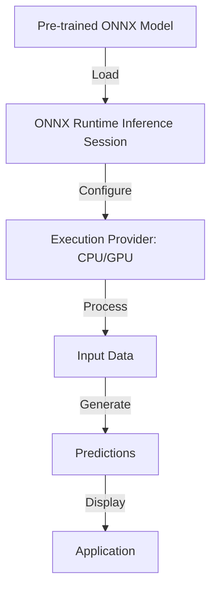

# ONNX Runtime Technical Notes
<!-- A rectangular image depicting a simplified ONNX Runtime workflow, showing a laptop with a machine learning model interface, a diagram of a neural network, and arrows illustrating the process of loading an ONNX model, running inference, and displaying predictions across various platforms. -->

## Quick Reference
- **Definition**: ONNX Runtime is an open-source, cross-platform machine learning inference engine for running ONNX (Open Neural Network Exchange) models efficiently.
- **Key Use Cases**: Deploying machine learning models in mobile apps, web applications, and desktop software for tasks like image recognition and text processing.
- **Prerequisites**: Basic programming knowledge (e.g., Python or C++), familiarity with machine learning concepts, and a development environment like Visual Studio Code or PyCharm.

## Table of Contents
1. Introduction
2. Core Concepts
3. Implementation Details
4. Real-World Applications
5. Tools & Resources
6. References
7. Appendix

## Introduction
### What
ONNX Runtime is a high-performance library that enables developers to run pre-trained ONNX models for inference on various platforms, including Windows, macOS, Linux, iOS, Android, and web browsers.

### Why
ONNX Runtime simplifies the deployment of machine learning models by providing a unified runtime that optimizes performance across diverse hardware, reducing the need for platform-specific code.

### Where
ONNX Runtime is used in applications requiring on-device or server-based inference, such as image classification in mobile apps, natural language processing in chatbots, and predictive analytics in enterprise software.

## Core Concepts
### Fundamental Understanding
- **Basic Principles**: ONNX Runtime executes ONNX models, a standardized format for representing machine learning models, enabling cross-platform compatibility and hardware acceleration.
- **Key Components**:
  - **ONNX Model**: A file (.onnx) containing the trained machine learning model’s structure and weights.
  - **Inference Session**: The runtime environment where the model is loaded and executed.
  - **Execution Providers**: Hardware-specific backends (e.g., CPU, GPU, TPU) for optimized inference.
- **Common Misconceptions**:
  - ONNX Runtime trains models: No, it only runs pre-trained models for inference.
  - Limited to specific platforms: ONNX Runtime supports multiple platforms, including web and mobile.
  - Requires advanced ML knowledge: Beginners can use pre-trained models with simple APIs.

### Visual Architecture

- **System Overview**: An ONNX model is loaded into an ONNX Runtime inference session, configured with a hardware-specific execution provider, and used to process input data and produce predictions.
- **Component Relationships**: The inference session bridges the model and hardware, processing inputs (e.g., images, text) to generate outputs (e.g., classifications, predictions).

## Implementation Details
### Basic Implementation
```python
import onnxruntime as ort
import numpy as np

# Load the ONNX model
session = ort.InferenceSession("model.onnx")

# Prepare input data (example: single image as a numpy array)
input_name = session.get_inputs()[0].name
input_data = np.random.randn(1, 3, 224, 224).astype(np.float32)  # Dummy image input

# Run inference
outputs = session.run(None, {input_name: input_data})

# Process output
prediction = outputs[0]
print("Prediction:", prediction)
```
- **Step-by-Step Setup**:
  1. Install ONNX Runtime: `pip install onnxruntime` (for CPU) or `pip install onnxruntime-gpu` (for GPU).
  2. Obtain a pre-trained ONNX model (e.g., from ONNX Model Zoo).
  3. Write code to load the model and prepare input data (e.g., numpy arrays for images).
  4. Run inference and process the output.
- **Code Walkthrough**:
  - The code loads an ONNX model into an inference session.
  - Input data is prepared as a numpy array matching the model’s expected format.
  - The session runs inference to produce predictions.
- **Common Pitfalls**:
  - Mismatched input dimensions: Ensure input data matches the model’s expected shape.
  - Missing dependencies: Install correct ONNX Runtime version for your hardware.
  - Incorrect model format: Verify the model is in valid ONNX format.

## Real-World Applications
### Industry Examples
- **Use Case**: Image classification in a mobile app to identify objects in photos.
- **Implementation Pattern**: Use a pre-trained ONNX model (e.g., ResNet50) with ONNX Runtime for mobile deployment.
- **Success Metrics**: High accuracy (>90%) and fast inference (<100ms) on mobile devices.

### Hands-On Project
- **Project Goals**: Build a Python script that uses ONNX Runtime to classify images as “cat” or “dog.”
- **Implementation Steps**:
  1. Install ONNX Runtime and numpy: `pip install onnxruntime numpy`.
  2. Download a pre-trained ONNX model (e.g., ResNet18 from ONNX Model Zoo).
  3. Load an image, preprocess it into a numpy array (e.g., resize to 224x224).
  4. Use the above code to run inference and display the prediction.
- **Validation Methods**: Test with sample cat/dog images and verify correct classification with high confidence.

## Tools & Resources
### Essential Tools
- **Development Environment**: Python 3.7+, Visual Studio Code, or PyCharm.
- **Key Frameworks**: ONNX Runtime, numpy for data preprocessing.
- **Testing Tools**: Jupyter Notebook for prototyping, ONNX Model Zoo for sample models.

### Learning Resources
- **Documentation**: ONNX Runtime documentation (onnxruntime.ai/docs).
- **Tutorials**: “Getting Started with ONNX Runtime” on ONNX official site.
- **Community Resources**: GitHub issues for ONNX Runtime, Stack Overflow.

## References
- ONNX Runtime Documentation: onnxruntime.ai/docs.
- ONNX Model Zoo: github.com/onnx/models.
- ONNX Specification: onnx.ai.

## Appendix
### Glossary
- **ONNX**: Open Neural Network Exchange, a standard format for ML models.
- **Inference Session**: ONNX Runtime’s runtime for executing models.
- **Execution Provider**: Hardware backend for running inference (e.g., CPU, CUDA).

### Setup Guides
- Install ONNX Runtime: `pip install onnxruntime`.
- Verify Model: Use `onnx.checker.check_model("model.onnx")` to validate ONNX files.