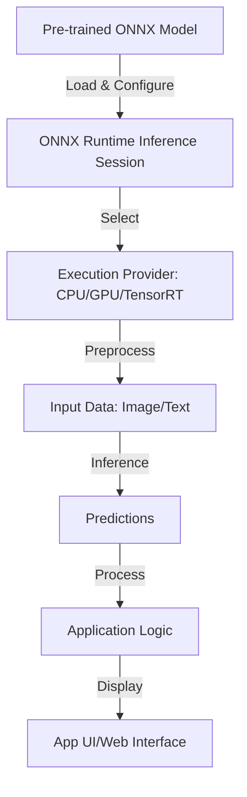

# ONNX Runtime Technical Notes
<!-- A rectangular image illustrating an intermediate ONNX Runtime workflow, showing a cross-platform application interface (e.g., web and mobile), a neural network diagram with preprocessing steps, and arrows depicting the flow from ONNX model loading to inference using hardware acceleration (CPU/GPU) and output display. -->

## Quick Reference
- **Definition**: ONNX Runtime is an open-source, cross-platform inference engine for running ONNX models with optimized performance across diverse hardware.
- **Key Use Cases**: Real-time image classification, natural language processing, and scalable inference in web, mobile, or server applications.
- **Prerequisites**: Proficiency in Python or C++, familiarity with machine learning model formats (e.g., ONNX), and experience with data preprocessing for inference.

## Table of Contents
1. Introduction
2. Core Concepts
3. Implementation Details
4. Real-World Applications
5. Tools & Resources
6. References
7. Appendix

## Introduction
### What
ONNX Runtime is a high-performance library that enables developers to deploy ONNX models for inference across platforms like Windows, Linux, macOS, iOS, Android, and web browsers, leveraging hardware acceleration.

### Why
ONNX Runtime simplifies model deployment by offering a unified API, optimized execution providers for various hardware, and support for complex models, reducing latency and improving scalability.

### Where
ONNX Runtime is used in production-grade applications, such as real-time computer vision in mobile apps, text analysis in web services, and predictive analytics in enterprise systems.

## Core Concepts
### Fundamental Understanding
- **Basic Principles**: ONNX Runtime executes ONNX models, a standardized format for machine learning models, with optimized inference pipelines that leverage hardware-specific execution providers (e.g., CPU, GPU, TPU).
- **Key Components**:
  - **ONNX Model**: A portable .onnx file containing the model’s architecture and weights.
  - **Inference Session**: The runtime environment for loading and executing the model.
  - **Execution Providers**: Backends like CUDA, TensorRT, or DirectML for hardware-accelerated inference.
- **Common Misconceptions**:
  - ONNX Runtime is only for deep learning: It supports various model types, including tree-based models.
  - Requires complex setup: ONNX Runtime provides straightforward APIs for most platforms.
  - Limited to Python: Supports multiple languages like C++, C#, and JavaScript.

### Visual Architecture

- **System Overview**: An ONNX model is loaded into an inference session, configured with an execution provider, preprocesses input data, and generates predictions for application use.
- **Component Relationships**: The inference session integrates the model with hardware, processes inputs through a pipeline, and outputs results to the application layer.

## Implementation Details
### Intermediate Patterns
```python
import onnxruntime as ort
import numpy as np
from PIL import Image
import cv2

# Configure inference session with execution provider
options = ort.SessionOptions()
options.intra_op_num_threads = 4  # Optimize for multi-core CPU
session = ort.InferenceSession("model.onnx", sess_options=options, providers=["CPUExecutionProvider"])

# Preprocess image input
def preprocess_image(image_path):
    img = cv2.imread(image_path)
    img = cv2.resize(img, (224, 224))  # Match model input size
    img = cv2.cvtColor(img, cv2.COLOR_BGR2RGB)
    img = img.astype(np.float32) / 255.0  # Normalize
    img = np.transpose(img, (2, 0, 1))  # Change to CHW format
    return np.expand_dims(img, axis=0)  # Add batch dimension

# Run inference
input_name = session.get_inputs()[0].name
image_data = preprocess_image("sample.jpg")
outputs = session.run(None, {input_name: image_data})

# Process output
prediction = np.argmax(outputs[0], axis=1)
print(f"Prediction: {prediction}, Confidence: {outputs[0][0][prediction[0]]}")
```
- **Design Patterns**:
  - **Modular Preprocessing**: Create reusable functions for input preprocessing (e.g., image resizing, normalization).
  - **Asynchronous Execution**: Use threading or async I/O for high-throughput inference in production.
  - **Provider Selection**: Dynamically select execution providers based on available hardware.
- **Best Practices**:
  - Validate input shapes and types against model requirements.
  - Use session options to configure thread pools and memory usage.
  - Cache inference sessions to avoid repeated model loading.
- **Performance Considerations**:
  - Optimize model with ONNX simplifier or quantization tools to reduce size and latency.
  - Select appropriate execution providers (e.g., CUDA for NVIDIA GPUs) for hardware acceleration.
  - Profile inference time to ensure <100ms latency for real-time applications.

## Real-World Applications
### Industry Examples
- **Use Case**: Real-time object detection in a web-based surveillance system.
- **Implementation Pattern**: Deploy a YOLOv5 ONNX model with ONNX Runtime in a JavaScript-based web app using WebAssembly.
- **Success Metrics**: Achieve >15 FPS for video processing and >90% detection accuracy.

### Hands-On Project
- **Project Goals**: Build a Python-based web app that performs real-time image classification using ONNX Runtime.
- **Implementation Steps**:
  1. Install ONNX Runtime and Flask: `pip install onnxruntime flask opencv-python`.
  2. Download a pre-trained ONNX model (e.g., ResNet50 from ONNX Model Zoo).
  3. Create a Flask app with an endpoint to upload images.
  4. Use the above code to preprocess images and run inference.
  5. Display predictions on a web page.
- **Validation Methods**: Test with sample images, verify classification accuracy, and measure inference latency (<200ms).

## Tools & Resources
### Essential Tools
- **Development Environment**: Python 3.7+, Visual Studio Code, or PyCharm.
- **Key Frameworks**: ONNX Runtime, numpy, OpenCV for preprocessing.
- **Testing Tools**: Jupyter Notebook, ONNX Model Zoo, performance profiling tools like cProfile.

### Learning Resources
- **Documentation**: ONNX Runtime documentation (onnxruntime.ai/docs).
- **Tutorials**: “ONNX Runtime for Real-Time Inference” on ONNX official site.
- **Community Resources**: GitHub ONNX Runtime discussions, ML forums like Reddit’s r/MachineLearning.

## References
- ONNX Runtime Documentation: onnxruntime.ai/docs.
- ONNX Model Zoo: github.com/onnx/models.
- ONNX Specification: onnx.ai.

## Appendix
### Glossary
- **ONNX**: Open Neural Network Exchange format for portable ML models.
- **Inference Session**: ONNX Runtime’s runtime for model execution.
- **Execution Provider**: Hardware-specific backend for optimized inference.

### Setup Guides
- Install ONNX Runtime: `pip install onnxruntime` or `pip install onnxruntime-gpu`.
- Model Optimization: Use `onnx-simplifier` or `onnxoptimizer` for model compression.