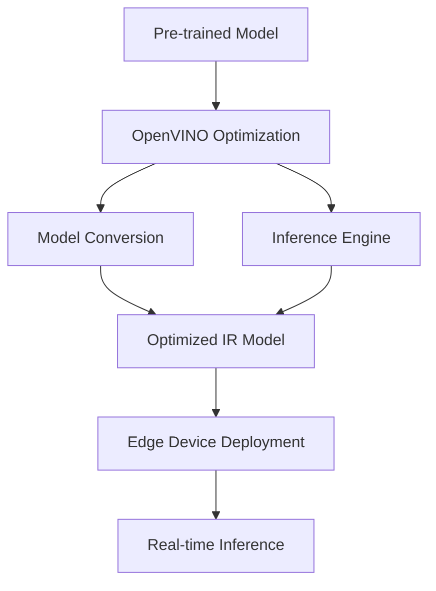

# Intel OpenVINO Technical Notes  
<!-- [Image description: A rectangular diagram showing a simple edge device (e.g., Intel NUC) receiving a pre-trained AI model optimized with OpenVINO. Arrows indicate the flow from model training to optimization and deployment, with labels for key steps like model conversion and inference, set against a clean, technical background.] -->

## Quick Reference  
- **One-sentence definition**: Deploying AI on edge devices with Intel OpenVINO involves optimizing pre-trained models for efficient inference on resource-constrained Intel hardware using an open-source toolkit.  
- **Key use cases**: Real-time object detection in security cameras, smart retail analytics, basic IoT monitoring.  
- **Prerequisites**: Basic understanding of AI models, Python, and edge hardware (e.g., Intel CPU or NUC).  

## Table of Contents  
1. [Introduction](#introduction)  
2. [Core Concepts](#core-concepts)  
  - [Fundamental Understanding](#fundamental-understanding)  
  - [Visual Architecture](#visual-architecture)  
3. [Implementation Details](#implementation-details)  
  - [Basic Implementation](#basic-implementation)  
4. [Real-World Applications](#real-world-applications)  
  - [Industry Examples](#industry-examples)  
  - [Hands-On Project](#hands-on-project)  
5. [Tools & Resources](#tools--resources)  
  - [Essential Tools](#essential-tools)  
  - [Learning Resources](#learning-resources)  
6. [References](#references)  
7. [Appendix](#appendix)  

## Introduction  
- **What**: Deploying AI with OpenVINO means converting and optimizing pre-trained models to run on Intel edge devices like CPUs or VPUs.  
- **Why**: It enables fast, offline AI processing with low latency and power usage, ideal for edge scenarios.  
- **Where**: Used in smart cameras, industrial sensors, and entry-level edge computing systems.  

## Core Concepts  
### Fundamental Understanding  
- **Basic principles**: Edge devices have limited resources, so OpenVINO optimizes models by reducing their size and complexity (e.g., converting to Intermediate Representation) for efficient inference.  
- **Key components**:  
  - Pre-trained model (e.g., TensorFlow, PyTorch).  
  - OpenVINO toolkit (Model Optimizer, Inference Engine).  
  - Intel edge hardware (e.g., Core CPU, Movidius VPU).  
- **Common misconceptions**:  
  - "Edge AI is less capable" – OpenVINO maintains accuracy with optimization.  
  - "You need high-end hardware" – Basic Intel CPUs can suffice.  

### Visual Architecture  

- **System overview**: A model is converted to OpenVINO’s IR format and deployed for edge inference.  
- **Component relationships**: OpenVINO links model optimization to Intel hardware execution.  

## Implementation Details  
### Basic Implementation  
```python  
# Basic OpenVINO inference  
import openvino as ov  
import numpy as np  

# Load OpenVINO core  
core = ov.Core()  

# Load pre-trained model (assumes IR format: .xml and .bin files)  
model = core.read_model(model="model.xml", weights="model.bin")  
compiled_model = core.compile_model(model, device_name="CPU")  

# Perform inference with dummy data  
input_data = np.random.rand(1, 3, 224, 224).astype(np.float32)  
result = compiled_model.infer_new_request({0: input_data})  
output = result[compiled_model.output(0)]  
```  
- **Step-by-step setup**:  
  1. Install OpenVINO (`pip install openvino`).  
  2. Convert a model to IR using Model Optimizer (e.g., `mo --input_model model.onnx`).  
  3. Run inference on CPU.  
- **Code walkthrough**: Loads an IR model, compiles it for CPU, and infers with random input.  
- **Common pitfalls**: Missing IR files, incorrect input shape.  

## Real-World Applications  
### Industry Examples  
- **Use case**: Motion detection in a smart camera.  
- **Implementation pattern**: Optimized MobileNet on Intel NUC.  
- **Success metrics**: <100ms inference, low power usage.  

### Hands-On Project  
- **Project goals**: Deploy an image classifier on an Intel CPU.  
- **Implementation steps**:  
  1. Train a simple CNN (e.g., on MNIST).  
  2. Convert to IR with Model Optimizer.  
  3. Run inference on a test image.  
- **Validation methods**: Accuracy >90%, inference <1s.  

## Tools & Resources  
### Essential Tools  
- **Development environment**: Python 3.8+, OpenVINO runtime.  
- **Key frameworks**: OpenVINO, TensorFlow/PyTorch (for training).  
- **Testing tools**: Intel NUC, sample datasets (e.g., MNIST).  

### Learning Resources  
- **Documentation**: OpenVINO Getting Started (Intel GitHub).  
- **Tutorials**: "OpenVINO Basics" (Intel Dev Network).  
- **Community resources**: Intel Developer Forum, Stack Overflow.  

## References  
- OpenVINO Toolkit: [github.com/openvinotoolkit/openvino].  
- Intel Edge AI Guide: [intel.com/edge-ai].  
- "Deep Learning Inference with OpenVINO" (Intel Blog).  

## Appendix  
- **Glossary**:  
  - IR: Intermediate Representation (OpenVINO model format).  
  - Inference Engine: Runtime for executing optimized models.  
- **Setup guides**: "Install OpenVINO on Ubuntu" (Intel docs).  
- **Code templates**: Basic inference script (above).  

