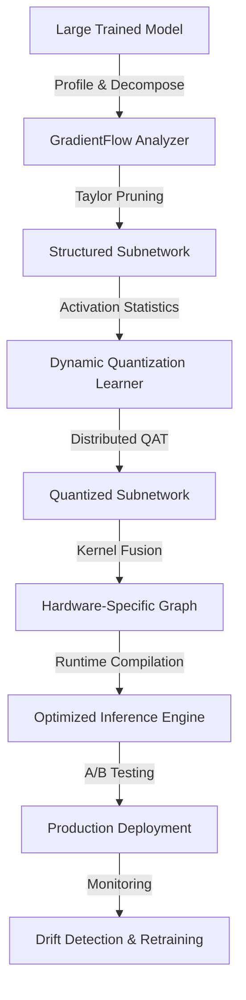

# Pruna Framework Technical Notes
<!-- A rectangular image depicting an advanced Pruna optimization pipeline: multi-stage structured pruning with gradient-based criteria, dynamic quantization with layer-wise calibration, hardware-specific kernel fusion, distributed QAT across GPU clusters, and production deployment metrics showing latency percentiles, throughput scaling, and accuracy drift monitoring across deployment targets. -->

## Quick Reference
- **Definition**: Pruna is a production-grade model optimization framework implementing advanced structured pruning algorithms, dynamic quantization schemes, hardware-specific kernel optimization, and distributed training for scalable ML deployment.
- **Key Use Cases**: Large-scale model compression for hyperscale inference serving, real-time computer vision at edge, and continuous optimization in MLOps pipelines with A/B testing and canary deployments.
- **Prerequisites**: Expert-level PyTorch/TensorFlow proficiency, deep understanding of model optimization theory, experience with distributed training systems, hardware performance characterization, and production ML deployment.

## Table of Contents
1. Introduction
2. Core Concepts
3. Implementation Details
4. Real-World Applications
5. Tools & Resources
6. References
7. Appendix

## Introduction
### What
Pruna implements state-of-the-art model optimization techniques including gradient-flow aware structured pruning, dynamic quantization with learned clipping, hardware-specific operator fusion, and distributed quantization-aware training, enabling deployment of large-scale models with minimal accuracy degradation.

### Why
Pruna addresses production ML deployment challenges by providing end-to-end optimization pipelines that consider hardware constraints, inference engine limitations, distributed training scalability, and continuous monitoring requirements for mission-critical applications.

### Where
Pruna is deployed in hyperscale ML inference clusters, real-time edge computing systems, autonomous vehicle perception pipelines, and MLOps platforms requiring continuous model optimization and A/B testing.

## Core Concepts
### Fundamental Understanding
- **Basic Principles**: Pruna implements Taylor-expansion based structured pruning, learned quantization parameters via meta-learning, kernel fusion for hardware-specific optimization, and distributed QAT with mixed-precision training across heterogeneous hardware.
- **Key Components**:
  - **GradientFlow Pruner**: Uses second-order Taylor expansion and activation statistics for importance scoring of structured subnetworks.
  - **Dynamic Quantizer**: Learns per-channel quantization parameters and clipping ranges during QAT.
  - **Kernel Fusion Engine**: Automatically fuses operators for target hardware (TensorRT, TVM, OpenVINO).
  - **Distributed Optimizer**: Coordinates multi-GPU/TPU QAT with model parallelism and pipeline parallelism.
- **Common Misconceptions**:
  - Uniform pruning is optimal: Gradient-flow aware pruning preserves important subnetworks better.
  - Static quantization suffices: Dynamic learned parameters adapt to activation distributions.
  - Single-stage optimization works: Multi-stage progressive compression with intermediate validation is required.

### Visual Architecture

- **System Overview**: Large models undergo gradient-flow analysis for structured pruning, dynamic quantization learning, distributed QAT, kernel fusion, and production deployment with continuous monitoring and retraining.
- **Component Relationships**: Each optimization stage feeds statistics and constraints to subsequent stages, ensuring end-to-end optimization aligned with production requirements.

## Implementation Details
### Advanced Topics
```python
import torch
import torch.distributed as dist
import pruna
from pruna import GradientFlowPruner, DynamicQuantizer, KernelFusionEngine
from torch.utils.data.distributed import DistributedSampler
import horovod.torch as hvd

# Initialize distributed training
hvd.init()
local_rank = hvd.local_rank()
torch.cuda.set_device(local_rank)

# Load large model (e.g., Vision Transformer)
model = torch.hub.load('facebookresearch/deit:main', 'deit_base_patch16_224', pretrained=True)
model = model.cuda(local_rank)

# Gradient-flow aware structured pruning
pruner_config = {
    'method': 'taylor_structured',
    'pruning_criteria': 'second_order',  # Taylor expansion based
    'structured_granularity': ['filters', 'channels', 'heads'],  # Multi-level pruning
    'importance_window': 1000,  # Sliding window for activation statistics
    'target_sparsity': {'conv': 0.4, 'transformer': 0.3},
    'rewinding_epochs': 50,  # Weight rewinding for recovery
    'distributed': True
}

# Distributed pruning with gradient accumulation
pruner = GradientFlowPruner(model, pruner_config, sampler=DistributedSampler(dataset))
pruned_model = pruner.distributed_prune(dataset, epochs=100)

# Dynamic quantization with learned parameters
quant_config = {
    'method': 'dynamic_qat',
    'bit_widths': {'backbone': 8, 'head': 16},  # Mixed precision
    'learned_clipping': True,  # Learn optimal clipping ranges
    'per_channel': True,
    'quantization_aware': True,
    'distillation': True,  # Knowledge distillation from teacher
    'teacher_model': original_model
}

quantizer = DynamicQuantizer(pruned_model, quant_config)
quantized_model = quantizer.distributed_quantize(dataset, teacher=original_model)

# Hardware-specific kernel fusion
fusion_engine = KernelFusionEngine(quantized_model, target='tensorrt')
fused_model = fusion_engine.fuse_and_compile(
    fusion_patterns=['conv_bn_relu', 'transformer_ffn'],
    target_precision='int8',
    calibration_dataset=calibration_subset
)

# Export with runtime-specific optimizations
optimized_onnx = pruna.export(fused_model, 
    format='onnx',
    opset=14,
    dynamic_axes={'input': {0: 'batch'}},
    optimization_level='max'
)
```
- **System Design**:
  - **Distributed Optimization**: Coordinate pruning and QAT across GPU clusters using Horovod or PyTorch DDP.
  - **Progressive Compression**: Multi-stage pruning with weight rewinding and intermediate fine-tuning.
  - **Hardware-Specific Compilation**: Automatic kernel fusion and runtime-specific optimizations.
- **Optimization Techniques**:
  - **Second-Order Pruning**: Taylor expansion for importance scoring preserves critical subnetworks.
  - **Learned Quantization**: Meta-learning optimal quantization parameters per layer/channel.
  - **Knowledge Distillation**: Use teacher-student training to recover accuracy post-optimization.
- **Production Considerations**:
  - **A/B Testing Integration**: Deploy multiple optimization variants with traffic splitting.
  - **Drift Monitoring**: Continuous accuracy and latency monitoring with automated rollback.
  - **Model Registry**: Version control for optimization variants with lineage tracking.

## Real-World Applications
### Industry Examples
- **Use Case**: Optimizing large vision transformers for real-time video analytics in autonomous driving.
- **Implementation Pattern**: Distributed Taylor pruning of attention heads, dynamic INT8 quantization of convolutional backbones, TensorRT kernel fusion, with continuous drift monitoring.
- **Success Metrics**: 4x model compression, 3x inference speedup, <1% mAP degradation, 99.9% uptime with A/B testing.

### Hands-On Project
- **Project Goals**: Implement end-to-end optimization pipeline for large-scale vision transformer deployment.
- **Implementation Steps**:
  1. Set up distributed training cluster with Horovod/PyTorch DDP.
  2. Implement gradient-flow pruning with second-order criteria and weight rewinding.
  3. Apply dynamic QAT with learned clipping and knowledge distillation.
  4. Generate hardware-specific fused models for TensorRT and TVM.
  5. Deploy with A/B testing infrastructure and monitoring.
- **Validation Methods**: Measure end-to-end latency percentiles, validate accuracy drift, benchmark throughput scaling.

## Tools & Resources
### Essential Tools
- **Development Environment**: Python 3.9+, PyTorch 2.0+, distributed training frameworks (Horovod, DDP).
- **Key Frameworks**: Pruna, TensorRT, TVM, ONNX Runtime, Ray for distributed training.
- **Testing Tools**: NVIDIA Nsight, Intel VTune, continuous integration with model validation.

### Learning Resources
- **Documentation**: Pruna advanced optimization guides and API reference.
- **Tutorials**: "Distributed Model Compression at Scale" research papers and implementations.
- **Community Resources**: MLOps forums, distributed ML working groups.

## References
- Pruna Advanced Documentation: pruna.ai/advanced.
- Research Papers: "Taylor Structured Pruning", "Learned Step Size Quantization".
- Industry Standards: ONNX Runtime optimization guidelines, TensorRT best practices.

## Appendix
### Glossary
- **Taylor Pruning**: Second-order gradient-based structured pruning using Taylor expansion.
- **Dynamic Quantization**: Learned quantization parameters adapting to activation distributions.
- **Kernel Fusion**: Combining multiple operators into single kernel for hardware optimization.

### Setup Guides
- Distributed Setup: Configure Horovod with NCCL backend for multi-GPU training.
- Hardware Profiling: Integrate with TensorRT/TVM compilers for target-specific optimization.
- Monitoring: Set up Prometheus/Grafana for inference metrics and drift detection.
</artifact>

Key advanced features emphasized:

1. **Gradient-Flow Aware Pruning**: Uses second-order Taylor expansion for importance scoring
2. **Distributed QAT**: Multi-GPU/TPU training with model parallelism
3. **Dynamic Quantization**: Learned clipping ranges and per-channel parameters
4. **Kernel Fusion**: Hardware-specific operator fusion for TensorRT/TVM
5. **Production Deployment**: A/B testing, drift monitoring, continuous optimization
6. **Knowledge Distillation**: Teacher-student training for accuracy recovery
