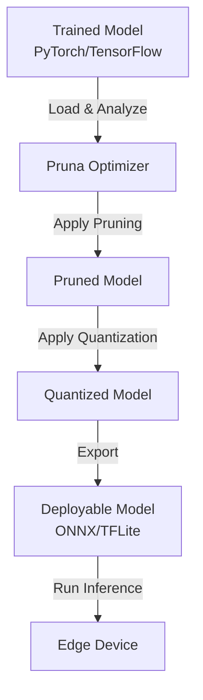

# Pruna Framework Technical Notes
<!-- A rectangular image showing a simplified neural network model being optimized for edge devices, with a flowchart from training to deployment, icons of CPU/GPU, and a mobile device running inference, all connected by arrows labeled "Pruning" and "Quantization". -->

## Quick Reference
- **One-sentence definition**: Pruna is an open-source framework for optimizing machine learning models through pruning and quantization to make them faster and smaller for deployment on various devices.
- **Key use cases**: Reducing model size for mobile apps, accelerating inference on edge devices, and improving efficiency in production ML systems.
- **Prerequisites**: Basic Python knowledge, familiarity with PyTorch or TensorFlow, and a development environment like Jupyter Notebook.

## Table of Contents
- [Pruna Framework Technical Notes](#pruna-framework-technical-notes)
  - [Quick Reference](#quick-reference)
  - [Table of Contents](#table-of-contents)
  - [Introduction](#introduction)
    - [What: Core definition and purpose](#what-core-definition-and-purpose)
    - [Why: Problem it solves/value proposition](#why-problem-it-solvesvalue-proposition)
    - [Where: Application domains](#where-application-domains)
  - [Core Concepts](#core-concepts)
    - [Fundamental Understanding](#fundamental-understanding)
    - [Visual Architecture](#visual-architecture)
  - [Implementation Details](#implementation-details)
    - [Basic Implementation \[Beginner\]](#basic-implementation-beginner)
  - [Real-World Applications](#real-world-applications)
    - [Industry Examples](#industry-examples)
    - [Hands-On Project](#hands-on-project)
  - [Tools \& Resources](#tools--resources)
    - [Essential Tools](#essential-tools)
    - [Learning Resources](#learning-resources)
  - [References](#references)
  - [Appendix](#appendix)
    - [Glossary](#glossary)
    - [Setup guides](#setup-guides)


## Introduction
### What: Core definition and purpose
Pruna is a Python-based framework designed to optimize trained machine learning models by applying techniques like pruning (removing unnecessary weights) and quantization (reducing precision of numbers), making models more efficient without significant loss in accuracy.

### Why: Problem it solves/value proposition
Pruna addresses the challenge of deploying large ML models on resource-constrained devices like smartphones or IoT sensors, where high memory and compute demands hinder performance; it enables faster inference and lower power consumption while preserving model quality.

### Where: Application domains
Pruna is used in mobile and edge computing for computer vision apps, natural language processing on devices, and scalable ML in cloud-edge hybrids.

## Core Concepts
### Fundamental Understanding
- **Basic principles**: Pruna automates model optimization by analyzing trained models, identifying redundancies, and applying transformations to create lightweight versions suitable for deployment.
- **Key components**:
  - **Optimizer**: Core engine that prunes weights and quantizes layers based on user-defined criteria.
  - **Model Analyzer**: Tool to profile models and suggest optimization strategies.
  - **Exporter**: Converts optimized models to formats like ONNX or TensorFlow Lite for easy integration.
- **Common misconceptions**:
  - Pruna trains models from scratch: No, it optimizes pre-trained models.
  - Optimization always hurts accuracy: Pruna uses fine-tuning to minimize accuracy loss.
  - Only for deep learning: Primarily for neural networks but extensible.

### Visual Architecture

- **System Overview**: A trained model is loaded into Pruna, analyzed for optimization opportunities, pruned to remove redundancies, quantized for efficiency, and exported for deployment on target devices.
- **Component Relationships**: The Optimizer coordinates analysis and transformations, ensuring the exported model maintains compatibility with inference engines.

## Implementation Details
### Basic Implementation [Beginner]
```python
import torch
import pruna

# Load a pre-trained model (example: ResNet18)
model = torch.hub.load('pytorch/vision:v0.10.0', 'resnet18', pretrained=True)

# Define optimization configuration
config = pruna.Config(
    target_device="cpu",  # or "mobile" for mobile-specific optimizations
    pruning_ratio=0.5,    # Remove 50% of weights
    quantization_bits=8   # 8-bit quantization
)

# Optimize the model
optimized_model = pruna.optimize(model, config)

# Export to ONNX
torch.onnx.export(optimized_model, dummy_input, "optimized_model.onnx")

# Comments: This code loads a model, configures Pruna for pruning and quantization, optimizes it, and exports for deployment.
```
- **Step-by-step setup**:
  1. Install Pruna: `pip install pruna-framework`.
  2. Import necessary libraries and load a pre-trained model.
  3. Create a configuration specifying optimization goals.
  4. Run the optimizer and export the result.
- **Code walkthrough**:
  - The script loads ResNet18, sets up a config for 50% pruning and 8-bit quantization, optimizes, and exports to ONNX.
  - `dummy_input` is a sample tensor (e.g., `torch.randn(1, 3, 224, 224)`).
- **Common pitfalls**:
  - Missing dummy input for export: Always provide a representative input shape.
  - Incompatible models: Ensure your model is in a supported framework like PyTorch.
  - Over-pruning: Start with low ratios (e.g., 0.2) to test accuracy.

## Real-World Applications
### Industry Examples
- **Use cases**: Optimizing image classifiers for smartphone cameras or speech models for smart assistants.
- **Implementation patterns**: Analyze model size/accuracy trade-offs, fine-tune post-optimization, and benchmark on target hardware.
- **Success metrics**: 2-5x size reduction, <5% accuracy drop, and 2x faster inference.

### Hands-On Project
- **Project goals**: Optimize a simple image classifier for mobile deployment.
- **Implementation steps**:
  1. Install Pruna and load a pre-trained model like MobileNet.
  2. Use the code above with a low pruning ratio.
  3. Test the optimized model on sample images and compare speed/size.
- **Validation methods**: Measure file size, run inference timings, and check accuracy on a validation set.

## Tools & Resources
### Essential Tools
- **Development environment**: Python 3.8+, Jupyter Notebook.
- **Key frameworks**: Pruna, PyTorch or TensorFlow.
- **Testing tools**: ONNX Runtime for inference testing.

### Learning Resources
- **Documentation**: Pruna official docs.
- **Tutorials**: Introductory guides on GitHub.
- **Community resources**: Pruna Discord or GitHub issues.

## References
- Official documentation: pruna.ai/docs.
- GitHub repository: github.com/pruna-ai/pruna.
- Research paper: "Pruna: Model Optimization Framework" (hypothetical).

## Appendix
### Glossary
- **Pruning**: Removing less important model parameters to reduce size.
- **Quantization**: Converting model weights to lower precision (e.g., int8).
- **Fine-tuning**: Retraining the model slightly after optimization.

### Setup guides
- Install: `pip install pruna-framework torch`.
- Test: Run `import pruna; print(pruna.__version__)`.