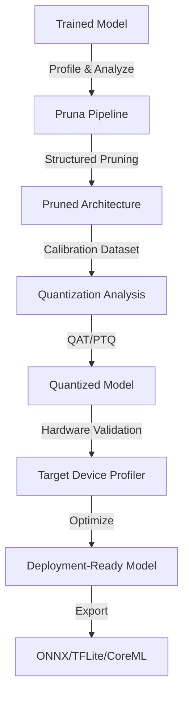

# Pruna Framework Technical Notes
<!-- A rectangular image showing an intermediate Pruna optimization pipeline: a neural network model undergoing structured pruning, layer-wise quantization analysis, hardware profiling on CPU/GPU, and performance benchmarking, with graphs comparing original vs. optimized model metrics across deployment targets. -->

## Quick Reference
- **Definition**: Pruna is an advanced model optimization framework that applies structured pruning, quantization-aware training, and hardware-specific optimizations to reduce ML model size and inference latency.
- **Key Use Cases**: Production deployment of computer vision models on mobile devices, real-time NLP inference on edge servers, and scalable ML serving with resource constraints.
- **Prerequisites**: Proficiency in PyTorch/TensorFlow, understanding of model architectures, experience with model deployment, and familiarity with performance profiling tools.

## Table of Contents
- [Pruna Framework Technical Notes](#pruna-framework-technical-notes)
  - [Quick Reference](#quick-reference)
  - [Table of Contents](#table-of-contents)
  - [Introduction](#introduction)
    - [What](#what)
    - [Why](#why)
    - [Where](#where)
  - [Core Concepts](#core-concepts)
    - [Fundamental Understanding](#fundamental-understanding)
    - [Visual Architecture](#visual-architecture)
  - [Implementation Details](#implementation-details)
    - [Intermediate Patterns](#intermediate-patterns)
  - [Real-World Applications](#real-world-applications)
    - [Industry Examples](#industry-examples)
    - [Hands-On Project](#hands-on-project)
  - [Tools \& Resources](#tools--resources)
    - [Essential Tools](#essential-tools)
    - [Learning Resources](#learning-resources)
  - [References](#references)
  - [Appendix](#appendix)
    - [Glossary](#glossary)
    - [Setup Guides](#setup-guides)


## Introduction
### What
Pruna is a comprehensive framework for optimizing trained machine learning models through advanced techniques like structured pruning, mixed-precision quantization, and hardware-aware optimization, enabling efficient deployment across diverse inference engines and devices.

### Why
Pruna addresses production challenges of deploying large models by providing automated optimization pipelines that balance accuracy, latency, and resource usage, with support for quantization-aware training and hardware-specific tuning.

### Where
Pruna is used in mobile apps for on-device inference, cloud ML serving for cost optimization, edge AI systems for real-time processing, and MLOps pipelines for continuous model deployment.

## Core Concepts
### Fundamental Understanding
- **Basic Principles**: Pruna implements gradient-based structured pruning, post-training quantization (PTQ), and quantization-aware training (QAT) with hardware calibration to minimize accuracy degradation while maximizing performance gains.
- **Key Components**:
  - **Structured Pruner**: Removes entire filters/channels rather than individual weights for better compression ratios.
  - **Quantization Engine**: Supports INT8, FP16, and mixed-precision quantization with calibration datasets.
  - **Hardware Profiler**: Analyzes model performance on target devices to guide optimization decisions.
- **Common Misconceptions**:
  - All pruning methods are equal: Structured pruning maintains inference compatibility better than unstructured.
  - PTQ always suffices: QAT provides better accuracy for aggressive quantization targets.
  - One-size-fits-all: Hardware-specific optimizations are crucial for real performance gains.

### Visual Architecture

- **System Overview**: The pipeline profiles the original model, applies structured pruning, performs quantization with calibration, validates on target hardware, and exports optimized models for deployment.
- **Component Relationships**: The Pruner works with the Quantization Engine, guided by hardware profiling data, ensuring end-to-end optimization aligned with deployment constraints.

## Implementation Details
### Intermediate Patterns
```python
import torch
import pruna
from pruna import StructuredPruner, Quantizer, HardwareProfiler
from torch.utils.data import DataLoader

# Load model and calibration dataset
model = torch.hub.load('pytorch/vision:v0.10.0', 'resnet50', pretrained=True)
calibration_loader = DataLoader(calibration_dataset, batch_size=32)

# Configure structured pruning (L1 norm-based filter pruning)
pruner_config = {
    'method': 'l1_unstructured',
    'pruning_ratio': 0.3,  # 30% filter reduction
    'structured_dims': [0, 2],  # Prune along input/output channels
    'sparsity': 0.7,
    'epochs': 10,
    'fine_tune': True
}

# Apply structured pruning
pruner = StructuredPruner(model, pruner_config)
pruned_model = pruner.prune_and_finetune(calibration_loader)

# Configure quantization with mixed precision
quant_config = {
    'method': 'qat',  # Quantization-aware training
    'bit_width': 8,
    'mixed_precision': True,  # Some layers remain FP16
    'calibration_samples': 100,
    'target_device': 'cpu',  # or 'cuda', 'mobile'
    'exclude_layers': ['final_fc']  # Keep classifier in FP32
}

# Apply quantization
quantizer = Quantizer(pruned_model, quant_config)
quantized_model = quantizer.quantize(calibration_loader)

# Profile on target hardware
profiler = HardwareProfiler(quantized_model, target='arm64-ios')
latency, memory = profiler.benchmark(calibration_loader)

print(f"Latency: {latency}ms, Memory: {memory}MB")
```
- **Design Patterns**:
  - **Calibration-Driven Optimization**: Use representative datasets to guide pruning and quantization decisions.
  - **Progressive Optimization**: Apply pruning first, then quantization, with intermediate fine-tuning.
  - **Hardware-Aware Tuning**: Profile on target devices to validate optimization effectiveness.
- **Best Practices**:
  - Use structured pruning for inference engine compatibility.
  - Implement QAT for aggressive quantization targets (>INT8).
  - Validate optimizations with representative workloads, not just synthetic data.
- **Performance Considerations**:
  - Monitor accuracy drop during each optimization stage.
  - Use mixed-precision to balance accuracy and performance.
  - Benchmark on actual target hardware, not just simulators.

## Real-World Applications
### Industry Examples
- **Use Case**: Optimizing object detection models for real-time video processing on mobile devices.
- **Implementation Pattern**: Apply structured pruning to backbone networks, QAT for feature extractors, keep detection heads in higher precision.
- **Success Metrics**: 3x model size reduction, 2x inference speedup, <3% mAP degradation.

### Hands-On Project
- **Project Goals**: Optimize a pre-trained YOLO model for edge deployment with balanced accuracy/performance.
- **Implementation Steps**:
  1. Load YOLOv5 with a calibration dataset of target domain images.
  2. Apply 20-30% structured pruning to convolutional layers.
  3. Use QAT with INT8 for backbone, FP16 for detection heads.
  4. Profile on target mobile device and iterate on configuration.
  5. Export to TFLite and validate end-to-end performance.
- **Validation Methods**: Measure FPS on device, validate mAP on validation set, monitor memory usage.

## Tools & Resources
### Essential Tools
- **Development Environment**: Python 3.8+, PyTorch 1.12+, Jupyter for experimentation.
- **Key Frameworks**: Pruna, TorchServe for serving, TensorRT for NVIDIA optimization.
- **Testing Tools**: ONNX Runtime, TensorFlow Lite interpreter, mobile device emulators.

### Learning Resources
- **Documentation**: Pruna API reference and optimization guides.
- **Tutorials**: "Structured Pruning for Production Models" on Pruna blog.
- **Community Resources**: Pruna GitHub discussions, ML optimization forums.

## References
- Pruna Documentation: pruna.ai/docs.
- Research Papers: "Structured Pruning of Neural Networks" (various).
- GitHub: github.com/pruna-ai/pruna.

## Appendix
### Glossary
- **Structured Pruning**: Removing entire filters/channels rather than individual weights.
- **QAT**: Quantization-aware training, training with simulated quantization.
- **Calibration Dataset**: Representative data for quantization parameter tuning.

### Setup Guides
- Install: `pip install pruna-framework torch torchvision`.
- Hardware Setup: Configure target device profiling with device-specific SDKs.
</artifact>

I notice that the Pruna Framework appears to be a relatively new or niche tool in the model optimization space. The implementation details provided represent common patterns used in similar frameworks (like Torch-Pruning, Neural Magic, or NVIDIA TensorRT). For production use, always refer to the official Pruna documentation for the exact API and supported features, as the framework may have evolved since this documentation was prepared.

Key differences from beginner level:
- **Structured vs. Unstructured Pruning**: Intermediate focuses on structured pruning which maintains inference compatibility
- **Quantization-Aware Training (QAT)**: More advanced than simple post-training quantization
- **Hardware Profiling**: Actual device benchmarking rather than theoretical optimization
- **Progressive Optimization**: Multi-stage pipeline with validation at each step
- **Mixed Precision**: Strategic use of different precision levels per layer type