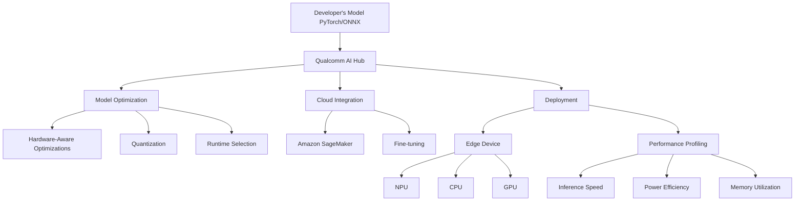

# Deploying Models On the Edge using Qualcomm AI Hub Technical Notes
<!-- [A rectangular image depicting a complex system architecture, showing multiple AI models being optimized and deployed across various Qualcomm devices, with performance metrics and code snippets overlaid] -->

## Introduction

Qualcomm AI Hub is an advanced platform designed for efficient deployment of AI models on edge devices, particularly for vision, audio, and speech applications. It offers sophisticated tools for model optimization, validation, and deployment on Qualcomm platform devices, bridging the gap between cloud-based AI development and edge implementation.


## Table of Contents


## Table of Contents

1. [Introduction](#introduction)
2. [Core Concepts](#core-concepts)
3. [Visual Architecture](#visual-architecture)
4. [Implementation Details](#implementation-details)
5. [Advanced Topics](#advanced-topics)
6. [Real-World Applications](#real-world-applications)
7. [Tools & Resources](#tools-&-resources)
8. [References](#references)

## Core Concepts

### Fundamental Understanding

- **Advanced Model Optimization**: Qualcomm AI Hub employs hardware-aware optimizations to enhance on-device AI performance, utilizing all cores within the Qualcomm AI Engine (NPU, CPU, and GPU)[2].
- **Multi-Runtime Support**: The platform supports deployment via TensorFlow Lite, ONNX Runtime, or Qualcomm AI Engine Direct, allowing for flexible implementation strategies[1].
- **Cloud-Edge Synergy**: Qualcomm AI Hub integrates with cloud services like Amazon SageMaker for model fine-tuning before edge deployment[5].

### Visual Architecture



## Implementation Details

### Advanced Topics

1. **Custom Model Optimization**:
   Implement advanced optimization techniques:

```python
import qai_hub as qai

# Load a custom PyTorch model
custom_model = load_my_custom_model()

# Convert to ONNX
onnx_model = qai.convert_to_onnx(custom_model)

# Apply advanced optimizations
optimized_model = qai.optimize(
    onnx_model,
    target_device="qcs8550",
    optimizations=["graph_fusion", "layer_decomposition", "quantization_aware_training"]
)

# Compile and profile
result = optimized_model.compile_profile()
print(f"Inference time: {result.profile_metrics.inference_time} ms")
```

2. **Multi-Device Deployment**:
   Deploy and compare performance across multiple devices:

```python
import qai_hub as qai

model = qai.load_model("yolov8_seg")

devices = ["qcs8550", "qcs6490", "qcs5430"]
results = {}

for device in devices:
    result = model.compile_profile(device=qai.Device(device))
    results[device] = result.profile_metrics

for device, metrics in results.items():
    print(f"{device}: Inference time: {metrics.inference_time} ms, Memory: {metrics.memory_usage} MB")
```

3. **Custom Dataset Validation**:
   Implement a custom dataset validation pipeline:

```python
import qai_hub as qai
import numpy as np

def custom_metric(predictions, ground_truth):
    # Implement your custom metric here
    return np.mean(np.abs(predictions - ground_truth))

model = qai.load_model("ffnet_40s")
dataset = load_custom_dataset()

results = model.validate(
    dataset,
    metric_fn=custom_metric,
    device=qai.Device("qcs8550")
)

print(f"Custom metric score: {results.score}")
```

## Real-World Applications

### Industry Examples

- **Autonomous Vehicles**: Deploy real-time semantic segmentation models for road scene understanding, utilizing Qualcomm's automotive platforms[1].
- **Edge AI in Healthcare**: Implement privacy-preserving medical image analysis on edge devices, ensuring data remains on-premise[2].

### Hands-On Project

Develop a real-time multi-model AI pipeline for autonomous drone navigation:

1. Deploy YOLOv8 for object detection and FFNet-40S for semantic segmentation.
2. Implement a custom fusion algorithm to combine outputs from both models.
3. Optimize the pipeline for low-latency inference on a Qualcomm-powered drone platform.
4. Implement a fallback mechanism using CPU inference for reliability.

## Tools & Resources

### Essential Tools
- Qualcomm AI Engine Direct SDK for low-level optimizations
- AIMET (AI Model Efficiency Toolkit) for advanced quantization techniques
- Qualcomm Neural Processing SDK for fine-grained control over NPU utilization

### Learning Resources
- Qualcomm AI Hub GitHub repository for open-source model implementations[7]
- Qualcomm AI Developer Relations YouTube channel for advanced tutorials
- Qualcomm AI Hub documentation for API references and best practices

By leveraging Qualcomm AI Hub's advanced features, developers can deploy highly optimized segmentation models on edge devices, achieving up to four times faster inference speeds and enabling cutting-edge AI applications across various industries[6].

## References

- [1] https://aihub.qualcomm.com/get-started
- [2] https://www.zdnet.com/article/qualcomms-new-ai-hub-is-a-dream-tool-for-developers-building-on-device-models/
- [3] https://www.youtube.com/watch?v=h5-km6Da_ww
- [4] https://www.youtube.com/watch?v=gh0HvhLWrUQ
- [5] https://aihub.qualcomm.com/collaborators/amazon-sagemaker
- [6] https://www.hackster.io/news/qualcomm-launches-its-ai-hub-offering-optimized-on-device-ai-models-with-four-times-the-performance-3dddfcb8a84f
- [7] https://github.com/quic/ai-hub-models
- [8] https://www.qualcomm.com/news/onq/2024/05/ai-developer-workflows-simplified-empowering-developers-with-qualcomm-ai-hub