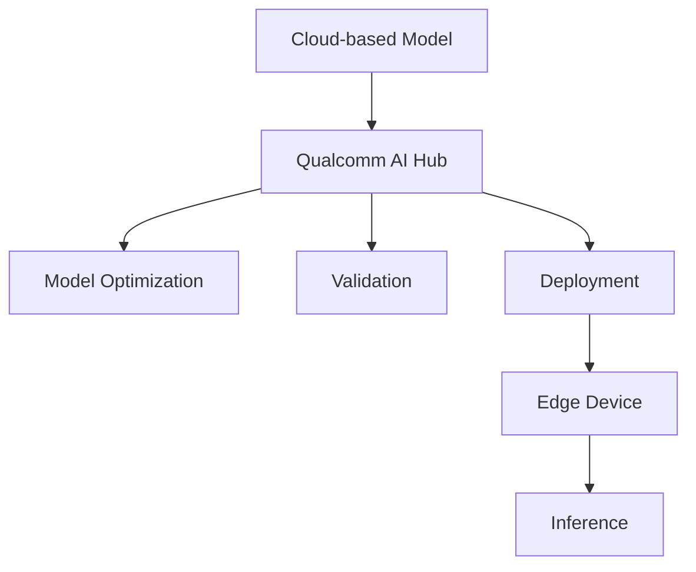

# Deploying Models On the Edge using Qualcomm AI Hub Technical Notes
<!-- [A rectangular image showing a smartphone with a segmented image on its screen, connected to cloud servers and edge devices, with the Qualcomm AI Hub logo prominently displayed] -->

## Quick Reference
- Qualcomm AI Hub is a platform for deploying optimized AI models on edge devices
- Key use cases: Real-time object detection, image segmentation, and AI model deployment on mobile devices
- Prerequisites: Basic understanding of machine learning, Python programming skills

## Table of Contents

1. [Introduction](#introduction)
2. [Quick Reference](#quick-reference)
3. [Core Concepts](#core-concepts)
4. [Visual Architecture](#visual-architecture)
5. [Implementation Details](#implementation-details)
6. [Basic Implementation](#basic-implementation)
7. [Real-World Applications](#real-world-applications)
8. [Tools & Resources](#tools--resources)
9. [References](#references)

## Introduction

Qualcomm AI Hub is a comprehensive platform designed to simplify the deployment of AI models on edge devices, particularly for vision, audio, and speech applications[3]. It allows developers to optimize, validate, and deploy AI models on hosted Qualcomm platform devices within minutes, bridging the gap between cloud-based AI development and edge device implementation[1].

## Core Concepts

### Fundamental Understanding

- **Model Optimization**: Qualcomm AI Hub automatically converts PyTorch or ONNX models for efficient on-device deployment using TensorFlow Lite, ONNX Runtime, or Qualcomm AI Engine Direct[3].
- **Edge Deployment**: The platform enables running AI models on real devices powered by Snapdragon and Qualcomm platforms, allowing for performance profiling and on-device inference[3].
- **Pre-optimized Models**: Qualcomm AI Hub offers a library of over 100 pre-optimized models for various applications, including segmentation models like YOLOv8[1][4].

### Visual Architecture



## Implementation Details

### Basic Implementation

To get started with Qualcomm AI Hub for deploying segmentation models:

1. Install the Qualcomm AI Hub library:
```bash
pip install qai-hub
```

2. Set up your Qualcomm AI Hub API token[3].

3. Run a simple example to deploy a segmentation model:
```python
import qai_hub as qai

# Load a pre-optimized segmentation model
model = qai.load_model("ffnet_40s")

# Compile and profile the model on a hosted device
result = model.compile_profile()
print(result.profile_metrics)

# Run inference on a sample image
image = qai.Image.open("street_scene.jpg")
output = model.predict(image)
```

This basic example demonstrates loading a pre-optimized segmentation model (FFNet-40S), compiling and profiling it on a hosted device, and running inference on a sample image[6].

## Real-World Applications

### Industry Examples

- **Automotive**: Segmentation models like FFNet-40S can be used for street scene analysis, identifying roads, sidewalks, and pedestrians in real-time[6].
- **Mobile Applications**: YOLOv8 Segmentation model can be deployed on smartphones for real-time object detection and segmentation, processing images in milliseconds[4].

### Hands-On Project

Create a simple Android app that uses a segmentation model to identify objects in real-time using the device's camera:

1. Set up an Android development environment.
2. Use Qualcomm AI Hub to optimize and deploy a segmentation model (e.g., YOLOv8 Segmentation).
3. Integrate the model into your Android app using TensorFlow Lite or Qualcomm AI Engine Direct.
4. Implement camera input and display the segmented output on the screen.


## Tools & Resources

### Essential Tools
- Qualcomm AI Hub Python library
- Android Studio (for mobile app development)
- PyTorch or ONNX (for model development)

### Learning Resources
- Qualcomm AI Hub documentation and tutorials
- Qualcomm AI Hub YouTube channel for video tutorials[5]
- GitHub repository for Qualcomm AI Hub Models[7]

By leveraging Qualcomm AI Hub, even beginners can deploy sophisticated segmentation models on edge devices, opening up possibilities for real-time AI applications in various industries[2].

## References

- [1] https://aws.amazon.com/blogs/machine-learning/train-optimize-and-deploy-models-on-edge-devices-using-amazon-sagemaker-and-qualcomm-ai-hub/
- [2] https://genai.works/applications/qualcommaiub
- [3] https://aihub.qualcomm.com/get-started
- [4] https://dataloop.ai/library/model/qualcomm_yolov8-segmentation/
- [5] https://www.youtube.com/watch?v=ZQIbXCfGKzo
- [6] https://github.com/quic/ai-hub-models/blob/main/qai_hub_models/models/ffnet_40s/README.md
- [7] https://github.com/quic/ai-hub-models
- [8] https://aihub.qualcomm.com/mobile/models
- [9] https://www.youtube.com/watch?v=77xgPnBucNw
- [10] https://www.linkedin.com/posts/andrewyng_learn-to-deploy-ai-models-to-edge-devices-activity-7198685657064460289-G1kP
- [11] https://github.com/quic/ai-hub-models/blob/main/qai_hub_models/models/yolov11_seg/README.md
- [12] https://dataloop.ai/library/model/qualcomm_mediapipe-selfie-segmentation/
- [13] https://aihub.qualcomm.com/mobile/models
- [14] https://aihub.qualcomm.com/models
- [15] https://github.com/quic/ai-hub-models/blob/main/qai_hub_models/models/yolov8_seg/README.md
- [16] https://github.com/quic/ai-hub-models/blob/main/qai_hub_models/models/ffnet_40s/README.md
- [17] https://aws.amazon.com/blogs/machine-learning/train-optimize-and-deploy-models-on-edge-devices-using-amazon-sagemaker-and-qualcomm-ai-hub/
- [18] https://app.aihub.qualcomm.com/docs/hub/link_examples.html