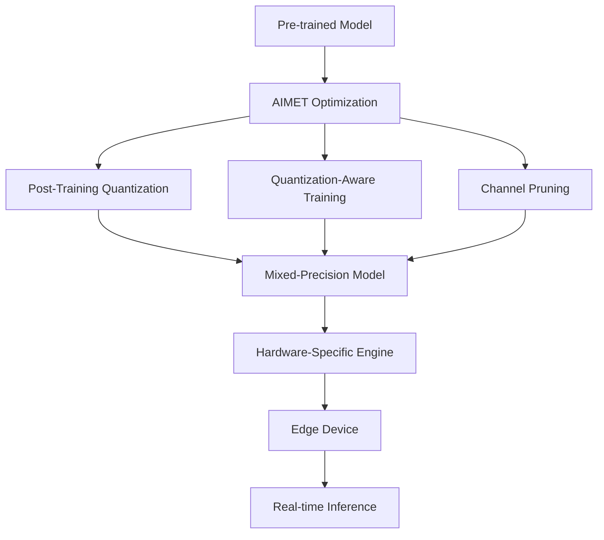

# AIMET Technical Notes - [Advanced]

<!-- [Image description: A rectangular, detailed diagram depicting an advanced edge deployment pipeline: a complex AI model (e.g., ResNet-50) undergoes AIMET optimization (quantization, pruning, and mixed-precision), then integrates with a hardware-specific inference engine (e.g., Qualcomm SNPE or NVIDIA TensorRT) on an edge device like a Snapdragon 8 Gen 1 or Jetson AGX. The image includes performance annotations (e.g., latency, throughput, power), layered architecture, and a futuristic technical aesthetic.] -->

## Quick Reference  
- **One-sentence definition**: Deploying AI on edge devices with AIMET leverages Qualcomm’s AI Model Efficiency Toolkit to optimize complex models for high-performance, low-resource edge hardware using advanced quantization, pruning, and system-level integration.  
- **Key use cases**: Autonomous vehicle perception, real-time industrial robotics, 5G-enabled edge analytics.  
- **Prerequisites**: Strong knowledge of deep learning frameworks (TensorFlow/PyTorch), model optimization, hardware accelerators, and production deployment workflows.  

## Table of Contents
1. [Introduction](#introduction)  
2. [Core Concepts](#core-concepts)  
  - [Fundamental Understanding](#fundamental-understanding)  
  - [Visual Architecture](#visual-architecture)  
3. [Implementation Details](#implementation-details)  
  - [Advanced Topics](#advanced-topics)  
4. [Real-World Applications](#real-world-applications)  
  - [Industry Examples](#industry-examples)  
  - [Hands-On Project](#hands-on-project)  
5. [Tools & Resources](#tools--resources)  
  - [Essential Tools](#essential-tools)  
  - [Learning Resources](#learning-resources)  
6. [References](#references)  
7. [Appendix](#appendix)  

## Introduction  
- **What**: Deploying AI on edge devices with AIMET involves advanced optimization of neural networks to meet stringent performance, power, and latency requirements on cutting-edge hardware.  
- **Why**: It enables mission-critical, real-time AI with minimal cloud dependency, optimized for power efficiency and scalability.  
- **Where**: Deployed in autonomous systems, 5G edge networks, and high-stakes IoT applications.  

## Core Concepts  
### Fundamental Understanding  
- **Basic principles**: AIMET applies post-training quantization (PTQ), quantization-aware training (QAT), and pruning to compress models while leveraging hardware-specific features (e.g., DSPs, NPUs).  
- **Key components**:  
  - Complex models (e.g., transformers, CNNs).  
  - AIMET (mixed-precision, AdaRound, channel pruning).  
  - Edge hardware with accelerators (e.g., Hexagon DSP, NVIDIA GPU).  
- **Common misconceptions**:  
  - "Optimization sacrifices scalability" – AIMET supports multi-device deployment.  
  - "Edge can’t handle large models" – With AIMET, even transformers can run efficiently.  

### Visual Architecture  

- **System overview**: AIMET optimizes models for hardware-aware inference.  
- **Component relationships**: Optimization stages feed into hardware-specific runtimes.  

## Implementation Details  
### Advanced Topics  
```python  
# Mixed-precision with AIMET for Snapdragon  
from aimet_common.defs import QuantScheme  
from aimet_tensorflow import mixed_precision  

# Load pre-trained model (assumed from prior levels)  
model = tf.keras.applications.ResNet50(weights='imagenet')  

# Define mixed-precision policy  
mp_config = mixed_precision.MixedPrecisionConfig(  
    quant_scheme=QuantScheme.post_training_tf_enhanced,  
    candidates=[(8, 16), (4, 8)]  # Bit-width pairs for weights/activations  
)  

# Apply mixed-precision  
mp_model = mixed_precision.MixedPrecision(model, mp_config)  
mp_model.optimize(eval_callback=lambda m, _: m.evaluate(val_data),  
                  eval_callback_args=None)  

# Export for Snapdragon SNPE  
mp_model.export('/path/to/output', 'mixed_precision_resnet', target='snpe')  
```  
- **System design**: Integrates with hardware runtimes (e.g., SNPE, TensorRT) for optimal layer execution.  
- **Optimization techniques**: Mixed-precision reduces compute load (e.g., 4-bit weights for non-critical layers, 16-bit for critical ones).  
- **Production considerations**: Load balancing across CPU/GPU/NPU, thermal management, fault tolerance.  

## Real-World Applications  
### Industry Examples  
- **Use case**: Real-time pedestrian detection in autonomous vehicles.  
- **Implementation pattern**: Mixed-precision YOLOv5 on Snapdragon 8 Gen 1, 30 FPS, 95% mAP.  
- **Success metrics**: <50ms latency, <2W power, 99% uptime.  

### Hands-On Project  
- **Project goals**: Deploy a transformer-based NLP model on Jetson AGX for real-time translation.  
- **Implementation steps**:  
  1. Train a small transformer on a multilingual dataset.  
  2. Optimize with AIMET (QAT + pruning).  
  3. Deploy with TensorRT, process live audio input.  
- **Validation methods**: Measure BLEU score (>0.9), latency (<200ms).  

## Tools & Resources  
### Essential Tools  
- **Development environment**: Python 3.9+, TensorFlow 2.x, AIMET, SNPE/TensorRT.  
- **Key frameworks**: AIMET, ONNX, NVIDIA DeepStream.  
- **Testing tools**: Jetson AGX, Snapdragon Dev Kit, profiling suites.  

### Learning Resources  
- **Documentation**: AIMET Advanced Guide (Qualcomm GitHub).  
- **Tutorials**: "Mixed-Precision with AIMET" (Qualcomm Dev Network).  
- **Community resources**: NVIDIA TAO Toolkit Forum, AIMET Slack.  

## References  
- Official AIMET docs: [Qualcomm AIMET GitHub](https://github.com/quic/aimet).  
- "Mixed Precision Training" (Micikevicius et al., 2017).  
- Snapdragon Neural Processing SDK: [developer.qualcomm.com].  

## Appendix  
- **Glossary**:  
  - Mixed-Precision: Using multiple bit-widths for efficiency.  
  - AdaRound: Adaptive rounding for quantization.  
- **Setup guides**: "SNPE Integration with AIMET" (Qualcomm docs).  
- **Code templates**: Mixed-precision script (above).  

---

### Key Changes
- **Beginner**: Focuses solely on basic implementation (post-training quantization).
- **Intermediate**: Focuses solely on intermediate patterns (quantization-aware training, cross-layer equalization), assuming basic quantization is understood.
- **Advanced**: Focuses solely on advanced topics (mixed-precision, hardware-specific deployment), assuming prior mastery of quantization and QAT.