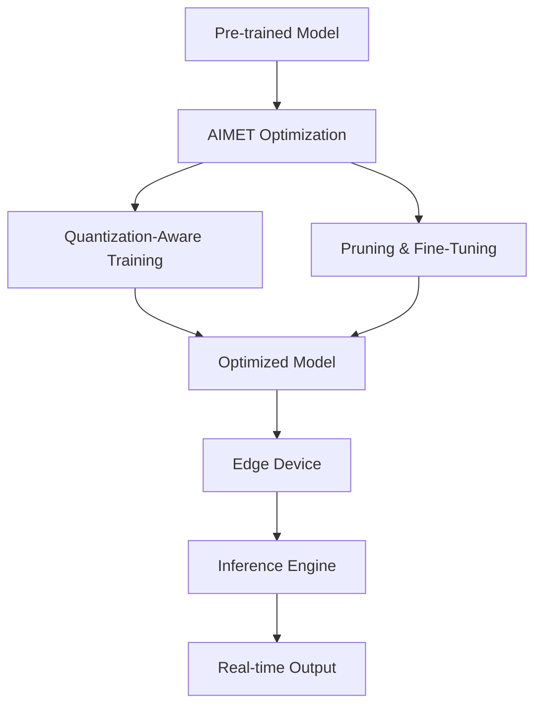

# AIMET Technical Notes - [Intermediate]

<!-- [Image description: A rectangular diagram illustrating an edge deployment pipeline, featuring a pre-trained AI model being processed through AIMET’s optimization stages (quantization and pruning), then deployed to an edge device like a Qualcomm Snapdragon or NVIDIA Jetson. The image includes labeled arrows showing data flow, a performance metrics overlay (e.g., latency, power usage), and a clean, technical design with a focus on intermediate complexity.] -->

## Quick Reference  
- **One-sentence definition**: Deploying AI on edge devices with AIMET involves using Qualcomm’s AI Model Efficiency Toolkit to optimize pre-trained models for resource-constrained hardware through techniques like quantization and pruning.  
- **Key use cases**: Real-time object detection in drones, predictive maintenance in industrial IoT, voice recognition in smart speakers.  
- **Prerequisites**: Familiarity with AI frameworks (TensorFlow/PyTorch), Python, basic model optimization concepts, and edge hardware specifications.  

## Table of Contents  
1. [Introduction](#introduction)  
2. [Core Concepts](#core-concepts)  
    - [Fundamental Understanding](#fundamental-understanding)  
    - [Visual Architecture](#visual-architecture)  
3. [Implementation Details](#implementation-details)  
    - [Intermediate Patterns](#intermediate-patterns)  
4. [Real-World Applications](#real-world-applications)  
    - [Industry Examples](#industry-examples)  
    - [Hands-On Project](#hands-on-project)  
5. [Tools & Resources](#tools--resources)  
    - [Essential Tools](#essential-tools)  
    - [Learning Resources](#learning-resources)  
6. [References](#references)  
7. [Appendix](#appendix)  

## Introduction  
- **What**: Deploying AI on edge devices with AIMET means optimizing and compressing AI models using quantization, pruning, and other techniques to run efficiently on edge hardware.  
- **Why**: It reduces latency, enables offline functionality, and optimizes power usage for real-time applications.  
- **Where**: Applied in autonomous systems, smart cities, and healthcare wearables.  

## Core Concepts  
### Fundamental Understanding  
- **Basic principles**: AIMET enhances model efficiency by reducing precision (quantization) and eliminating redundant parameters (pruning), balancing performance and resource use.  
- **Key components**:  
  - Pre-trained model (e.g., CNNs like ResNet).  
  - AIMET toolkit (quantization-aware training, pruning APIs).  
  - Edge hardware (e.g., Snapdragon, Jetson Nano).  
- **Common misconceptions**:  
  - "Optimization always degrades accuracy" – AIMET minimizes this with fine-tuning.  
  - "Edge deployment is plug-and-play" – Hardware-specific tuning is often required.  

### Visual Architecture  

- **System overview**: Model optimization with AIMET integrates into a deployment pipeline targeting edge inference.  
- **Component relationships**: AIMET processes interact with hardware-specific inference engines.  

## Implementation Details  
### Intermediate Patterns  
```python  
# Quantization-aware training with AIMET  
from aimet_tensorflow import cross_layer_equalization as cle  
from aimet_tensorflow import quantization_aware_training as qat  

# Load pre-trained model (assumed from beginner level)  
model = tf.keras.applications.ResNet50(weights='imagenet')  

# Apply cross-layer equalization  
cle.apply_cross_layer_equalization(model)  

# Fine-tune with quantization-aware training  
qat_model = qat.QuantizationAwareTraining(model, quant_scheme='tf')  
qat_model.train(train_data, epochs=5, batch_size=32)  

# Export  
qat_model.export('/path/to/output', 'qat_resnet')  
```  
- **Design patterns**: Use cross-layer equalization to balance weights, followed by quantization-aware training for better accuracy.  
- **Best practices**: Fine-tune with representative data, validate on target hardware.  
- **Performance considerations**: Reduces memory footprint (e.g., from 100MB to 25MB) and inference time (e.g., 50ms to 20ms).  

## Real-World Applications  
### Industry Examples  
- **Use case**: Drone-based object detection for agriculture.  
- **Implementation pattern**: Quantized ResNet on NVIDIA Jetson, processing 10 frames/sec.  
- **Success metrics**: 90% accuracy, <100ms latency, <1W power draw.  

### Hands-On Project  
- **Project goals**: Deploy a quantized object detector on a Jetson Nano.  
- **Implementation steps**:  
  1. Train a YOLOv3-tiny model on a small dataset (e.g., COCO subset).  
  2. Optimize with AIMET (quantization + pruning).  
  3. Deploy and detect objects in real-time video.  
- **Validation methods**: Measure frames-per-second (aim for 15+), accuracy (>85%).  

## Tools & Resources  
### Essential Tools  
- **Development environment**: Python 3.8+, TensorFlow 2.x, AIMET.  
- **Key frameworks**: AIMET, TensorRT (for NVIDIA hardware).  
- **Testing tools**: Jetson Nano, profiling tools (e.g., NVIDIA Nsight).  

### Learning Resources  
- **Documentation**: AIMET API Reference (Qualcomm GitHub).  
- **Tutorials**: "Quantization-Aware Training with AIMET" (Qualcomm Dev Network).  
- **Community resources**: NVIDIA Developer Forums, AIMET GitHub Issues.  

## References  
- Official AIMET documentation: [Qualcomm AIMET GitHub](https://github.com/quic/aimet).  
- "Quantization and Training of Neural Networks" (Jacob et al., 2018).  
- NVIDIA TensorRT Developer Guide: [developer.nvidia.com/tensorrt].  

## Appendix  
- **Glossary**:  
  - Quantization-Aware Training: Simulates quantization during training.  
  - Cross-Layer Equalization: Balances weights across layers.  
- **Setup guides**: "AIMET Installation on Jetson" (Qualcomm docs).  
- **Code templates**: QAT script (above).  
