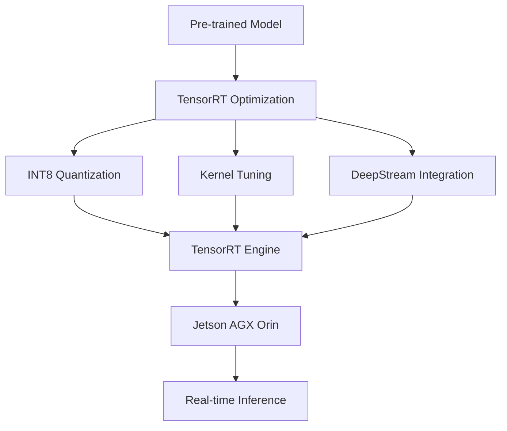

# NVIDIA TensorRT Technical Notes  
<!-- [Image description: A rectangular, detailed diagram showing a complex model (e.g., transformer) optimized with TensorRT, deployed to a high-end edge device (e.g., Jetson AGX Orin). It includes advanced steps like INT8 quantization, kernel tuning, and integration with DeepStream, with performance metrics (e.g., latency, power) and a futuristic aesthetic.] -->

## Quick Reference  
- **One-sentence definition**: Deploying AI on edge devices with NVIDIA TensorRT leverages advanced optimization techniques to run complex models efficiently on high-performance NVIDIA edge hardware.  
- **Key use cases**: Autonomous vehicle perception, real-time NLP on edge, industrial robotics.  
- **Prerequisites**: Expertise in deep learning, TensorRT optimization, and hardware accelerators.  

## Table of Contents

1. [Introduction](#introduction)  
2. [Core Concepts](#core-concepts)  
    - [Fundamental Understanding](#fundamental-understanding)  
    - [Visual Architecture](#visual-architecture)  
3. [Implementation Details](#implementation-details)  
    - [Advanced Topics](#advanced-topics)  
4. [Real-World Applications](#real-world-applications)  
    - [Industry Examples](#industry-examples)  
    - [Hands-On Project](#hands-on-project)  
5. [Tools & Resources](#tools--resources)  
    - [Essential Tools](#essential-tools)  
    - [Learning Resources](#learning-resources)  
6. [References](#references)  
7. [Appendix](#appendix)  

## Introduction  
- **What**: Deploying AI with TensorRT involves advanced optimization (e.g., INT8, kernel tuning) for complex models on powerful edge devices.  
- **Why**: It delivers mission-critical, real-time AI with minimal latency and power use.  
- **Where**: Used in autonomous systems, 5G edge networks, and advanced IoT.  

## Core Concepts  
### Fundamental Understanding  
- **Basic principles**: TensorRT maximizes throughput and minimizes latency using precision reduction (e.g., INT8), kernel optimization, and hardware-specific tuning.  
- **Key components**:  
  - Complex models (e.g., transformers, YOLO).  
  - TensorRT (advanced APIs, runtime).  
  - High-end edge hardware (e.g., Jetson AGX Orin).  
- **Common misconceptions**:  
  - "INT8 is inaccurate" – Calibration ensures high fidelity.  
  - "Edge can’t scale" – TensorRT supports multi-device setups.  

### Visual Architecture  

- **System overview**: Advanced optimization integrates with hardware runtimes for edge deployment.  
- **Component relationships**: TensorRT leverages GPU/NPU features for peak performance.  

## Implementation Details  
### Advanced Topics  
```python  
# INT8 quantization with TensorRT  
import tensorrt as trt  
import numpy as np  
import pycuda.driver as cuda  
import pycuda.autoinit  

TRT_LOGGER = trt.Logger(trt.Logger.WARNING)  
with trt.Builder(TRT_LOGGER) as builder, builder.create_network(1 << int(trt.NetworkDefinitionCreationFlag.EXPLICIT_BATCH)) as network:  
    parser = trt.OnnxParser(network, TRT_LOGGER)  
    with open("model.onnx", "rb") as f:  
        parser.parse(f.read())  
    builder.max_batch_size = 1  
    builder.int8_mode = True  
    builder.int8_calibrator = trt.IInt8EntropyCalibrator2()  # Calibration for INT8  
    engine = builder.build_cuda_engine(network)  

# Inference with DeepStream  
# (Assumes DeepStream pipeline setup)  
with engine.create_execution_context() as context:  
    inputs, outputs, bindings, stream = allocate_buffers(engine)  
    inputs[0].host = np.random.random((1, 3, 640, 640)).astype(np.float32)  
    context.execute_v2(bindings)  
    result = outputs[0].host  
```  
- **System design**: Integrates with DeepStream for video analytics, tunes kernels for GPU/NPU.  
- **Optimization techniques**: INT8 reduces memory 4x, boosts speed (e.g., 10ms inference).  
- **Production considerations**: Multi-stream processing, thermal limits, fault tolerance.  

## Real-World Applications  
### Industry Examples  
- **Use case**: Autonomous vehicle lane detection.  
- **Implementation pattern**: INT8 YOLOv8 on Jetson AGX Orin, 30 FPS.  
- **Success metrics**: <20ms latency, 98% accuracy.  

### Hands-On Project  
- **Project goals**: Deploy a real-time video analytics system on Jetson AGX Orin.  
- **Implementation steps**:  
  1. Train YOLOv8 on a custom dataset.  
  2. Optimize with TensorRT (INT8) and integrate with DeepStream.  
  3. Process live video feeds.  
- **Validation methods**: FPS >25, mAP >0.9.  

## Tools & Resources  
### Essential Tools  
- **Development environment**: Python 3.9+, TensorRT, DeepStream.  
- **Key frameworks**: ONNX, TensorRT, NVIDIA TAO.  
- **Testing tools**: Jetson AGX Orin, Nsight Systems.  

### Learning Resources  
- **Documentation**: TensorRT Advanced Guide (NVIDIA Developer).  
- **Tutorials**: "DeepStream with TensorRT" (NVIDIA GTC).  
- **Community resources**: NVIDIA Edge AI Forum.  

## References  
- TensorRT SDK: [developer.nvidia.com/tensorrt].  
- DeepStream Docs: [developer.nvidia.com/deepstream-sdk].  
- "Advanced TensorRT Optimization" (NVIDIA Blog).  

## Appendix  
- **Glossary**:  
  - INT8: 8-bit integer precision.  
  - Kernel Tuning: Optimizing GPU compute kernels.  
- **Setup guides**: "DeepStream on AGX Orin" (NVIDIA docs).  
- **Code templates**: INT8 script (above).  
