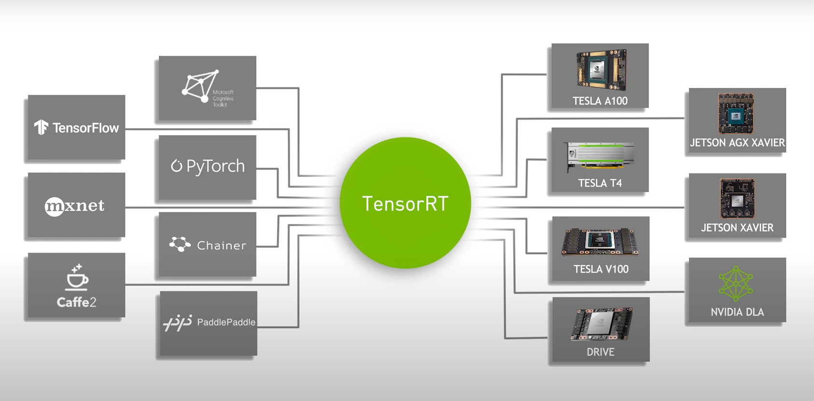
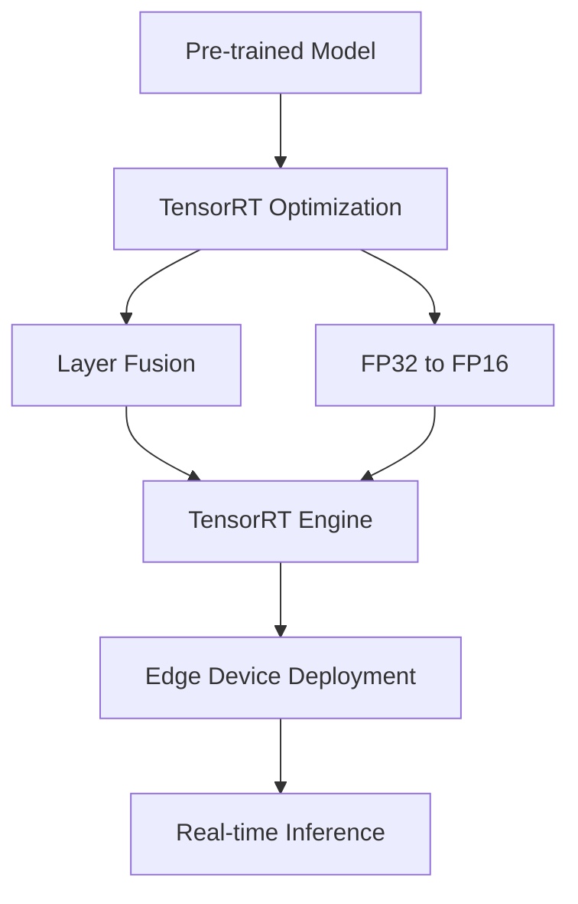

# NVIDIA TensorRT Technical Notes  
<!-- [Image description: A rectangular diagram showing a simple edge device (e.g., NVIDIA Jetson Nano) receiving a pre-trained AI model optimized with TensorRT. Arrows indicate the flow from model training to optimization and deployment, with labels for key steps like conversion to TensorRT engine and inference, set against a minimalistic technical background.] -->



## Quick Reference  
- **One-sentence definition**: Deploying AI on edge devices with NVIDIA TensorRT involves optimizing pre-trained AI models for efficient inference on resource-constrained hardware using NVIDIA’s high-performance inference SDK.  
- **Key use cases**: Real-time image classification on smart cameras, voice recognition on IoT devices, basic robotics navigation.  
- **Prerequisites**: Basic knowledge of AI models, Python, and edge hardware (e.g., NVIDIA Jetson series).  

## Table of Contents  
1. [Introduction](#introduction)  
2. [Core Concepts](#core-concepts)  
    - [Fundamental Understanding](#fundamental-understanding)  
    - [Visual Architecture](#visual-architecture)  
3. [Implementation Details](#implementation-details)  
    - [Basic Implementation](#basic-implementation)  
4. [Real-World Applications](#real-world-applications)  
    - [Industry Examples](#industry-examples)  
    - [Hands-On Project](#hands-on-project)  
5. [Tools & Resources](#tools--resources)  
    - [Essential Tools](#essential-tools)  
    - [Learning Resources](#learning-resources)  
6. [References](#references)  
7. [Appendix](#appendix)  

## Introduction  
- **What**: Deploying AI on edge devices with TensorRT means converting and optimizing pre-trained models to run efficiently on NVIDIA edge hardware like Jetson Nano or TX2.  
- **Why**: It enables low-latency, offline AI processing, reducing reliance on cloud servers and minimizing power usage.  
- **Where**: Used in smart home devices, entry-level autonomous systems, and portable IoT solutions.  

## Core Concepts  
### Fundamental Understanding  
- **Basic principles**: Edge devices have limited compute and memory, so TensorRT optimizes models by reducing their complexity (e.g., layer fusion, precision reduction) for faster inference.  
- **Key components**:  
  - Pre-trained model (e.g., PyTorch or TensorFlow).  
  - TensorRT SDK for optimization and runtime.  
  - NVIDIA edge hardware (e.g., Jetson Nano).  
- **Common misconceptions**:  
  - "Edge AI is slow" – TensorRT accelerates inference significantly.  
  - "You need a powerful GPU" – Even low-end Jetson devices can handle optimized models.  

### Visual Architecture  

- **System overview**: A model is optimized into a TensorRT engine and deployed for edge inference.  
- **Component relationships**: TensorRT acts as a bridge between training and edge execution.  

## Implementation Details  
### Basic Implementation  
```python  
# Basic TensorRT conversion and inference  
import tensorrt as trt  
import numpy as np  
import pycuda.driver as cuda  
import pycuda.autoinit  

# Load pre-trained ONNX model  
TRT_LOGGER = trt.Logger(trt.Logger.WARNING)  
with open("model.onnx", "rb") as f, trt.Builder(TRT_LOGGER) as builder:  
    network = builder.create_network(1 << int(trt.NetworkDefinitionCreationFlag.EXPLICIT_BATCH))  
    parser = trt.OnnxParser(network, TRT_LOGGER)  
    parser.parse(f.read())  
    engine = builder.build_cuda_engine(network)  

# Perform inference  
with engine.create_execution_context() as context:  
    inputs, outputs, bindings, stream = allocate_buffers(engine)  # Custom function for buffer allocation  
    inputs[0].host = np.random.random((1, 3, 224, 224)).astype(np.float32)  # Dummy input  
    context.execute_v2(bindings)  
    result = outputs[0].host  # Output result  
```  
- **Step-by-step setup**:  
  1. Install TensorRT on Jetson (via JetPack SDK).  
  2. Export a model to ONNX format (e.g., from PyTorch).  
  3. Convert to TensorRT engine and run inference.  
- **Code walkthrough**: Loads an ONNX model, builds a TensorRT engine, and performs inference with dummy data.  
- **Common pitfalls**: Missing JetPack installation, incompatible ONNX ops.  

## Real-World Applications  
### Industry Examples  
- **Use case**: Smart doorbell with face recognition.  
- **Implementation pattern**: Quantized MobileNet on Jetson Nano.  
- **Success metrics**: <200ms inference, low power draw.  

### Hands-On Project  
- **Project goals**: Deploy an image classifier on Jetson Nano.  
- **Implementation steps**:  
  1. Train a simple CNN (e.g., on CIFAR-10).  
  2. Export to ONNX and convert with TensorRT.  
  3. Run inference on Nano with a webcam.  
- **Validation methods**: Accuracy >80%, inference <500ms.  

## Tools & Resources  
### Essential Tools  
- **Development environment**: Python 3.8+, TensorRT (via JetPack).  
- **Key frameworks**: PyTorch/TensorFlow, ONNX.  
- **Testing tools**: Jetson Nano, sample datasets (e.g., CIFAR-10).  

### Learning Resources  
- **Documentation**: TensorRT Developer Guide (NVIDIA Developer).  
- **Tutorials**: "TensorRT Basics" (NVIDIA GTC).  
- **Community resources**: NVIDIA Forums, GitHub TensorRT repo.  

## References  
- TensorRT SDK: [developer.nvidia.com/tensorrt].  
- JetPack SDK: [developer.nvidia.com/embedded/jetpack].  
- "Deep Learning Inference with TensorRT" (NVIDIA Blog).  

## Appendix  
- **Glossary**:  
  - Layer Fusion: Combining operations to reduce compute.  
  - ONNX: Open Neural Network Exchange format.  
- **Setup guides**: "Install JetPack on Jetson Nano" (NVIDIA docs).  
- **Code templates**: Basic inference script (above).  
