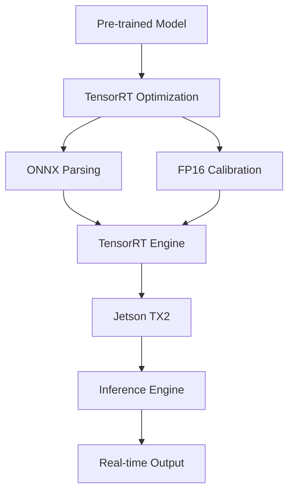

# NVIDIA TensorRT Technical Notes  
<!-- [Image description: A rectangular diagram showing a pre-trained model optimized with TensorRT, deployed to an edge device like Jetson TX2. It includes detailed steps like ONNX parsing, precision calibration (FP16), and engine building, with a performance overlay (e.g., latency, throughput) and a technical design.] -->

## Quick Reference  
- **One-sentence definition**: Deploying AI on edge devices with NVIDIA TensorRT uses an SDK to optimize and accelerate pre-trained models for real-time inference on NVIDIA edge hardware.  
- **Key use cases**: Object detection in drones, real-time video analytics, industrial IoT monitoring.  
- **Prerequisites**: Familiarity with AI frameworks, TensorRT basics, and edge hardware tuning.  

## Table of Contents  

1. [Introduction](#introduction)  
2. [Core Concepts](#core-concepts)  
    - [Fundamental Understanding](#fundamental-understanding)  
    - [Visual Architecture](#visual-architecture)  
3. [Implementation Details](#implementation-details)  
    - [Intermediate Patterns](#intermediate-patterns)  
4. [Real-World Applications](#real-world-applications)  
    - [Industry Examples](#industry-examples)  
    - [Hands-On Project](#hands-on-project)  
5. [Tools & Resources](#tools--resources)  
    - [Essential Tools](#essential-tools)  
    - [Learning Resources](#learning-resources)  
6. [References](#references)  
7. [Appendix](#appendix)  

## Introduction  
- **What**: Deploying AI with TensorRT involves optimizing models with techniques like FP16 precision and layer fusion for efficient edge inference.  
- **Why**: It ensures low-latency, high-throughput AI on devices with moderate compute power.  
- **Where**: Used in robotics, smart cities, and mid-tier autonomous systems.  

## Core Concepts  
### Fundamental Understanding  
- **Basic principles**: TensorRT enhances inference by optimizing neural network graphs (e.g., fusing layers, reducing precision) and leveraging NVIDIA GPU capabilities.  
- **Key components**:  
  - Model in ONNX format.  
  - TensorRT (optimization and runtime).  
  - Edge device (e.g., Jetson TX2).  
- **Common misconceptions**:  
  - "FP16 always loses accuracy" – TensorRT calibrates to minimize loss.  
  - "Optimization is one-size-fits-all" – Tuning varies by hardware.  

### Visual Architecture  

- **System overview**: Model is parsed, optimized, and deployed for edge inference.  
- **Component relationships**: TensorRT integrates with hardware-specific runtimes.  

## Implementation Details  
### Intermediate Patterns  
```python  
# FP16 optimization with TensorRT  
import tensorrt as trt  
import numpy as np  
import pycuda.driver as cuda  
import pycuda.autoinit  

TRT_LOGGER = trt.Logger(trt.Logger.WARNING)  
with trt.Builder(TRT_LOGGER) as builder, builder.create_network(1 << int(trt.NetworkDefinitionCreationFlag.EXPLICIT_BATCH)) as network:  
    parser = trt.OnnxParser(network, TRT_LOGGER)  
    with open("model.onnx", "rb") as f:  
        parser.parse(f.read())  
    builder.max_batch_size = 1  
    builder.fp16_mode = True  # Enable FP16  
    engine = builder.build_cuda_engine(network)  

# Inference with dynamic batching  
with engine.create_execution_context() as context:  
    inputs, outputs, bindings, stream = allocate_buffers(engine)  
    inputs[0].host = np.random.random((1, 3, 224, 224)).astype(np.float32)  
    context.execute_v2(bindings)  
    result = outputs[0].host  
```  
- **Design patterns**: Use FP16 for speed, dynamic batching for flexibility.  
- **Best practices**: Profile on target hardware, validate accuracy post-optimization.  
- **Performance considerations**: FP16 halves memory use, boosts throughput (e.g., 20ms to 10ms inference).  

## Real-World Applications  
### Industry Examples  
- **Use case**: Drone obstacle detection.  
- **Implementation pattern**: FP16 YOLOv3 on Jetson TX2, 15 FPS.  
- **Success metrics**: <50ms latency, >90% accuracy.  

### Hands-On Project  
- **Project goals**: Deploy an object detector on Jetson TX2.  
- **Implementation steps**:  
  1. Train YOLOv5 on a small dataset (e.g., COCO subset).  
  2. Export to ONNX, optimize with TensorRT (FP16).  
  3. Detect objects in real-time video.  
- **Validation methods**: FPS >10, mAP >0.8.  

## Tools & Resources  
### Essential Tools  
- **Development environment**: Python 3.8+, TensorRT, JetPack.  
- **Key frameworks**: ONNX, TensorRT, PyTorch.  
- **Testing tools**: Jetson TX2, NVIDIA Nsight.  

### Learning Resources  
- **Documentation**: TensorRT API Reference (NVIDIA Developer).  
- **Tutorials**: "Optimizing with TensorRT" (NVIDIA GTC).  
- **Community resources**: Jetson Community Forum.  

## References  
- TensorRT Docs: [developer.nvidia.com/tensorrt].  
- "TensorRT Optimization Techniques" (NVIDIA Blog).  
- JetPack Guide: [developer.nvidia.com/embedded/jetpack].  

## Appendix  
- **Glossary**:  
  - FP16: 16-bit floating-point precision.  
  - Dynamic Batching: Adjusting batch size at runtime.  
- **Setup guides**: "JetPack on TX2" (NVIDIA docs).  
- **Code templates**: FP16 script (above).  

---

